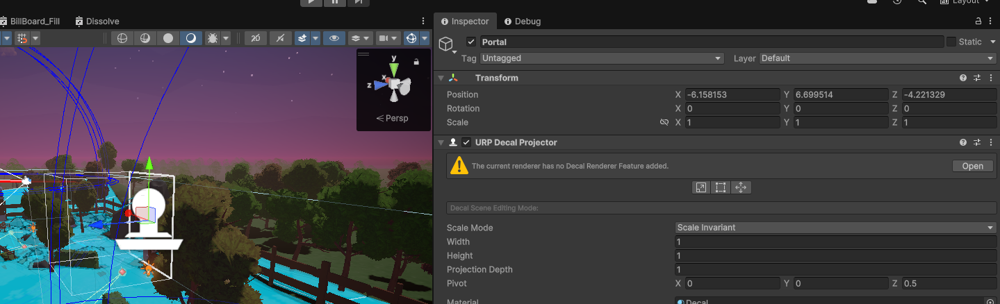
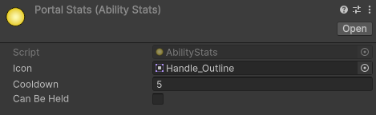

# Chicken Chaser CM 10 Portal Ability [OPTIONAL]

---
## Final Result


* [10.1) Concept](#101-concept)

* [10.2) Shader](#102-shader)
  * [10.2a) Preparation](#102a-preparation)
  * [10.2b) Shader Graph](#102b-shader-graph)
  * [10.2c) Cleanup and Prefab](#102c-cleanup-and-prefab)

* [10.3) Logic](#103-logic)

* [10.4) Apply](#104-apply)


* [End Results](#end-results)
    * [PortalAbility.cs](#portalabilitycs)
    * [IPortable.cs](#iportablecs)
    * [Portal.cs](#portalcs)
    * [Chicken.cs](#chickencs)

## [Render pipeline](https://github.com/RealProgrammingInstructors/Shared-Content/blob/main/Content/Shaders/ShaderPipeline.md)
## [Decals](https://github.com/RealProgrammingInstructors/Shared-Content/blob/main/Content/Shaders/Decals.md)


---


## 10.1) Concept

We want to be able to place a portal where we're current standing. There should only ever be 0 - 2 portals at a time. The Portals can only be placed on a specified layer to prevent cheating. When the second portal is placed, the user will fall through the portal and teleport to it's partner portal.

Then finally both portals will close after use.

Because it's fun, we want the portal to also work with slopes, ejecting the user on an angle.


## 10.2) Shader
### 10.2a) Preparation
First, let's create the following:

In the Abilities folder create the C# script:

    PortalAbility.cs

Then in the Game folder create the C# script

    Portal.cs

Then in the Interfaces folder create the  C# script:

    IPortable.cs

Open both of these scripts for later.

Next, in the materials folder, create a new unlit Shader Graph:

    Portal


Finally, right click on the shader graph and press create material:

    miPortal


mi stands for Material Instance, and is proper convention in Unreal... Unity has no "official" convention

Next, create an empty:

    Portal

Then add the URP decal renderer component to it. 

[Read more about decals](https://github.com/RealProgrammingInstructors/Shared-Content/blob/main/Content/Shaders/Decals.md)



Next, we need to add decal rendering to our URP instance. Go to settings, and change:

and add to each setting (Balanced, HighFidelity and Performant), Decals.


next, select the portal object once more and drag your material into it


### 10.2b) Shader Graph

Now we can begin editing our shader graph (by double clicking the desired shader graph). I recommend when editing shaders to do split screen:


To move around in shader graph:
* Press down middle mouse (the scroll wheel) and drag.
* Left click to select
* Right click for options
* Scroll wheel to zoom

First, we need to make the shader into a decal. In the Graph Inspector tab change the following:

Unlit --> Decal

    Affect Emission (Off) --> (On) // Makes it glow


Make sure to save often to update the shader and see it's effects.


The graph current should look like this.


First let's create some variables:

    float CellDensity
    float Speed
    float InnerSize
    float OuterSize
    Color InnerColor
    Color OuterColor


First let's make basic variables

    Set CellDensity to 3
    Set Speed to 1

Next let's do our sliders :

    Set InnerSize to 0.8 and make it a slider (0-1)
    Set OuterSize to 0.05 and make it a slider (0-1)


Finally let's do our glowing colors:
HDR means High Definition Range and allows us to make colors that will glow with Bloom.

    Set InnerColor to HDR color mode and pick a color
    Set OuterColor to HDR color mode and pick a color


If done properly, the material should look like this in the inspector:


Next, it's time to start making the graph. Let's first get the shape.


Now we can multiply in our color... Multiplying white by a color will give us a pure color and is essential to making good effects.
Multiply the full circle by inner and the small by outer than add them together.

Connect it to both BaseColor and Emissive.

Let's do the same for our alpha.


Now in the scene view, it should look something like this:


Next let's group our nodes together (Select all then CTRL + G) and move the group to the side

Create a group for the color, and another for the shape


Now Let's create a swirl effect Feel free to create variables instead of hardcoding

(NOTE: Gifs have color banding, don't worry about colors being wrong.)


Then optionally you can connect it to a power node to mute the colors a bit.


Next, let's group it ,and then  we can connect it to our shape and output


Finally, connect before the add for alpha, first subtract  either the inner or outer circle so the inside remains black.


Final Shader


NOTE: You also need to connect the alpha to blend for it to work correctly in the game view


If your decal isn't animating in the scene view:


### 10.2c) Cleanup and Prefab

Next it's time to prefab our object and delete it from the scene.

First, Mark the object as Ignore Ray cast.

Then reset the transform

Then add a sphere collider and make it a trigger

Then change the radius to 0.3, and the z offset to 0.25

Add the Portal script, then prefab the object


## 10.3) Logic

Now it's time to do the logic!

First open [PortalAbility.cs](../Assets/Scripts/Ability/PortalAbility.cs). Clear it out and make it a child of [AbstractAbility.cs](../Assets/Scripts/Ability/AbstractAbility.cs) and implement the class

```csharp
using UnityEngine;

public class PortalAbility : AbstractAbility
{
    protected override void Activate()
    {
        
    }
}
```

To function, we need to spawn in a portal, and check if a portal already exists. If the portal already exists, we can bind them together.

```csharp
public class PortalAbility : AbstractAbility
{
    [SerializeField] private Portal prefab;
    
    private Portal _currentPortal;
    private Portal _oldPortal;
    protected override void Activate()
    {
        Physics.Raycast(transform.position, Vector3.down, out RaycastHit hit, 3, StaticUtilities.GroundLayers);

        Portal instance = Instantiate(prefab, hit.point - new Vector3(0, 0.5f, 0), Quaternion.LookRotation(hit.normal));

        if (_oldPortal)
        {
            Destroy(_oldPortal.gameObject);
        }
        
        if (_currentPortal)
        {
            //Bind the portals
            _oldPortal = _currentPortal;
        }
        _currentPortal = instance;
    }
}
```

Next, we need to update when we can activate, the owner must be grounded.

```csharp
public class PortalAbility : AbstractAbility
{
    
    protected override void Activate()  { ... }

    public override bool CanActivate()
    {
        return base.CanActivate() && Owner.GetIsGrounded();
    }
}
```

Now let's move over to [Portal.cs](../Assets/Scripts/Game/Portal.cs). Start bby deleting start and update.

```csharp
using UnityEngine;

public class Portal : MonoBehaviour
{
   
}
```

Next let's create a function called bind, and a variable to remember our partner.
This function needs to be static, so we don't have a recursion issue.

```csharp
using UnityEngine;

public class Portal : MonoBehaviour
{
   private Portal _partner;
   
   public static void Bind(Portal a, Portal b)
   {
      a._partner = b;
      b._partner = a;
   }
}
```

Next, we need to detect when an object enters our range
```csharp
using UnityEngine;

public class Portal : MonoBehaviour
{
   private Portal _partner;
   
   public static void Bind(Portal a, Portal b)  { ...  }

   private void OnTriggerEnter(Collider other)
   {
      if (other.attachedRigidbody.TryGetComponent(out IPortable target))
      {
         
      }
   }
}
```

Now we need to fill out [IPortable.cs](../Assets/Scripts/Interfaces/IPortable.cs)
```csharp
using UnityEngine;

public interface IPortable
{
    void EnterPortal();
    void ApplyPortalForce(Vector3 exitPosition, Vector3 forceDirection);
    void ExitPortal();
}
```

Back in [Portal.cs](../Assets/Scripts/Game/Portal.cs)

Let's add a variable to check if we're being used and fill more stuff out.

```csharp
public class Portal : MonoBehaviour
{
   private Portal _partner;
   //-----------------ADDED----------------------//
   private bool _isBeingUsed;
   private IPortable _target;
   //-------------------------------------------//
    
   public static void Bind(Portal a, Portal b) { ... }

   private void OnTriggerEnter(Collider other)
   {
      //If we don't have a partner, or it's being used, then Cancel.
      //-----------------ADDED----------------------//
      if (!_partner || _partner._isBeingUsed || _isBeingUsed) return;
       
      if (other.attachedRigidbody.TryGetComponent(out IPortable target))
      {
          _target = target;
          _isBeingUsed = true;
          StartCoroutine(HandleEntrance(other.transform));
      }
       //-------------------------------------------//
   }
    //-----------------ADDED----------------------//
   private IEnumerator HandleEntrance(Transform other)
   {
      _target.EnterPortal();
      yield return new WaitUntil(() =>  other.position.y - transform.position.y < -0.5f);
      _partner.StartCoroutine(_partner.HandleExit(other));
      Destroy(gameObject);
      
   }
   private IEnumerator HandleExit(Transform other)
   {
      _target.ApplyPortalForce(transform.position, transform.forward);
      yield return new WaitUntil(() => other.position.y - transform.position.y > 1);
      _target.ExitPortal();
      Destroy(gameObject);
   }
    //-------------------------------------------//
}
```

Next let's go back to Portal Ability and just bind the portals

```csharp
using UnityEngine;
using Utilities;

public class PortalAbility : AbstractAbility
{
    // Variables 
    protected override void Activate()
    {
        Physics.Raycast(transform.position, Vector3.down, out RaycastHit hit, 3, StaticUtilities.GroundLayers);

        Portal instance = Instantiate(prefab, hit.point - new Vector3(0, 0.5f, 0), Quaternion.LookRotation(hit.normal));

        if (_oldPortal)
        {
            Destroy(_oldPortal.gameObject);
        }
        
        if (_currentPortal)
        {
            Portal.Bind(_currentPortal, instance);
            _oldPortal = _currentPortal;
        }
        _currentPortal = instance;
    }

    public override bool CanActivate()  { ... }
}
```

Finally, we just need to make things are portable, Let's only do [Chicken.cs](../Assets/Scripts/Characters/Chicken/Chicken.cs). 
You can alternatively just do [PlayerChicken.cs](../Assets/Scripts/Characters/Chicken/PlayerChicken.cs), or add it to other scripts

Add the Interface and implement it.

```csharp
public abstract class Chicken : MonoBehaviour, IVisualDetectable, ITrappable, IPortable // << ADDED
{
    //Other functions and variables 
    public void EnterPortal()
    {
        
    }

    public void ApplyPortalForce(Vector3 exitPosition, Vector3 forceDirection)
    {
        
    }

    public void ExitPortal()
    {
        
    }
}
```

Then let's fill it out
```csharp
public abstract class Chicken : MonoBehaviour, IVisualDetectable, ITrappable, IPortable // << ADDED
{
    public void EnterPortal()
    {
        //Disable collider
        BodyCollider.enabled = false;
    }

    public void ApplyPortalForce(Vector3 exitPosition, Vector3 forceDirection)
    {
        transform.position = exitPosition;
        PhysicsBody.AddForce(forceDirection * PhysicsBody.linearVelocity.magnitude, ForceMode.Impulse);
        PhysicsBody.linearVelocity = Vector3.zero;
    }

    public void ExitPortal()
    {
        //Enable collider
        BodyCollider.enabled = true;
    }
}
```

## 10.4) Apply

Finally, let's add the Ability the PlayerChicken, and set it as one of our selected abilities

Make a portal stats as well:



(or just add a new ability entirely)


Last, when placing the portal it goes ontop of the player and looks silly. We correct this with render layers.

First go back to the settings and enable Use Render Layers on each setting mode


Next, go back to the portal prefab (whitelist) and change the render layer:


Finally, change __any object__ that should show up's mesh renderer to include that layer:


## End Results


### [PortalAbility.cs](../Assets/Scripts/Ability/PortalAbility.cs)
```csharp
using UnityEngine;
using Utilities;

public class PortalAbility : AbstractAbility
{
    [SerializeField] private Portal prefab;
    
    private Portal _currentPortal;
    private Portal _oldPortal;
    protected override void Activate()
    {
        Physics.Raycast(transform.position, Vector3.down, out RaycastHit hit, 3, StaticUtilities.GroundLayers);

        Portal instance = Instantiate(prefab, hit.point - new Vector3(0, 0.5f, 0), Quaternion.LookRotation(hit.normal));

        if (_oldPortal)
        {
            Destroy(_oldPortal.gameObject);
        }
        
        if (_currentPortal)
        {
            Portal.Bind(_currentPortal, instance);
            _oldPortal = _currentPortal;
        }
        _currentPortal = instance;
    }

    public override bool CanActivate()
    {
        return base.CanActivate() && Owner.GetIsGrounded();
    }
}

```
### [IPortable.cs](../Assets/Scripts/Interfaces/IPortable.cs)
```csharp
using UnityEngine;

public interface IPortable
{
    void EnterPortal();
    void ApplyPortalForce(Vector3 exitPosition, Vector3 forceDirection);
    void ExitPortal();
}

```
### [Portal.cs](../Assets/Scripts/Game/Portal.cs)
```csharp
using System.Collections;
using UnityEngine;

public class Portal : MonoBehaviour
{
   private Portal _partner;
   private bool _isBeingUsed;
   private IPortable _target;
   
   public static void Bind(Portal a, Portal b)
   {
      a._partner = b;
      b._partner = a;
   }

   private void OnTriggerEnter(Collider other)
   {
      //If we don't have a partner, or it's being used, then Cancel.
      if (!_partner || _partner._isBeingUsed || _isBeingUsed) return;
      
      if (other.attachedRigidbody.TryGetComponent(out IPortable target))
      {
         _partner._target = target;
         _target = target;
         _isBeingUsed = true;
         StartCoroutine(HandleEntrance(other.transform));
      }
   }
   private IEnumerator HandleEntrance(Transform other)
   {
      _target.EnterPortal();
      yield return new WaitUntil(() =>  other.position.y - transform.position.y < -0.5f);
      _partner.StartCoroutine(_partner.HandleExit(other));
      Destroy(gameObject);
      
   }
   private IEnumerator HandleExit(Transform other)
   {
      _target.ApplyPortalForce(transform.position, transform.forward);
      yield return new WaitUntil(() => other.position.y - transform.position.y > 1);
      _target.ExitPortal();
      Destroy(gameObject);
   }
}

```
### [Chicken.cs](../Assets/Scripts/Characters/Chicken/Chicken.cs)
```csharp
using AI;
using Characters;
using Interfaces;
using Managers;
using ScriptableObjects;
using UnityEngine;
using Utilities;

public abstract class Chicken : MonoBehaviour, IVisualDetectable, ITrappable, IPortable
{
    [SerializeField] protected ChickenStats stats;
    
    [Header("Objects")] 
    [SerializeField] protected Transform head;
    [SerializeField] protected Transform foot;

    [SerializeField] private ParticleSystem landEffect;

    protected AudioSource Audio;
    protected Rigidbody PhysicsBody;
    protected Animator AnimatorController;
    protected Collider BodyCollider;
    protected bool IsGrounded;
    
    protected float currentSpeed;
    protected float currentFallTIme;
    protected Vector3 slopeNormal;
    
    protected float Visibility = 1;

    
    protected virtual void Awake()
    {
        PhysicsBody = GetComponent<Rigidbody>();
        AnimatorController = GetComponentInChildren<Animator>();
        BodyCollider = GetComponentInChildren<Collider>();
        Audio = GetComponentInChildren<AudioSource>();
        
        ChickenAnimatorReceiver car = transform.GetChild(0).GetComponent<ChickenAnimatorReceiver>();
        car.OnLandEffect += HandleLanding;
    }

    private void FixedUpdate()
    {
        HandleGroundState();
        HandleMovement();
        HandleAnims();
    }


    private void HandleGroundState()
    {
        //We're going to spherecast downwards, and detect if we've hit the floor.
        //Basic Spherecast check, NOTE: StaticUtilites.GroundLayers helps the code know which layers to look at for floors.
        // Preventing players from registering grounded on illegal objects.
        bool newGroundedState = Physics.SphereCast(foot.position, stats.FootRadius, Vector3.down, out RaycastHit slope, stats.FootDistance, StaticUtilities.GroundLayers);
       
        //If the ground state is different
        if (newGroundedState != IsGrounded)
        {
            //We should enter that state
            IsGrounded = newGroundedState;
            //Then we should update our grounded state.
            AnimatorController.SetBool(StaticUtilities.IsGroundedAnimID, IsGrounded);

            //If we were falling
            if (currentFallTIme >= 0)
            {
                //Handle Landing
                HandleLanding(Mathf.Max(currentFallTIme / 2, 3)); // Arbitrarily limit effects
                currentFallTIme = 0;
            }
        }

        //If we're not grounded then update the air time
        if (!IsGrounded) currentFallTIme += Time.deltaTime;
        //If we are grounded keep track of the slope normal so that Movement is smoother.
        else slopeNormal = slope.normal;
    }

    protected virtual void HandleLanding(float force)
    {
        landEffect.emission.SetBurst(0, new ParticleSystem.Burst(0, Random.Range(10,20) * force));
        landEffect.Play();
            
        //If we missed, we can't possibly find a clip...
        Vector3 pos = foot.position;
            
        //Make sure hit is not null
        if (!Physics.SphereCast(pos, stats.FootRadius, Vector3.down, out RaycastHit hit, stats.FootDistance,StaticUtilities.GroundLayers)) return;
           

            
        //Make sure the layer is not null
        if (!GameManager.SoundsDictionary.TryGetValue(hit.transform.tag, out AudioVolumeRangeSet set)) return;
        Audio.pitch = Random.Range(0.8f, 1.2f);
        //Play the desired audio + detection
        Audio.PlayOneShot(set.clip, set.volume);
        AudioDetection.onSoundPlayed.Invoke(pos, set.volume, set.rangeMultiplier * force, EAudioLayer.Chicken);
    }

    protected virtual void HandleAnims()
    {
        AnimatorController.SetFloat(StaticUtilities.MoveSpeedAnimID, currentSpeed);
    }

    protected abstract void HandleMovement();
    
    public abstract void OnFreedFromCage();
    
    public abstract void OnEscaped(Vector3 position);
    public void OnPreCapture()
    {
        enabled = false;
    }

    public Transform GetTransform()
    {
        return transform;
    }

    public bool CanBeTrapped()
    {
        return isActiveAndEnabled;
    }

    public abstract void OnCaptured();
    
    public bool GetIsGrounded()
    {
        return IsGrounded;
    }
    public float GetCurrentSpeed()
    {
        return currentSpeed;
    }

    public Vector3 GetLookDirection()
    {
        return head.forward;
    }

    public void AddVisibility(float visibility)
    {
        Visibility += visibility;
    }

    public void RemoveVisibility(float visibility)
    {
        Visibility -= Mathf.Max(0,visibility);
    }

    public float GetVisibility()
    {
        return Visibility;
    }

    public void EnterPortal()
    {
        //Disable collider
        BodyCollider.enabled = false;
    }

    public void ApplyPortalForce(Vector3 exitPosition, Vector3 forceDirection)
    {
        transform.position = exitPosition;
        PhysicsBody.AddForce(forceDirection * PhysicsBody.linearVelocity.magnitude, ForceMode.Impulse);
        PhysicsBody.linearVelocity = Vector3.zero;
    }

    public void ExitPortal()
    {
        //Enable collider
        BodyCollider.enabled = true;
    }
}

```