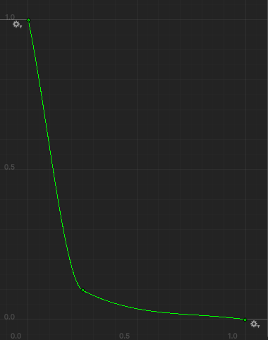

# Chicken Chaser CM 10 Portal Ability [OPTIONAL]

---
## Final Result


* [11.1) Concept](#111-concept)

* [11.2) Blender [OPTIONAL]](#112-blender-optional)

* [11.3) Shader](#113-shader)
  * [11.3a) Preparation](#113a-preparation)
  * [11.3b) Shader Graph](#113b-shader-graph)
  * [11.3c) Cleanup and Prefab](#113c-cleanup-and-prefab)

* [11.4) Logic](#114-logic)

* [11.5) Apply](#115-apply)


* [End Results](#end-results)
  * [ShieldAbility.cs](#shieldabilitycs)
  * [Shield.cs](#shieldcs)

NOTE: It's recommended to have blender installed to get better insight

NOTE: It's strongly recommended to do CM 10 first if you have low shader experience.

## [UVs shared CM](https://github.com/RealProgrammingInstructors/Shared-Content/blob/main/Content/Shaders/UVs.md) 
## [Render pipeline](https://github.com/RealProgrammingInstructors/Shared-Content/blob/main/Content/Shaders/ShaderPipeline.md)

---

## 11.1) Concept

We want to create a shield effect that follows the player and keeps them protected from the humans for a short duration


## 11.2) Blender [OPTIONAL]

**If you're skipping this step, give the students the model from the project called shieldSphere**

1. Open blender
2. In Blender press A to select all
3. Press del to delete all
4. Press Shift + A and add a sphere


5. Once created, you may change it's settings in the bottom left (optional)


6. Select the object (or press A)
7. Right click and press shade smooth


8. Press TAB to enter edit mote 


9. [optional] Open the UV Editing page and view the UVs


10. Export as FBX


11. Add to project in models folder (create the folder)


## 11.3) Shader
### 11.3a) Preparation
First, let's create the following:

In the Abilities folder create the C# script:

     ShieldAbility

In the Game folder create the C# script:

     Shield

Next, let's drag our sphere object into the scene


Now let's create our shader and material

in the materials folder create a shader graph


name the material miShield and the shader graph Shield

then open the shield shader graph.

### 11.3b) Shader Graph

In the graph inspector, change the following:

    Material --> Unlit *(if not already) (No light detail)
    Surface Type --> Transparent 
    Blending Mode --> Additive (Affects how we blend in with other transparencies)
    Cast Shadows --> Disabled 


Next, let's create some variables

    Texture2D MainTex
    Color Color
    Vector2 Speed
    float Power
    float Fresnel
    float Growth
    float GrowthPower

Set MainTex's default to hexagonAlbedo


Set the Color to HDR and pick a color with intensity to make it glow


Set the Speed to 0,0.1

Set the Power to 4

Set the Fresnel to 8

Set the Growth to slider with default value 1


Set Growth power to 7

next let's create the color group

Multiply time width speed, and input that as the offset into a tilling and offset node. This will create constant movement.

Next, plug the output UVs into a sample texture 2D node's UVs and connect the MainTex Variable to the sample. Finally, take the color of the sample, we only need the R because the image is grayscale, and multiply in our color. Finally connect it to the base color.


Next, let's make the alpha group

First create a fresnel node, and plug the fresnel variable into power. Fresnel is a simulation of light reflection that makes the edges of an object stand out more.
Next connect it to multiply, and multiply the R of the sampled texture. Finally multiply again, and connect the output into the alpha output

Next, We want the alpha to be affected by the shields animated growth. So create a UV node, and connect it to a split. Take the G (which is the Y or V) and connect it to a Maximum node. Connect the other input to one minus the growth (We do inverse growth for reasons later). Next substract the maximum from the one minus growth, and then take the power of that output and the power variable. This will create a nice gradient that fades away the lower the shield is. Connect this to the prior multiply node.


Currently it should look like this:


Last let's make an animated vertex shader

In the vertex shader, connect a UV node to split, and once more grab the B value. Connect that to a power node and plug GrowthPower into the bottom. Connect this to a multiply and multiply against One Minus the growth. This will create a gradient where the effect is larger above than it is below. Next multiply the output against the OBJECTS normals. This will allow us to scale the object. Then we subtract the objects position from the multiplied node so the effect goes inwards. Finally split this, and Plug the B into a maximum node with a value of 0. Then combine it back into a vector R --> R, G --> G, B --> Min --> B. Finally take the output vector3 and plug it into the position node.


The end shader should look like this:


### 11.3c) Cleanup and Prefab

Now on the sphere object we added to the scene earlier, 

1. Let's change the transform to: 0, -0.15, 0 | -90,0,0 | 50,50,50

2. let's add a NavMeshObstacle component with a capsule shape. Set. with radius 0.02, and height 0.02. Then Enable Carve

3. Add the Shield script

4. Prefab the object

The Nav Mesh Obstacle aspect is how the shield works. When it's enabled, AI won't be able to reach their destination. This can be problematic for three reasons: 1. what happens if you push a character into the wall? 2. What happens if a character is somehow off track? 3. It's technically still possible to be caught.

Those cases are all edge cases though, and not worth correcting in the short time we have to develop these projects.


## 11.4) Logic

Now let's do the logic

Starting in [ShieldAbility.cs](../Assets/Scripts/Ability/ShieldAbility.cs)

```csharp
using UnityEngine;

//Make us as an ability
public class ShieldAbility : AbstractAbility // <<-- REMEMBER TO DO THIS
{
    //Use a prefab or premade object
    [SerializeField] private Shield shield;

    private void Awake()
    {
        //Create a shield if one doesn't already exist.
        if (!shield.gameObject.scene.IsValid()) shield = Instantiate(shield, transform);
    }

    //Override the activate function
    protected override void Activate()
    {
        //Activate the shield
        shield.gameObject.SetActive(true);
    }
}
```

Next, let's fill out [Shield.cs](../Assets/Scripts/Game/Shield.cs). First let's create some serialized properties. These can be made into a Scriptable object for ease of editing + easy customization.

An AnimationCurve is just a curve that we can move along to get nice values

```csharp
public class Shield : MonoBehaviour
{
    //Define The effects for the animation
    [Header("Effects")]
    [SerializeField] private AnimationCurve entrance;
    [SerializeField] private float entranceTime;
    [SerializeField] private AnimationCurve exit;
    [SerializeField] private float exitTime;
    
    //How long does the ability last?
    [Header("Ability")]
    [SerializeField] private float duration;
}
```

Next, we need add some private variables... We need our Material to be able to change it, and a NavMeshObstacle so we can control the logic.

```csharp
public class Shield : MonoBehaviour
{
    // Serialized Variables
    private NavMeshObstacle _obstacle;
    private Material _material;
}
```

Finally we need a variable for the property ID. You retrieve these from the ShaderGraph.


```csharp
public class Shield : MonoBehaviour
{
    //Define The effects for the animation
    [Header("Effects")]
    [SerializeField] private AnimationCurve entrance;
    [SerializeField] private float entranceTime;
    [SerializeField] private AnimationCurve exit;
    [SerializeField] private float exitTime;
    
    //How long does the ability last?
    [Header("Ability")]
    [SerializeField] private float duration;

    private NavMeshObstacle _obstacle;
    private Material _material;
    
    //------------ADDED----------//
    private static readonly int GrowthID = Shader.PropertyToID("_Growth");
}
```

Now we need to create our functions and fill them out:

```csharp
public class Shield : MonoBehaviour
{
    //Variables
    
    private static readonly int GrowthID = Shader.PropertyToID("_Growth");
    //When the ShieldAbility enables us
    private void OnEnable()
    {
        //Access our components
        _obstacle = GetComponent<NavMeshObstacle>();
        _material = GetComponent<MeshRenderer>().material;
        
        //Begin our Coroutine
        StartCoroutine(CreateShield());
    }
    
    private IEnumerator CreateShield()
    {
        //Disable the Shield by default
        _obstacle.enabled = false;
        
        //Create a timer
        float ct = 0;
        while (ct < entranceTime)
        {
            ct += Time.deltaTime;
            //Move along the curve and set the growth to match
            _material.SetFloat(GrowthID, entrance.Evaluate(ct/entranceTime));
            yield return null;
        }
        
        //Enable the Shield
        _obstacle.enabled = true;

        //Wait until the duration is over
        yield return new WaitForSeconds(duration);

        //Begin the destruction timer
        StartCoroutine(DestroyShield());
    }

    private IEnumerator DestroyShield()
    {
        //Disable the shield
        _obstacle.enabled = false;
        
        //Create a timer
        float ct = 0;
        while (ct < exitTime)
        {
            ct += Time.deltaTime;
            //Move along the curve and set the growth to match
            _material.SetFloat(GrowthID, exit.Evaluate(ct/exitTime));
            yield return null;
        }
        
        //Disable ourselves so we can reset
        gameObject.SetActive(false);
    }
    
}
```

## 11.5) Apply

Now all we need to do is apply. On the player prefab, attach the shield prefab.


Then, open the shield prefab and set the following:

    Entrance Time = 0.4
    Exit Time = 1
    Duration = 3

You can edit curves by Right clicking on nodes to edit them, or left click and dragging them.
Double clicking creates new nodes


Entrance Curve: Starting at 0.9, ending at 1, Ease out


Exit Curve: Starting at 1, heading to 0.2 fast, Ease out to 0



Next create an Ability Stats for the shield Ability


Finally apply to Player


NOTE: Make sure the shield object is disabled by default as the ability is responsible for enabling the object


## End Results


### [ShieldAbility.cs](../Assets/Scripts/Ability/ShieldAbility.cs)
```csharp
using UnityEngine;

//Make us as an ability
public class ShieldAbility : AbstractAbility
{
    //Use a prefab or premade object
    [SerializeField] private Shield shield;

    private void Awake()
    {
        //Create a shield if one doesn't already exist.
        if (!shield.gameObject.scene.IsValid()) shield = Instantiate(shield, transform);
    }

    //Override the activate function
    protected override void Activate()
    {
        //Activate the shield
        shield.gameObject.SetActive(true);
    }
}

```
### [Shield.cs](../Assets/Scripts/Game/Shield.cs)
```csharp
using System.Collections;
using UnityEngine;
using UnityEngine.AI;

public class Shield : MonoBehaviour
{
    //Define The effects for the animation
    [Header("Effects")]
    [SerializeField] private AnimationCurve entrance;
    [SerializeField] private float entranceTime;
    [SerializeField] private AnimationCurve exit;
    [SerializeField] private float exitTime;
    
    //How long does the ability last?
    [Header("Ability")]
    [SerializeField] private float duration;

    private NavMeshObstacle _obstacle;
    private Material _material;
    
    private static readonly int GrowthID = Shader.PropertyToID("_Growth");
    //When the ShieldAbility enables us
    private void OnEnable()
    {
        //Access our components
        _obstacle = GetComponent<NavMeshObstacle>();
        _material = GetComponent<MeshRenderer>().material;
        
        //Begin our Coroutine
        StartCoroutine(CreateShield());
    }
    
    private IEnumerator CreateShield()
    {
        //Disable the Shield by default
        _obstacle.enabled = false;
        
        //Create a timer
        float ct = 0;
        while (ct < entranceTime)
        {
            ct += Time.deltaTime;
            //Move along the curve and set the growth to match
            _material.SetFloat(GrowthID, entrance.Evaluate(ct/entranceTime));
            yield return null;
        }
        
        //Enable the Shield
        _obstacle.enabled = true;

        //Wait until the duration is over
        yield return new WaitForSeconds(duration);

        //Begin the destruction timer
        StartCoroutine(DestroyShield());
    }

    private IEnumerator DestroyShield()
    {
        //Disable the shield
        _obstacle.enabled = false;
        
        //Create a timer
        float ct = 0;
        while (ct < exitTime)
        {
            ct += Time.deltaTime;
            //Move along the curve and set the growth to match
            _material.SetFloat(GrowthID, exit.Evaluate(ct/exitTime));
            yield return null;
        }
        
        //Disable ourselves so we can reset
        gameObject.SetActive(false);
    }
    
}

```