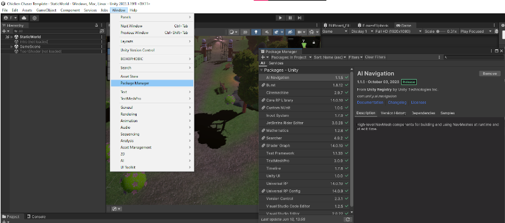
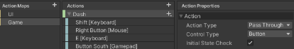

# Chicken Chaser CM 1 - Characters and Inputs

---
## Final Result

* [1.1) Setup](#11-setup)
  *   [1.1a) Hierarchy](#11a-hierarchy)
  *   [1.1b) Inspector](#11b-inspector)
  *   [1.1c) Scene and Game](#11c-scene-and-game)
  *   [1.1d) Project and Console](#11d-project-and-console)
  *   [1.1e) IDE fix](#11e-ide-fix)
  *   [1.1f) Movement Script](#11f-movement-script)

* [1.2) Input Mapping](#12-input-mapping)
  * [1.2a) Installation](#12a-installation)
  * [1.2b) Creating the input mapping](#12b-creating-the-input-mapping)

* [1.3) Single Responsibility: Controls](#13-single-responsibility-controls)
  *   [1.3a) PlayerControls](#13a-playercontrols)
  *   [1.3b) Initialize](#13b-initialize)
  *   [1.3c) PlayerChicken](#13c-playerchicken)
  *   [1.3d) Finishing Player Controls](#13d-finishing-player-controls)
  *   [1.3e) Revised Movement](#13e-revised-movement)

* [End Results](#end-results)
  * [PlayerControls.cs [COMPLETE]](#playercontrolscs-complete)
  * [PlayerChicken.cs](#playerchickencs)

---
# 1.1) Setup
## 1.1a) Hierarchy
Students must understand where the windows are, and what their purposes are. On the left side, the Hierarchy is where GameObjects are located.

    QUESTION: What GameObject does the scene currently have?

    ANSWER: Main Camera and Directional Light (Depending on if you’ve opened a scene)
We can right-click in the hierarchy to create objects. Start by creating any 3D object. (Only pick from the top section, so it has a mesh). This cube will now be visible in the hierarchy, scene, and game views.


## 1.1b) Inspector
Next, select our game object in the scene view, the inspector (right side) should now contain information about that object. Each section is called a COMPONENT. It’s essential students understand what a component is, to use Unity effectively.

    Question: What components does the cube have?

    Answer: Transform, Mesh Filter, Mesh Renderer and  Box Collider

Next, press on each object in the hierarchy, what components do they have?


    Question: What component does EVERY GAMEOBJECT HAVE?

    Answer: Transform
## 1.1c) Scene and Game
Next is the Scene and the Game View, I like moving these around (drag and drop) to have the game in split screen. The scene view helps us edit the game, while the Game View is what a player would see. Also, You can double-click on any tab to open it in full-screen. When pressing play (at the top) unity will automatically focus on the Game View

Moving around in the inspector is also very important. Practice moving objects around by pressing on the object, and then pressing
   
    W → TRANSLATE and moving the object
    E → ROTATE and rotate the object
    R → SCALE and scale the object

Next, try to orbit around the object. Hold right-click, and move the mouse to look around. While holding right-click, WASD allows you to move, and Q and E go up and down respectively.

If you get too far from an object, you can double-click it in the hierarchy, or press on an object and then press F to “Focus”

Finally, press on the cube once more, and in the inspector, press Add Component. Let’s add physics to our object by giving it a RigidBody. Encourage students to explore their options, and see what happens when you add a Rigidbody to the cube, and press “PLAY”. Try adding a floor to catch the object before it falls.


Additionally, on our RigidBody, let's check off Freeze Rotation X,Y,Z so that we have control over the objects rotation


## 1.1d) Project and Console
Finally, at the bottom are the project and console, it can be handy to keep these separated too. In the project tab, there’s a bunch of pre-made content, as Chicken Chaser is a pre-built course.

The project tab stores all of our game data, and we can use it to create many neat things such as prefabs. A prefab is a clone of an object, and we can create one by dragging an object from the hierarchy into the project window. Then we can use it by dragging it out from the project and into the scene.

Next, let’s create a custom component

      To make a script go to Scripts → Characters → PlayerChicken, and right-click. Press Create C# Script
 Name it PlayerChicken (so we can re-use it later)

 

### OLD (Before Unity 6)

### CURRENT (Unity 6+)


## 1.1e) IDE fix
Before opening the script, we need to make sure Visual Studio (or rider) is set up correctly. In the top left, press Edit → Open Preferences and navigate to “External Tools”.

Change the External Script Editor to the most appropriate option, and press “Regenerate Project Files”. If this is not done, then IntelliSense will not work, making Unity development very difficult.


## 1.1f) Movement Script
Let’s open the [PlayerChicken](../Assets/Scripts/Characters/Chicken/PlayerChicken.cs) script. By default, there are two functions. Update and Start. Let’s change “Start” To “Awake” We want Awake instead of Start because Awake will run before start, and Awake should be used when defining or accessing things that belong to ourselves.


```csharp
using System.Collections;
using System.Collections.Generic;
using UnityEngine;

public class PlayerChicken : MonoBehaviour
{
  // REMOVE: Start is called before the first frame update
  // ADD: Awake is called before start and should be used to define things that we own
  //MODIFY (replace start with Awake)
  void Awake()
  {
  
  }
  
  // Update is called once per frame
  void Update()
  {
  
  }
}
```

We want our object to be able to move, so let’s create two variables.

NOTE: It’s expected students have made variables at this point, or will very quickly learn to make them.


    Question: The first will be a number with a decimal, what type is it?
    Answer: float (Students may not know this if it’s their first class)

    Question: What component did we add to the Cube that made it fall?
    Answer: Rigidbody (if students can’t figure it out, tell them to look around in Unity)

Next, we need to ask ourselves, “Who else needs access to these variables?”

    Public - Any file can access the variable, and also serializes variables in Unity
    Protected - Only us and our children/subclasses can access the variable
    Private - Only we can access the variable.
    [SerializeField] - Can be added to private or protected variables to make them visible in Unity


```csharp
public class PlayerChicken : MonoBehaviour
{
  //--- Added ---//
  [SerializeField] private float speed;
  protected Rigidbody rigidbody;
  //----------//
    
  // Awake is called before start and should be used to define things that we own
  void Awake()   
  {
      
  }
  
  // Update is called once per frame
  void Update() 
  {
      
  }
}
```
Next, let’s make our rigidbody move! In Update, we can say “rigidbody.” and browse our options. In this case, we want to AddForce in the objects forward multiplied by our speed, and this force should be accelerative
```csharp
void Update()
{
    //Add
    rigidbody.AddForce(transform.forward * speed, ForceMode.Acceleration);
}
```
Now, save the code so it updates in Unity, and let’s attach the script to our cube by selecting it, dragging and dropping (or pressing add component and searching), changing the speed and finally, saving it to our prefab by right-clicking the blue highlighted name (the component) and pressing apply to prefab. Finally, press play and the cubes WILL NOT move! We get an error in the console.


    QUESTION: What error did we get?

    ANSWER: NullReferenceException

Null means nothing, so therefore something in our code is not bound correctly. Looking at the code, we can see the error is at rigidbody.AddForce()... which tells us the rigidbody is likely the culprit. To resolve this issue we can either add [SerializeField] to the Rigidbody, or we can use GetComponent in Awake. Let’s do GetComponent:

```csharp
void Awake()
{
    //Add
    rigidbody = GetComponent<Rigidbody>();
}
```

And now our objects will also accelerate based on their rotation and speed!


----
# 1.2) Input Mapping
## 1.2a) Installation
The new input system comes pre-installed in Chicken Chaser, but it’s still good to direct students
Press Window, Package Manager and verify that Input System is downloaded.



If it’s not  downloaded, then change from “Packages: In the project” to “Unity Registry”, search for Input System, and press download


## 1.2b) Creating the input mapping
In the project tab, navigate to Scripts → Managers, then right-click → Create, scroll to the bottom, and select Input Actions.


Name it “Controls” or something similar, and double-click it to open it.


***An “Action Map” is a set of bindings that can be enabled or disabled*** in different scenarios to limit controls easily. We want to create two of these, one for the game controls and one for the UI controls to make the game more accessible for controllers and keyboards.


Next, we need to define a bunch of actions and their states:

In the ***“UI” Action map***, we’ll just have a DisableUI key, the properties will be a button (no initial state check), and however many bindings. You can press the plus button to add more bindings


Finally, in the “Game” Action map, let’s create the following bindings


To do Move and Look, first change the type to Vector2, 
then when you press plus you’ll have an option for an Up/Down/Left/Right composite. 
Additionally, all the remaining keys will be “Pass Through” with Initial State Check enabled. 


    Pass through, means any change (Press and Released) inputs will trigger events,
    and initial state check means when the action is enabled, to check the state of each of those keys, 
    meaning if you’re holding space while exiting the pause menu, you’ll jump.





Finally, save the Input Actions to update them, then press on the action map, press “Generate C# class” and “Apply”.


 # 1.3) Single Responsibility: Controls
 ## 1.3a) PlayerControls
When making code, it’s important to make things with purpose and to
keep our logic as organized as possible. 
An easy way to do this is to make a script that 
handles all inputs and then responds to other scripts.

In the Scripts → Managers folder, create a new C# script, and name it
[PlayerControls.cs](../Assets/Scripts/Managers/PlayerControls.cs).
Modify the class so that it’s Static. This does two things, 
it means that everything in this class must be static, 
and it also means that this class cannot be instantiated 
as an object, but rather just exists.

(We can also remove imports)
```csharp
using UnityEngine;

public static class PlayerControls // Remove(: MonoBehaviour)
{
  //---Remove---//
  void Start()
  {
      
  }
  void Update()
  {
      
  }
  //----------//
}
```
Next, we need to define some variables. We need a PlayerChicken, so we know who our owner is. Additionally, we need Controls so we can enable our controls. Both of which will be private

```csharp
public static class PlayerControls
{
  //---ADDED---//
  private static PlayerChicken _chicken;
  private static Controls _controls;
  //----------//
}
```

Next, then we make the following functions.
Initialize(PlayerChicken owner) NOTE: this is the only function with parameters.
UseGameControls
UseUIControls
DisablePlayer

```csharp
public static class PlayerControls
{
  private static PlayerChicken _chicken;
  private static Controls _controls;
  //---ADDED---//
  public static void Initialize(PlayerChicken owner)
  { 
      
  }
  
  public static void UseGameControls()
  {  
      
  }
  
  public static void UseUIControls()
  {  
      
  }
  
  public static void DisablePlayer()
  {   
      
  }
  //----------//
}
```
NOTE: try getting the students to make as many as possible, each function will be accessible to all files.

## 1.3b) Initialize
Next, let’s build our initialize function.

NOTE: When binding the inputs, allow students to read their options. 
When doing “_controls.” they should notice “Game” and “UI” 
from the previous step. When doing “_controls.Game.” 
They should notice their actions, and finally when doing 
“_controls.Game.Dash. ” there should be 3 options with 
lightning bolts. In this game, 
we will exclusively use performed as it’s the most consistent.

```csharp
public static void Initialize(PlayerChicken owner)
{
   //---------ADDED-------//
  //Bind our owner
  _chicken = owner;
  
  //Create the controls object
  _controls = new Controls();
  
  //When the Dash button is pressed, read the value as a button (true for down, false for up)
  _controls.Game.Dash.performed += context => owner.SetDashState(context.ReadValueAsButton());
  _controls.Game.Cluck.performed += context => owner.SetCluckState(context.ReadValueAsButton());
  _controls.Game.Jump.performed += context => owner.SetJumpState(context.ReadValueAsButton());
  
  //Read the value as a type of Vector2
  _controls.Game.Move.performed += context => owner.SetMoveDirection(context.ReadValue<Vector2>());
  _controls.Game.Look.performed += context => owner.SetLookDirection(context.ReadValue<Vector2>());
  
  // _ means discard (We don't care about the input)
       _controls.Game.EnableUI.performed += _ =>
        {
            //Settings is a premade class
            Settings.OpenSettings(false);
            UseUIControls();
        };
        _controls.UI.DisableUI.performed += _ =>
        {
            Settings.CloseSettings();
            UseGameControls();
        };
    //---------END OF ADDING-------//
}
```


## 1.3c) PlayerChicken

Some of these functions won’t exist, so head over to [PlayerChicken](../Assets/Scripts/Characters/Chicken/PlayerChicken.cs), make the following functions at the bottom, and add Debug.Logs so we can see what’s happening
```csharp
public class PlayerChicken : MonoBehaviour
{
// Variables

void Awake(){...}

void Update(){...}

//-------ADD---------//
public void SetDashState(bool state)
{ 
    //OPTIONAL for debugging
    Debug.Log(“Dash: ” + state); 
}
public void SetCluckState(bool state) 
{ 
    //OPTIONAL for debugging
    Debug.Log(“Cluck: ” + state); 
}
public void SetJumpState(bool state) 
{ 
    //OPTIONAL for debugging
    Debug.Log(“Jump: ” + state);
}
public void SetMoveDirection(Vector2 direction) 
{ 
    
}
public void SetLookDirection(Vector2 direction) 
{
    
}
 // ------------ End of adding -------- //
}
```


Then, let’s initialize the controls

```csharp
public class PlayerChicken : MonoBehaviour {
// Variables
  void Awake()
  {
    rigidbody = GetComponent<Rigidbody>();
    PlayerControls.Initialize(this);
    PlayerControls.UseGameControls();
  }
  //---- Added ----//
  //Called if the object is disabled.
  private void OnDisable()
  {
    PlayerControls.DisablePlayer();  
  }
  //----End of Adding----//
//Other functions
}
```

## 1.3d) Finishing Player Controls

Finally, let’s go back to [PlayerControls.cs](../Assets/Scripts/Managers/PlayerControls.cs), and Finish it.
Remove | Modify | Add
```csharp
public static class PlayerControls
{
  //other functions and variables
  public static void UseGameControls()
  {
    //Enable game, disable ui
    Cursor.lockState = CursorLockMode.Locked;
    Cursor.visible = false;
      
    _controls.Game.Enable();
    _controls.UI.Disable();
  }
  
  public static void UseUIControls()
  {
    //Disable the player, and the game, enable the UI
    DisablePlayer();
    _controls.Game.Disable();
    _controls.UI.Enable();
  }
  
  
  public static void DisablePlayer()
  {
    //Disable all controls
    _controls.UI.Disable();
    _controls.Game.Disable();
      
    //If we disable the controls, Unity will not longer check to see when we stop our input.
    //Therefore, we need to send a message to all our inputs as if we've let go of them if we need to disable the player.
    _chicken.SetCluckState(false);
    _chicken.SetDashState(false);
    _chicken.SetJumpState(false);
    _chicken.SetLookDirection(Vector2.zero);
    _chicken.SetMoveDirection(Vector2.zero);
      
     Cursor.lockState = CursorLockMode.None;
     Cursor.visible = true;
  }
}
```
Save all the code, and try running the game, at this point pressing the keys should print in the console that they are working.

## 1.3e) Revised Movement
Let’s get movement working, we’ll do Looking in the next one.
For Movement, we need to store the direction the player is trying to move and move our player in that direction. Here are two important details:
We can multiply a Quaternion by a vector to retrieve a rotated vector
When working with Physics we should not use Update, but rather FixedUpdate.
```csharp
public class PlayerChicken : MonoBehaviour
{
  [SerializeField] private float speed;
  protected Rigidbody rigidbody;
  
  private Vector3 _moveDirection;
  
  // Awake is called before start and should be used to define things that we own
  void Awake()
  {
    rigidbody = GetComponent<Rigidbody>();
    //ADDED
    PlayerControls.Initialize(this);
    //ADDED
    PlayerControls.UseGameControls();
  }
  
  // Update is called once per frame
  // Fixed update is update, but for physics
  void FixedUpdate()
  {
    rigidbody.AddForce(transform.rotation * _moveDirection * speed, ForceMode.Acceleration);
  }
  
  public void SetDashState(bool state) 
  { 
      Debug.Log("Dash: " + state); 
  }
  public void SetCluckState(bool state)
  { 
      Debug.Log("Cluck: " + state); 
  }
  public void SetJumpState(bool state) 
  { 
      Debug.Log("Jump: "  + state);
  }
  
  public void SetMoveDirection(Vector2 direction)
  {
    //In unity, Y is up, so we need to convert to vector3, and have WS affect the forward (Z) axis.
    _moveDirection = new Vector3(direction.x, 0, direction.y);
  }
  public void SetLookDirection(Vector2 direction)
  {
      
  }
}
```
Finally, Save everything and run the game. You should have control over each box.

The code created here can and should be used in a similar capacity in most projects.
Updated Scripts and how it should look:

## End Results


### [PlayerControls.cs [COMPLETE]](../Assets/Scripts/Managers/PlayerControls.cs)
```csharp
using UnityEngine;

public static class PlayerControls
{
  private static PlayerChicken _chicken;
  private static Controls _controls;

  public static void Initialize(PlayerChicken owner)
  {
    //Bind our owner
    _chicken = owner;

       //Create the controls object
       _controls = new Controls();
      
       //When the Dash button is pressed, read the value as a button (true for down, false for up)
       _controls.Game.Dash.performed += context => owner.SetDashState(context.ReadValueAsButton());
       _controls.Game.Cluck.performed += context => owner.SetCluckState(context.ReadValueAsButton());
       _controls.Game.Jump.performed += context => owner.SetJumpState(context.ReadValueAsButton());

       //Read the value as a type of Vector2
       _controls.Game.Move.performed += context => owner.SetMoveDirection(context.ReadValue<Vector2>());
       _controls.Game.Look.performed += context => owner.SetLookDirection(context.ReadValue<Vector2>());
      
       // _ means discard (We don't care about the input)
       _controls.Game.EnableUI.performed += _ =>
        {
            //Settings is a premade class
            Settings.OpenSettings(false);
            UseUIControls();
        };
        _controls.UI.DisableUI.performed += _ =>
        {
            Settings.CloseSettings();
            UseGameControls();
        };
  }

  public static void UseGameControls()
  {
    //Enable game, disable ui
    Cursor.lockState = CursorLockMode.Locked;
    Cursor.visible = false;
      
    _controls.Game.Enable();
    _controls.UI.Disable();
  }

  public static void UseUIControls()
  {
    //Disable the player, and the game, enable the UI
    DisablePlayer();
    _controls.Game.Disable();
    _controls.UI.Enable();
  }

  public static void DisablePlayer()
  {
      //Disable all controls
      _controls.UI.Disable();
      _controls.Game.Disable();
      
    //If we disable the controls, Unity will not longer check to see when we stop our input.
    //Therefore, we need to send a message to all our inputs as if we've let go of them if we need to disable the player.
    _chicken.SetCluckState(false);
    _chicken.SetDashState(false);
    _chicken.SetJumpState(false);
    _chicken.SetLookDirection(Vector2.zero);
    _chicken.SetMoveDirection(Vector2.zero);
    Cursor.lockState = CursorLockMode.None;
    Cursor.visible = true;
  }
}
```
## [PlayerChicken.cs](../Assets/Scripts/Characters/Chicken/PlayerChicken.cs)
```csharp
using System;
using System.Collections;
using System.Collections.Generic;
using UnityEngine;

public class PlayerChicken : MonoBehaviour
{
  [SerializeField] private float speed;
  protected Rigidbody rigidbody;
  
  private Vector3 _moveDirection;
  
  // Awake is called before start and should be used to define things that we own
  void Awake()
  {
    rigidbody = GetComponent<Rigidbody>();
    PlayerControls.Initialize(this);
    PlayerControls.UseGameControls();
  }
  //Called if the object is disabled.
  private void OnDisable()
  {
    PlayerControls.DisablePlayer();  
  }
  
  // Update is called once per frame
  // Fixed update is update, but for physics
  void FixedUpdate()
  {
     rigidbody.AddForce(transform.rotation * _moveDirection * speed, ForceMode.Acceleration);
  }
  
  public void SetDashState(bool state) 
  { 
      Debug.Log("Dash: " + state); 
  }
  public void SetCluckState(bool state) 
  {  
      Debug.Log("Cluck: " + state); 
  }
  public void SetJumpState(bool state) 
  { 
      Debug.Log("Jump: "  + state); 
  }
  
  public void SetMoveDirection(Vector2 direction)
  {
    //In unity, Y is up, so we need to convert to vector3, and have WS affect the forward (Z) axis.
    _moveDirection = new Vector3(direction.x, 0, direction.y);
  }
  public void SetLookDirection(Vector2 direction) 
  { 
      
  }
}
```


