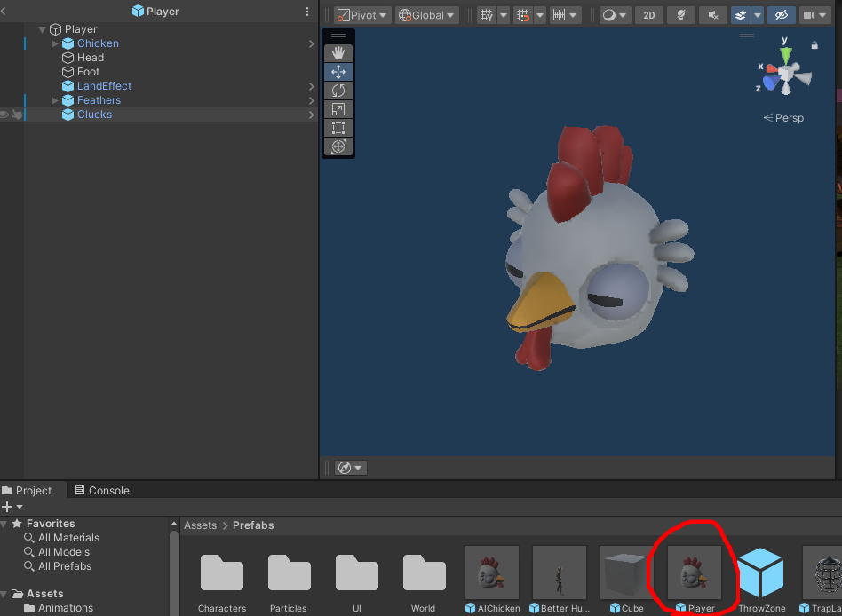

# Chicken Chaser CM 2 - Abstraction and Animation

---
## Final Result

* [2.1) Setting up the Game and Chicken](#21-setting-up-the-game-and-chicken)
    *   [2.1a) Scene setup](#21a-scene-setup)
    *   [2.1b) Prefab setup](#21b-prefab-setup)

* [2.2) Abstract Character](#22-abstract-character)
    * [2.2a) What is Abstraction and Why is it helpful?](#22a-what-is-abstraction-and-why-is-it-helpful)
    * [2.2b) Creating the abstract parent](#22b-creating-the-abstract-parent)
    * [2.2c) Fixing the player chicken](#22c-fixing-the-player-chicken)
    * [2.2d) Creating the AI Chickens](#22d-creating-the-ai-chickens)

* [2.3) Cinemachine and Looking](#23-cinemachine-and-looking)
  *   [2.3a) Setting up Cinemachine](#23a-setting-up-cinemachine)
  *   [2.3b) Understanding the Look Logic](#23b-understanding-the-look-logic)
  *   [2.3c) The Look Function](#23c-the-look-function)

* [2.4) Animations](#24-animations)
    *   [2.4a) Attaching Components and Animation setup](#24a-attaching-components-and-animation-setup)
    *   [2.4b) Making it Accessible in Unity](#24b-making-it-accessible-in-unity)

* [End Results](#end-results)
    * [Chicken.cs](#chickencs)
    * [AIChicken.cs](#aichickencs)
    * [PlayerChicken.cs](#playerchickencs)
    * [StaticUtilities.cs](#staticutilitiescs-)

---

## 2.1) Setting up the Game and Chicken

### 2.1a) Scene setup

To Begin, it's time to move to the correct scene... When creating a new project from GitHub, we will start in the wrong scene by default.
To correct this open the Static world scene. Navigate to

    Assets -> Scenes -> StaticWorld


This game uses a multi-scene approach. Primarily, we'll be working in:

    Assets -> Scenes -> GameScene

To have both open at the same time, simply drag and drop the scene under StaticWorld


### 2.1b) Prefab setup

Next let's fix the prefab, there's a pre-made asset in 

      Assets -> Prefabs -> Player

You can either edit the prefab directly, or edit the player that exists in the scene by default.



On the root object (Player), let's attach a RigidBody, and the PlayerChicken script.
Make sure the RigidBody has no rotation, and feel free to change the players speed


## 2.2) Abstract Character

### 2.2a) What is Abstraction and Why is it helpful?

general object type that acts as an identifier and enforces rules on its derived classes.

A real-life example of abstraction is the concept of "Animal." While many things are animals, a fish is very different from a dog. "Animal" serves as an identifier, categorizing these diverse creatures under one umbrella. Despite their differences, there are certain rules that all animals follow; for example, both fish and dogs CAN sleep and HAVE health. In OOP terms, the "Animal" class enforces these rules on its subclasses, such as "Fish" and "Dog."

It's important to note that you cannot create an instance of an "Animal" because it is an abstract concept used to group and define common characteristics and behaviors. Instead, you create instances of specific animals, like "Fish" or "Dog," which inherit the properties and behaviors defined by the "Animal" class

Abstraction is helpful because it allows us to identify objects, and creates structure in our code.

### 2.2b) Creating the abstract parent

Let's create some new scripts... Navigate to 

    Assets -> Scripts -> Characters -> Chicken

And create and open the following scripts:

[Chicken.cs](../Assets/Scripts/Characters/Chicken/Chicken.cs)

[AiChicken.cs](../Assets/Scripts/Characters/Chicken/AiChicken.cs)


Starting in [Chicken.cs](../Assets/Scripts/Characters/Chicken/Chicken.cs), let's make the class abstract
```csharp
// Using Statements ...

//----Add the abstract key word---------
public abstract class Chicken : MonoBehaviour
{
    // Code ...
}
```

Then we need to ask ourselves:

    QUESTION: What does every chicken HAVE?

ANSWERS: (Add more if students suggest)
* Rigidbody
* Animator (Used later)
* Speed
* MaxSpeed 
* FootRadius 
* FootDistance 
* isGrounded

NOTE: protected means that we and our children have access to the variable (as discussed prior), and Header is another tag that just makes editing a bit nicer.

```csharp
using System.Collections;
using System.Collections.Generic;
using UnityEngine;

public class Chicken : MonoBehaviour
{
    //-------- ADDED ---------//
    [Header("Movement")]
    [SerializeField] protected float speed;
    [SerializeField] protected float maxSpeed;
    
    [Header("Foot Management")] 
    [SerializeField] protected float footRadius;
    [SerializeField] protected float footDistance;
    
    protected Rigidbody PhysicsBody;
    protected Animator AnimatorController;
    protected bool IsGrounded;
    //----------------------//
    
    // Start is called before the first frame update
    void Start()
    {
        
    }

    // Update is called once per frame
    void Update()
    {
        
    }
}
```

    QUESTION: What can every chicken DO?

ANSWERS: (Add more if students suggest)
* HandleGroundState
* HandleLanding 
* HandleMovement
* OnFreedFromCage
* OnEscaped
* OnCaptured

NOTE:
You can also add function here to give all chickens abilities, or allow them to explode, 
but in the default implementation of ChickenChaser, only the player can use abilities.

The bottom three functions will be abstract functions. This means that these functions are not defined in Chicken,
but our child classes will need to tell us what they mean. We make them public, because later the Human will need to use these.

```csharp
using System.Collections;
using System.Collections.Generic;
using UnityEngine;

public abstract class Chicken : MonoBehaviour
{
    [Header("Movement")]
    [SerializeField] protected float speed;
    [SerializeField] protected float maxSpeed;
    
    [Header("Foot Management")] 
    [SerializeField] protected float footRadius;
    [SerializeField] protected float footDistance;
    
    protected Rigidbody PhysicsBody;
    protected Animator AnimatorController;
    protected bool IsGrounded;
    
    // Start is called before the first frame update
    void Start()
    {
        
    }

    // Update is called once per frame
    void Update()
    {
        
    }
    //------------ ADDED --------------//


    void HandleGroundState()
    {
        
    }

    void HandleLanding()
    {
        
    }
    
    //NOTE: Abstract functions, not defined here, but defined in child classes
    protected abstract void HandleMovement();
    
    public abstract void OnFreedFromCage();
    public abstract void OnEscaped(Vector3 position);
    public abstract void OnCaptured();
    //--------------------------//
}

```

Next, let's replace Start with Awake, as mentioned prior, 
we do this because Awake runs before start, and should be used when staying inside this class

and let's replace Update with Fixed Update, as mentioned prior,
we do this because FixedUpdate is used for Physics, and will make the game less jittery.

```csharp
// Usings

public abstract class Chicken : MonoBehaviour
{
   //Variables
    
    //----MODIFIED----//
    void Awake()
    {
    }

    void FixedUpdate()
    {
    }
    //--------------//
    
    // Other functions
}

```

Finally, let's also make the following functions protected and virtual. The difference between abstract and virtual is that abstract functions must be defined in the child class while virtual is optional.
Doing this just makes the code more flexible for later.

    Awake
    HandleLanding

```csharp
using System.Collections;
using System.Collections.Generic;
using UnityEngine;

public abstract class Chicken : MonoBehaviour
{
    [Header("Movement")]
    [SerializeField] protected float speed;
    [SerializeField] protected float maxSpeed;
    
    [Header("Foot Management")] 
    [SerializeField] protected float footRadius;
    [SerializeField] protected float footDistance;
    
    protected Rigidbody PhysicsBody;
    protected Animator AnimatorController;
    protected bool IsGrounded;
    
    // MODIFIED
    protected virtual void Awake()
    {
        
    }

    private void FixedUpdate()
    {
        
    }
    

    private void HandleGroundState()
    {
        
    }

    // MODIFIED
    protected virtual void HandleLanding()
    {
        
    }

    protected abstract void HandleMovement();
    
    public abstract void OnFreedFromCage();
    public abstract void OnEscaped(Vector3 position);
    public abstract void OnCaptured();
}
```

### 2.2c) Fixing the player chicken

In here, let's replace MonoBehaviour with Chicken. In english, we can now say A [PlayerChicken.cs](../Assets/Scripts/Characters/Chicken/PlayerChicken.cs) IS A chicken

```csharp
//Usings
                
//------Modified------//
public class PlayerChicken : Chicken
{
    //Code
}
```

Doing this will cause an error, as we need to explicitly declare what the abstract 
functions we created mean. To solve the error, 
you can press on the light bulb and press implement abstract class, 
or just make them manually.


Make sure that these new functions are empty, and we'll be using them later;


[PlayerChicken.cs](../Assets/Scripts/Characters/Chicken/PlayerChicken.cs)
```csharp
using System;
using System.Collections;
using System.Collections.Generic;
using UnityEngine;

public class PlayerChicken : Chicken
{
    [SerializeField] private float speed;
    protected Rigidbody rigidbody;

    private Vector3 _moveDirection;
    
    // Awake is called before start and should be used to define things that we own
    void Awake()
    {
        rigidbody = GetComponent<Rigidbody>();
        PlayerControls.Initialize(this);
        PlayerControls.UseGameControls();
    }
    //Called if the object is disabled.
    private void OnDisable()
    {
        PlayerControls.DisablePlayer();   
    }

    // Update is called once per frame
    // Fixed update is update, but for physics
    void FixedUpdate()
    {
        rigidbody.AddForce(transform.rotation * _moveDirection * speed, ForceMode.Acceleration);
    }

    //---------------- ADDED ---------------//
    public override void OnFreedFromCage()
    {
        
    }

    public override void OnEscaped(Vector3 position)
    {
        
    }

    public override void OnCaptured()
    {
        
    }
    //------------------------------------//

    public void SetDashState(bool state) { Debug.Log("Dash: " + state); }
    public void SetCluckState(bool state) {  Debug.Log("Cluck: " + state); }
    public void SetJumpState(bool state) { Debug.Log("Jump: "  + state); }

    public void SetMoveDirection(Vector2 direction)
    {
        //In unity, Y is up, so we need to convert to vector3, and have WS affect the forward (Z) axis.
        _moveDirection = new Vector3(direction.x, 0, direction.y);
    }
    public void SetLookDirection(Vector2 direction) { }
}
```

Next, we need to move things out of here, and into Chicken.
Delete speed and the rigidbody, the line in Awake() that uses the rigidbody,
and move the line in FixedUpdate() into HandleMovement before deleting fixed Update
Then finally, Awake needs to be overriden, and implement the parent with base.Awake() so that both code runs still.

```csharp
using System;
using System.Collections;
using System.Collections.Generic;
using UnityEngine;

public class PlayerChicken : Chicken
{
    //speed WAS DELETED
    //rigidbody WAS DELETED
    private Vector3 _moveDirection;
    
    //MODIFY (Make override)
    protected override void Awake()
    {
        //ADDED Base.Awake();
        base.Awake();
        //GET COMPONENT WAS DELETED
        PlayerControls.Initialize(this);
        PlayerControls.UseGameControls();
    }
    private void OnDisable()
    {
        PlayerControls.DisablePlayer();   
    }
    
    //FIXED UPDATE WAS DELETED

    protected override void HandleMovement()
    {
        //ADDED NOTE: Change rigidbody to PhysicsBody (Or whatever you called it)
        PhysicsBody.AddForce(transform.rotation * _moveDirection * speed, ForceMode.Acceleration);
    }

    public override void OnFreedFromCage()
    {
        
    }

    public override void OnEscaped(Vector3 position)
    {
        
    }

    public override void OnCaptured()
    {
        
    }

    public void SetDashState(bool state) { Debug.Log("Dash: " + state); }
    public void SetCluckState(bool state) {  Debug.Log("Cluck: " + state); }
    public void SetJumpState(bool state) { Debug.Log("Jump: "  + state); }

    public void SetMoveDirection(Vector2 direction)
    {
        //In unity, Y is up, so we need to convert to vector3, and have WS affect the forward (Z) axis.
        _moveDirection = new Vector3(direction.x, 0, direction.y);
    }
    public void SetLookDirection(Vector2 direction) { }
}
```

Finally, let's head back to [Chicken.cs](../Assets/Scripts/Characters/Chicken/Chicken.cs) and get out components and call some functions.

In Awake get the components

```csharp
public abstract class Chicken : MonoBehaviour
{
    //Variables
    
    protected virtual void Awake()
    {
        //ADDED
        PhysicsBody = GetComponent<Rigidbody>();
        
        //NOTE: GetComponentInChildren as the Chicken will be doing the animations, not the root object.
         AnimatorController = GetComponentInChildren<Animator>();

    }
    
    //Other functions
}
```

Next, we need to call some functions in Fixed Update

```csharp
 public abstract class Chicken : MonoBehaviour
 {
     //Other functions and variables
     private void FixedUpdate()
    {
        //ADDED
        HandleGroundState();
        HandleMovement();
    }
     //Ohter functions
 }
```

While it may feel like nothing has been done so far, we've really created a very 
powerful driver class. If you run the project, there should be no differences.


### 2.2d) Creating the AI Chickens

Next let's create the [AIChicken.cs](../Assets/Scripts/Characters/Chicken/AiChicken.cs) just to have it, the setup is exactly the same as [PlayerChicken.cs](../Assets/Scripts/Characters/Chicken/PlayerChicken.cs), 
change the parent class, implement the functions and make Awake overridden,
and delete everything else.


in [AIChicken.cs](../Assets/Scripts/Characters/Chicken/AiChicken.cs)
```csharp
using System.Collections;
using System.Collections.Generic;
using UnityEngine;

public class AiChicken : Chicken
{
    protected override void Awake()
    {
        base.Awake();
    }

    protected override void HandleMovement()
    {
        
    }

    public override void OnFreedFromCage()
    {
        
    }

    public override void OnEscaped(Vector3 position)
    {
        
    }

    public override void OnCaptured()
    {
        
    }
}
```

## 2.3) Cinemachine and Looking

### 2.3a) Setting up Cinemachine

Now let's allow our player to look around. 
Thankfully Unity has given us a neat tool called Cinemachine, 
which will help us make some really cool camera effects.

Let's go back to the project and once again open the 
__prefab for the Player Chicken__. In the prefab, create a virtual camera.

### OLD (Before Unity 6) (Use Virtual Camera)


### CURRENT (Unity 6) (Use Cinemachine Camera)


Name it something like "HeadCam" and then change the following:
      
      Follow: Head

      Lens Vertical FOV: 40

      Body: 3rd Person Follow

      3rd Person Follow -> Damping: 0,0,0 (If this is not zero, the camera will take time to move with the player, 
      which can sometimes feel like the camera is escaping the players soul...)

      3rd Person Follow -> Shoulder Offset: 0.3,0,0 (This change where the camera is)

      3rd Person Follow -> Vertical Arm Length: 0.2 (Height of controller)
      
      3rd Person Follow -> Camera Distance: 3 (Distance from player)

      3rd Person Follow -> Camera Collision Filter: Default (Collides with all world props (some layers are premade))
      
      3rd Person Follow -> Ignore Tag: Player (Do not collide with (some tags are premade))

      3rd Person Follow -> Camera Radius: 0.1

      3rd Person Follow -> Damping from Collision: 0

      Aim: Do Nothing (This will give us control over look direction later)
### OLD (Before Unity 6)
  

### Current (Unity 6)
  

Next, change the tag on the players Collider (Located in PLayer->Chicken->Collider) to player so the camera responds correctly

Ensure that everything is applied to prefab.

(Don't worry about the missing tag for now, we'll add that later)


### 2.3b) Understanding the Look Logic

 When designing a solution, it's important to understand the problem, and work backwards. 
 We need to rotate around some axes in order to achieve "Looking".


We want to rotate the player around the 

    X axis to look up and down (pitch) 
    Y Axis to look left and right (yaw)

But if we just rotate the player, then the chicken will physically look up and down, 
while in the case of Chicken Chaser this may make sense, 
it does not for games with humanoid models, 
as either the body or the head should rotate, 
typically not both at the same time 
(Especially when the body rotate upwards, 
and because we want to use this code in other projects)

The first is what happens when we only rotate the player


The second is what happens when we rotate our "Head" and "Body" and different objects


### 2.3c) The Look Function

Next, we just need to rotate the player with the mouse.

First in [Chicken.cs](../Assets/Scripts/Characters/Chicken/Chicken.cs)
Add a head variable
```csharp
public abstract class Chicken : MonoBehaviour
{
    [Header("Movement")]
    [SerializeField] protected float speed;
    [SerializeField] protected float maxSpeed;
    
    [Header("Foot Management")] 
    [SerializeField] protected float footRadius;
    [SerializeField] protected float footDistance;

    //-------------ADDED--------------//
    [Header("Objects")] 
    [SerializeField] protected Transform head;
    //---------------------------------//
    
    protected Rigidbody PhysicsBody;
    protected Animator AnimatorController;
    protected bool IsGrounded;
    
    // Functions (unedited)
}

```

Navigate to [PlayerChicken.cs](../Assets/Scripts/Characters/Chicken/PlayerChicken.cs) and add the following code

```csharp
using System;
using System.Collections;
using System.Collections.Generic;
using UnityEngine;

public class PlayerChicken : Chicken
{
    private Vector3 _moveDirection;
    //--------------------------ADDED----------------------//
    private Vector2 _lookDirection;
    
    //NOTE: If you're comfortable / have good students, these should ideally go in Settings.
    [Header("Looking")] 
    [SerializeField , Range(0,90)] private float pitchLimit = 30; // Partial rotation up and down
    [SerializeField, Range(0,180)] private float yawLimit = 180; // Full rotation side ways
    [SerializeField] private float lookSpeed = 5;
    //-----------------------------------------------------//
    
    protected override void Awake()
    {
        base.Awake();
        PlayerControls.Initialize(this);
        PlayerControls.UseGameControls();
    }
    private void OnDisable()
    {
        PlayerControls.DisablePlayer();   
    }

    protected override void HandleMovement()
    {
        PhysicsBody.AddForce(transform.rotation * _moveDirection * speed, ForceMode.Acceleration);
        //--------------------------ADDED----------------------//
        HandleLooking();
        //-----------------------------------------------------//
    }

    public override void OnFreedFromCage()
    {
        
    }

    public override void OnEscaped(Vector3 position)
    {
        
    }

    public override void OnCaptured()
    {
        
    }

    public void SetDashState(bool state) { Debug.Log("Dash: " + state); }
    public void SetCluckState(bool state) {  Debug.Log("Cluck: " + state); }
    public void SetJumpState(bool state) { Debug.Log("Jump: "  + state); }

    public void SetMoveDirection(Vector2 direction)
    {
        //In unity, Y is up, so we need to convert to vector3, and have WS affect the forward (Z) axis.
        _moveDirection = new Vector3(direction.x, 0, direction.y);
    }

    public void SetLookDirection(Vector2 direction)
    {
        //--------------------------ADDED----------------------//
        _lookDirection = direction;
        //-----------------------------------------------------//
    }

    //--------------------------ADDED----------------------//
    private void HandleLooking()
    {
        //Caching the Time.deltaTime is important if you're using it more than once. It saves RAM.
        float timeShift = Time.deltaTime;
        float pitchChange = head.localEulerAngles.x - lookSpeed * _lookDirection.y * timeShift;
        float yawChange = transform.localEulerAngles.y + lookSpeed * _lookDirection.x * timeShift;
        
        //Apply limits so we don't Gimbal Lock ourselves
        // (Quaternion rotation would correct this but this does the job)
        if (pitchChange > pitchLimit && pitchChange < 180) pitchChange = pitchLimit;
        else if (pitchChange < 360-pitchLimit && pitchChange > 180) pitchChange = -pitchLimit;
        if (yawChange > yawLimit && yawChange < 180) yawChange = yawLimit;
        else if (yawChange < 360-yawLimit && yawChange > 180) yawChange = -yawLimit;

        //Apply the modifications to each part, be sure to use LOCAL euler angles, so that other systems work correctly.
        transform.localEulerAngles = new Vector3(0, yawChange, 0);
        head.localEulerAngles = new Vector3(pitchChange, 0, 0);
    }
    //-----------------------------------------------------//
}

```
Remember to assign your variables in the inspector, and you should get this result:


## 2.4) Animations

### 2.4a) Attaching Components and Animation setup

Next, these animations have already been setup, 
but it's good to keep student aware. 
Navigate to the Chicken prefab, and double click on the controller to open the animator.


### 2.4b) Making it Accessible in Unity

There's a file called [StaticUtilities.cs](../Assets/Scripts/Utilities/StaticUtilities.cs) 
which has also been pre-created, and contains the optimized way to access these animations

    NOTE: The animation variable names are identical to what's in Static Utilities.

So, in [Chicken.cs](../Assets/Scripts/Characters/Chicken/Chicken.cs) make the following changes

```csharp
using System.Collections;
using System.Collections.Generic;
using UnityEngine;
//--------ADDED--------//
using Utilities;
//--------------------//

public abstract class Chicken : MonoBehaviour
{
    [Header("Movement")]
    [SerializeField] protected float speed;
    [SerializeField] protected float maxSpeed;
    
    [Header("Foot Management")] 
    [SerializeField] protected float footRadius;
    [SerializeField] protected float footDistance;

    [Header("Objects")] 
    [SerializeField] protected Transform head;
    
    protected Rigidbody PhysicsBody;
    protected Animator AnimatorController;
    protected bool IsGrounded;
    
    protected virtual void Awake()
    {
        PhysicsBody = GetComponent<Rigidbody>();
         AnimatorController = GetComponentInChildren<Animator>();

    }

    private void FixedUpdate()
    {
        HandleGroundState();
        HandleMovement();
        //--------ADDED--------//
        HandleAnims();
        //--------------------//
    }


    private void HandleGroundState()
    {
        
    }

    protected virtual void HandleLanding()
    {
        
    }
//--------ADDED--------//
    protected virtual void HandleAnims()
    {
        //Note, you can CTRL + left click on a function, variable or class to see it's definition. Try this on StaticUtilities.
        AnimatorController.SetFloat(StaticUtilities.MoveSpeedAnimID, PhysicsBody.velocity.magnitude);
    }
//--------------------//
    protected abstract void HandleMovement();
    
    public abstract void OnFreedFromCage();
    public abstract void OnEscaped(Vector3 position);
    public abstract void OnCaptured();
}

```

## End Results

### [Chicken.cs](../Assets/Scripts/Characters/Chicken/Chicken.cs)
```csharp
using System.Collections;
using System.Collections.Generic;
using UnityEngine;
using Utilities;

public abstract class Chicken : MonoBehaviour
{
    [Header("Movement")]
    [SerializeField] protected float speed;
    [SerializeField] protected float maxSpeed;
    
    [Header("Foot Management")] 
    [SerializeField] protected float footRadius;
    [SerializeField] protected float footDistance;

    [Header("Objects")] 
    [SerializeField] protected Transform head;
    
    protected Rigidbody PhysicsBody;
    protected Animator AnimatorController;
    protected bool IsGrounded;
    
    protected virtual void Awake()
    {
        PhysicsBody = GetComponent<Rigidbody>();
         AnimatorController = GetComponentInChildren<Animator>();

    }

    private void FixedUpdate()
    {
        HandleGroundState();
        HandleMovement();
        HandleAnims();
    }

    private void HandleGroundState()
    {
        
    }

    protected virtual void HandleLanding()
    {
        
    }
    protected virtual void HandleAnims()
    {
        AnimatorController.SetFloat(StaticUtilities.MoveSpeedAnimID, PhysicsBody.velocity.magnitude);
    }
    
    protected abstract void HandleMovement();
    
    public abstract void OnFreedFromCage();
    public abstract void OnEscaped(Vector3 position);
    public abstract void OnCaptured();
}
```
### [AIChicken.cs](../Assets/Scripts/Characters/Chicken/AiChicken.cs)
```csharp
using System.Collections;
using System.Collections.Generic;
using UnityEngine;

public class AiChicken : Chicken
{
    protected override void Awake()
    {
        base.Awake();
    }

    protected override void HandleMovement()
    {
        
    }

    public override void OnFreedFromCage()
    {
        
    }

    public override void OnEscaped(Vector3 position)
    {
        
    }

    public override void OnCaptured()
    {
        
    }
}
```
### [PlayerChicken.cs](../Assets/Scripts/Characters/Chicken/PlayerChicken.cs)
```csharp
using System;
using System.Collections;
using System.Collections.Generic;
using UnityEngine;

public class PlayerChicken : Chicken
{
    private Vector3 _moveDirection;
    
    protected override void Awake()
    {
        base.Awake();
        PlayerControls.Initialize(this);
        PlayerControls.UseGameControls();
    }
    private void OnDisable()
    {
        PlayerControls.DisablePlayer();   
    }
   
    protected override void HandleMovement()
    {
        PhysicsBody.AddForce(transform.rotation * _moveDirection * speed, ForceMode.Acceleration);
    }

    public override void OnFreedFromCage()
    {
        
    }

    public override void OnEscaped(Vector3 position)
    {
        
    }

    public override void OnCaptured()
    {
        
    }

    public void SetDashState(bool state) { Debug.Log("Dash: " + state); }
    public void SetCluckState(bool state) {  Debug.Log("Cluck: " + state); }
    public void SetJumpState(bool state) { Debug.Log("Jump: "  + state); }

    public void SetMoveDirection(Vector2 direction)
    {
        _moveDirection = new Vector3(direction.x, 0, direction.y);
    }
    public void SetLookDirection(Vector2 direction) { }
}
```
### [StaticUtilities.cs](../Assets/Scripts/Utilities/StaticUtilities.cs) 
(Lines are given, but may need to be modified)
```csharp
using System.Collections;
using System.Collections.Generic;
using UnityEngine;

namespace Utilities
{
    public static class StaticUtilities
    {
        public static readonly int WallLayer = 1 << LayerMask.NameToLayer("Default");
        
        public static readonly int WaterLayer = 1 << LayerMask.NameToLayer("Water");
        public static readonly int BushLayer = 1 << LayerMask.NameToLayer("HidingZone");
        
        
        public static readonly int HumanLayer = 1 << LayerMask.NameToLayer("Human");
        public static readonly int PlayerLayer = 1 << LayerMask.NameToLayer("Player");
        public static readonly int ChickenAiLayer = 1 << LayerMask.NameToLayer("AiChicken");
        
        //Describes layers for detection
        public static readonly int EverythingButChicken = ~(PlayerLayer | HumanLayer | ChickenAiLayer);
        
        //Describes the layers we cannot see/pass through
        public static readonly int VisibilityLayer =  WallLayer | HumanLayer;
        
        //What layers are we looking for
        public static readonly int DetectableLayer = PlayerLayer | ChickenAiLayer;
        
        //Describes the layers that will count as grounded if we are in or touching
        public static readonly int GroundLayers = WallLayer | WaterLayer | BushLayer;
    
    
        //Animations
        public static readonly int MoveSpeedAnimID = Animator.StringToHash("moveSpeed");
        public static readonly int CluckAnimID = Animator.StringToHash("IsDancing");
        public static readonly int JumpAnimID = Animator.StringToHash("Jump");
        public static readonly int DashAnimID = Animator.StringToHash("Dash");
        
        public static readonly int IsGroundedAnimID = Animator.StringToHash("isGrounded");
        public static readonly int IsSearchingAnimID = Animator.StringToHash("isSearching");
        public static readonly int CaptureAnimID = Animator.StringToHash("Dive");
        public static readonly int BeginCaptureAnimID = Animator.StringToHash("HasChicken");


        public static readonly int FillMatID = Shader.PropertyToID("_Fill");
        
        //The "this" keyword will allow us to say source.TransitionSound anywhere.
        /// <summary>
        /// This is a coroutine function that transitions audio. It is not async because web support
        /// </summary>
        /// <param name="source"></param>
        /// <param name="nextClip"></param>
        /// <param name="duration"></param>
        /// <returns></returns>
        public static IEnumerator TransitionSound(this AudioSource source, AudioClip nextClip, float duration)
        {
            float curTime = 0;
            float volume = source.volume;
            bool hasChanged = false;
            while (curTime < duration)
            {
                curTime += Time.deltaTime;
                float percent = curTime / duration;
                
                //Make a parabolic function, in which when percent is 0, currentVolume is volume, and when percent is 0.5, volume is 0, and when percent is currentVolume is volume
                var currentVolume = 4 * volume * (percent - 0.5f) * (percent - 0.5f);

                if (!hasChanged && percent > 0.5f)
                {
                    hasChanged = true;
                    source.clip = nextClip;
                    source.Play();
                }
                source.volume = currentVolume;

                yield return null;
            }
            source.volume = volume;
        }
    }
}
```