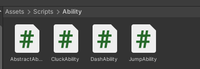

# Chicken Chaser CM 3 - Abstract Abilities

---
## Final Result


* [3.1) Abstract Ability](#31-abstract-ability)
    * [3.1a) What does every ability HAVE?](#31a-what-does-every-ability-have)
    * [3.1b) What CAN every ability DO?](#31b-what-can-every-ability-do)
    * [3.1c) Making safe functions](#31c-making-safe-functions)
    * [3.1d) Filling out the other functions](#31d-filling-out-the-other-functions)


* [3.2) Applying Abilities](#32-applying-abilities)
    * [3.2a) Chicken Ground Check](#32a-chicken-ground-check)
    * [3.2b) Player Speed Limit](#32b-player-speed-limit)
    * [3.2c) Polymorphic Abilities](#32c-polymorphic-abilities)


* [3.3) Jump [Optional]](#33-jump-optional)


* [3.4) Cluck [Optional]](#34-cluck-optional)
  


* [3.5) Dash [Optional]](#35-dash-optional)


* [3.6) Apply and Bind Abilities](#36-apply-and-bind-abilities)


* [End Results](#end-results)
    * [AbstractAbility.cs](#abstractabilitycs)
    * [Chicken.cs](#chickencs)
    * [PlayerChicken.cs](#playerchickencs)
    * [JumpAbility.cs [COMPLETE]](#jumpabilitycs-complete)
    * [CluckAbility.cs [COMPLETE]](#cluckabilitycs-complete)
    * [DashAbility.cs [COMPLETE]](#dashabilitycs-complete)

---
## 3.1) Abstract Ability

As will be continuously emphasized throughout this course, being a good programmer is about creating re-usable and flexible code. While there may be other, faster ways to make the following logic, 
this approach of abstraction allows us to create simple logic that can be reused in many contexts.

    Start by allowing students to create the following files with an abstract base in the Assets->Scripts->Ability folder:

- Ability Folder
- [AbstractAbility.cs](../Assets/Scripts/Ability/AbstractAbility.cs) (Abstract class)
- [JumpAbility.cs](../Assets/Scripts/Ability/JumpAbility.cs) (child of AbstractAbility)
- [CluckAbility.cs](../Assets/Scripts/Ability/CluckAbility.cs) (child of AbstractAbility)
- [DashAbility.cs](../Assets/Scripts/Ability/DashAbility.cs) (child of AbstractAbility)



Then delete all the code besides for the class.

[AbstractAbility.cs](../Assets/Scripts/Ability/AbstractAbility.cs) 
```csharp
using UnityEngine;

//NOTE: abstract class
public abstract class AbstractAbility : MonoBehaviour
{
    
}
```

[JumpAbility.cs](../Assets/Scripts/Ability/JumpAbility.cs) (child of AbstractAbility)
```csharp
//NOTE Child of AbstractAbility, not MonoBehaviour
public class JumpAbility : AbstractAbility 
{
    
}
```

[CluckAbility.cs](../Assets/Scripts/Ability/CluckAbility.cs) (child of AbstractAbility)
```csharp
//NOTE Child of AbstractAbility, not MonoBehaviour
public class CluckAbility : AbstractAbility
{
    
}
```

[DashAbility.cs](../Assets/Scripts/Ability/DashAbility.cs) (child of AbstractAbility)
```csharp
//NOTE Child of AbstractAbility, not MonoBehaviour
public class DashAbility : AbstractAbility
{
  
}
```

### 3.1a) What does every ability HAVE?
When creating new systems, it's important to clear what every ability MUST HAVE so that we can create a set of variables.

Allow students to make contributions and add variables.


NOTE: Many variables here are private rather than protected. This will be explained further in 3.1C, but it's because we want this class to drive logic, and the children to be remote.
[AbstractAbility.cs](../Assets/Scripts/Ability/AbstractAbility.cs) 
```csharp
using UnityEngine;

public abstract class AbstractAbility : MonoBehaviour
{
    //We need to know how we appear visually
    [SerializeField] private Sprite icon;
    
    //We need to know how we function
    [SerializeField] private float cooldown;
    [SerializeField] private bool canBeHeld;
    
    //We need to who we belong to
    protected Chicken Owner;
    
    //We need to know what animations to control
    protected Animator AnimatorController;
    
    //We need to track our state
    private bool _isReady = true; // Default to true because we should start as ready.
    private bool _isBeingHeld;
    private float _currentCooldownTime;
}
```

### 3.1b) What CAN every ability DO?

When creating new systems, it's important to clear what every ability CAN DO so that we can create a set of functions.

Allow students to make contributions and add functions.

[AbstractAbility.cs](../Assets/Scripts/Ability/AbstractAbility.cs)
```csharp
using System.Collections;
using UnityEngine;

public abstract class AbstractAbility : MonoBehaviour
{
    //We need to know how we appear visually
    [SerializeField] private Sprite icon;
    
    //We need to know how we function
    [SerializeField] private float cooldown;
    [SerializeField] private bool canBeHeld;
    
    //We need to who we belong to
    protected Chicken Owner;
    
    //We need to know what animations to control
    protected Animator AnimatorController;
    
    //We need to track our state
    private bool _isReady = true; // Default to true because we should start as ready.
    private bool _isBeingHeld;
    private float _currentCooldownTime;
    
    //----------------------ADDED------------------------------//
    //Getter Functions so we can access data in other files
    public Sprite GetIcon()
    {
        return icon;
    }

    public float GetCooldownPercent()
    {
        return _currentCooldownTime / cooldown;
    }

    private bool IsTriggerAnimation()
    {
        //Edited later
        return false;
    }

    private bool IsBooleanAnimation()
    {
        //Edited later
        return false;
    }
    
    // Base Functionality
    private void Start()
    {
        //Use start because we don't own these components
        Owner = GetComponentInParent<Chicken>();
        AnimatorController = GetComponentInChildren<Animator>();
    }

    //IEnumerators are timer functions
    private IEnumerator BeginCooldown()
    {
        yield return null;
    }

    //Accessibility functions
    public void StartUsingAbility()
    {
        
    }

    public void StopUsingAbility()
    {
        
    }
    //----------------------------------------------------//
}
```

### 3.1c) Making safe functions

Next, we want to create functions that give abilities functionality, HOWEVER there are two issues:
1) We don't know what functionality there should be, nor should we assume
2) We want to have total control over logic flow

In order to best fit these needs, we can make more functions, then activate them when we're ready, and thanks to abstraction, 
we can force future abilities to do these things.

```csharp
using System.Collections;
using UnityEngine;

public abstract class AbstractAbility : MonoBehaviour
{
    //We need to know how we appear visually
    [SerializeField] private Sprite icon;
    
    //We need to know how we function
    [SerializeField] private float cooldown;
    [SerializeField] private bool canBeHeld;
    
    //We need to who we belong to
    protected Chicken Owner;
    
    //We need to know what animations to control
    protected Animator AnimatorController;
    
    //We need to track our state
    private bool _isReady = true; // Default to true because we should start as ready.
    private bool _isBeingHeld;
    private float _currentCooldownTime;
    
    //Getter Functions so we can access data in other files
    public Sprite GetIcon()
    {
        return icon;
    }

    public float GetCooldownPercent()
    {
        return _currentCooldownTime / cooldown;
    }

    private bool IsTriggerAnimation()
    {
        //Edited later
        return false;
    }

    private bool IsBooleanAnimation()
    {
        //Edited later
        return false;
    }
    
    // Base Functionality
    private void Start()
    {
        //Use start because we don't own these components
        Owner = GetComponentInParent<Chicken>();
        AnimatorController = GetComponentInChildren<Animator>();
    }

    //IEnumerators are timer functions
    private IEnumerator BeginCooldown()
    {
        yield return null;
    }

    //Accessibility functions
    public void StartUsingAbility()
    {
        
    }

    public void StopUsingAbility()
    {
        
    }
//--------------------- added ----------------------  
    //Modified in Child Classes
    public virtual bool CanActivate()
    {
        return true;
    }

    public virtual void ForceCancelAbility()
    {
        
    }
    
    protected virtual int AbilityBoolID()
    {
        return 0;
    }

    protected virtual int AbilityTriggerID()
    {
        return 0;
    }

    protected abstract void Activate();
//---------------------------------------------------
}
```

### 3.1d) Filling out the other functions

First, let's handle the animation logic. 
The AbilityID functions are used to return the animation hash, 
which is something that will exist in [StaticUtilities.cs](../Assets/Scripts/Utilities/StaticUtilities.cs)
All we need to do to prepare our animations for now, 
is modify the boolean check functions

in [AbstractAbility.cs](../Assets/Scripts/Ability/AbstractAbility.cs)
```csharp
private bool IsTriggerAnimation()
{
    //MODIFIED
    return AbilityTriggerID() != 0;
}

private bool IsBooleanAnimation()
{
    //MODIFIED
    return AbilityBoolID() != 0;
}
```

Next, let's do the Start and Stop using functions.

In both, toggle is holding and the animation state respectively to true or false.
Then in start using, call the UpdateLoop function

still in [AbstractAbility.cs](../Assets/Scripts/Ability/AbstractAbility.cs)
```csharp
//Accessibility functions
    public void StartUsingAbility()
    {
        //-------Added-------//
        _isBeingHeld = true;
        //Only start if we're ready... If we're not ready, then a loop must be running still
        if(_isReady) StartCoroutine(BeginCooldown());
        if(IsBooleanAnimation()) AnimatorController.SetBool(AbilityBoolID(), true);
        //--------------------//
    }

    public void StopUsingAbility()
    {
        //--------Added-------//
        _isBeingHeld = false;
        if(IsBooleanAnimation()) AnimatorController.SetBool(AbilityBoolID(), false);
        //--------------------//
    }
```

Next, let's process the update loop

in [AbstractAbility.cs](../Assets/Scripts/Ability/AbstractAbility.cs) 
```csharp
//IEnumerators are timer functions
    private IEnumerator BeginCooldown()
    {
        //--------------------- ADDED -----------------//
        do
        {
            //Wait until we can activate  (This can be optimized by caching the WaitUntil)
            yield return new WaitUntil(CanActivate);
            
            //If we've let go, then we should leave the loop
            if(!_isBeingHeld) yield break; 
           
            //Activate and Animate
            Activate();
            if(IsTriggerAnimation()) AnimatorController.SetTrigger(AbilityTriggerID());
            
            //Refresh the cooldown
            _currentCooldownTime = 0;
            _isReady = false;
            
            while (_currentCooldownTime < cooldown)
            {
                _currentCooldownTime += Time.deltaTime;
                //Wait until the next frame
                yield return null;
            }

            //Mark as ready, and set the currentTime to cooldownTime so that it's 100%
            _currentCooldownTime = cooldown;
            _isReady = true;
            
            //If we're still holding and we can be held, then repeat the loop
        } while (_isBeingHeld && canBeHeld);

        StopUsingAbility();
        //-----------------------------------------//
    }
```

Finally, let's define the default activate rule, 
and what should happen if we need to cancel the ability

[AbstractAbility.cs](../Assets/Scripts/Ability/AbstractAbility.cs)
```csharp
public virtual bool CanActivate()
{
    //NOTE: we don't need to return the time, because they're updated together
    return _isReady;
}

public virtual void ForceCancelAbility()
{
    _currentCooldownTime = cooldown;
    _isReady = true;
    StopAllCoroutines();
    StopUsingAbility();
}
```

## 3.2) Applying Abilities

### 3.2a) Chicken Ground Check

First, we actually need to go back and fill out some logic that will aid us later.

in [Chicken.cs](../Assets/Scripts/Characters/Chicken/Chicken.cs)

NOTE: We grab the surface normals here so that later we can move up slopes easier, or make custom logic so jumping can be slope based.


We then can project the movement direction onto the surface normal to calculate a better movement direction which will make sloped movement smoother
There are no good images of this, but you can use debug lines to test it.

```csharp
using System.Collections;
using System.Collections.Generic;
using UnityEngine;
using Utilities;

public abstract class Chicken : MonoBehaviour
{
    [Header("Movement")]
    [SerializeField] protected float speed;
    [SerializeField] protected float maxSpeed;
    
    [Header("Foot Management")] 
    [SerializeField] protected float footRadius;
    [SerializeField] protected float footDistance;

    [Header("Objects")] 
    [SerializeField] protected Transform head;
    //-------------------- ADDED ----------------------------//
    [SerializeField] protected Transform foot;
    //--------------------------------------------------------//
    protected Rigidbody PhysicsBody;
    protected Animator AnimatorController;
    protected bool IsGrounded;
    
    //-------------------- ADDED ----------------------------//
    protected float currentSpeed;
    protected float currentFallTIme;
    protected Vector3 slopeNormal;
    //---------------------------------------------------//
    
    protected virtual void Awake()
    {
        PhysicsBody = GetComponent<Rigidbody>();
        AnimatorController = GetComponentInChildren<Animator>();
    }

    private void FixedUpdate()
    {
        HandleGroundState();
        HandleMovement();
        HandleAnims();
    }


    private void HandleGroundState()
    {
        //-------------------- ADDED ----------------------------//
        
        //We're going to spherecast downwards, and detect if we've hit the floor.
        //Basic Spherecast check, NOTE: StaticUtilites.GroundLayers helps the code know which layers to look at for floors.
        // Preventing players from registering grounded on illegal objects.
        bool newGroundedState = Physics.SphereCast(foot.position, footRadius, Vector3.down, out RaycastHit slope, footDistance, StaticUtilities.GroundLayers);
       
        //If the ground state is different
        if (newGroundedState != IsGrounded)
        {
            //We should enter that state
            IsGrounded = newGroundedState;
            //Then we should update our grounded state.
            AnimatorController.SetBool(StaticUtilities.IsGroundedAnimID, IsGrounded);

            //If we were falling
            if (currentFallTIme >= 0)
            {
                //Handle Landing
                HandleLanding();
                currentFallTIme = 0;
            }
        }

        //If we're not grounded then update the air time
        if (!IsGrounded) currentFallTIme += Time.deltaTime;
        //If we are grounded keep track of the slope normal so that Movement is smoother.
        else slopeNormal = slope.normal;
        //-------------------------------------------------------//
    }

    protected virtual void HandleLanding()
    {
        
    }

    protected virtual void HandleAnims()
    {
        //MODIFIED (use currentSpeed instead)
        AnimatorController.SetFloat(StaticUtilities.MoveSpeedAnimID, currentSpeed);
    }

    protected abstract void HandleMovement();
    
    public abstract void OnFreedFromCage();
    public abstract void OnEscaped(Vector3 position);
    public abstract void OnCaptured();
    
    //-------------------- ADDED ----------------------------//
    public bool GetIsGrounded()
    {
        return IsGrounded;
    }
    public float GetCurrentSpeed()
    {
        return currentSpeed;
    }
    public Vector3 GetLookDirection()
    {
        return head.forward;
    }
    //-------------------------------------------------------//
}

```

### 3.2b) Player Speed Limit

We also should add a speed limiter to the chickens, however because the player moves via RigidBody and the AI will not, we'll put this code exclusively in player.

in [PlayerChicken.cs](../Assets/Scripts/Characters/Chicken/PlayerChicken.cs)

```csharp
using System;
using System.Collections;
using System.Collections.Generic;
using UnityEngine;

public class PlayerChicken : Chicken
{
    private Vector3 _moveDirection;
    private Vector2 _lookDirection;
    
    [Header("Looking")] 
    [SerializeField , Range(0,90)] private float pitchLimit;
    [SerializeField, Range(0,180)] private float yawLimit;
    [SerializeField] private float lookSpeed;

    [Header("Abilities")]
    [SerializeField] private AbstractAbility jumpAbility;
    [SerializeField] private AbstractAbility cluckAbility;
    [SerializeField] private AbstractAbility dashAbility;
    
    protected override void Awake()
    {
        base.Awake();
        PlayerControls.Initialize(this);
        PlayerControls.UseGameControls();
    }
    private void OnDisable()
    {
        PlayerControls.DisablePlayer();  
        jumpAbility.ForceCancelAbility();
        cluckAbility.ForceCancelAbility();
        dashAbility.ForceCancelAbility();
    }

    protected override void HandleMovement()
    {
        //-------------------------------ADDED-----------------------------//
        Vector3 direction = _moveDirection;
        if (IsGrounded)
        {
            //If we're grounded, then the direction we want to move should be projected onto the plane.
            //Doing this will help us move up steep slopes easier.
            direction = Vector3.ProjectOnPlane(_moveDirection, slopeNormal);
        }
        //------------------------------------------------------------------//
        
        PhysicsBody.AddForce(transform.rotation * direction * speed, ForceMode.Acceleration);

         //-------------------------------ADDED-----------------------------//
        //Note: we don't care about falling speed, only XZ speed.
        Vector2 horizontalVelocity = new Vector2(PhysicsBody.velocity.x, PhysicsBody.velocity.z);
        currentSpeed = horizontalVelocity.magnitude; 

        //Check if our speed is exceeding the max speed
        if (currentSpeed > maxSpeed)
        {
            horizontalVelocity = horizontalVelocity.normalized * maxSpeed;
            //Limit the speed, but be sure to keep the gravity speed.
            PhysicsBody.velocity = new Vector3(horizontalVelocity.x, PhysicsBody.velocity.y, horizontalVelocity.y);
            
            //Lock the speed to prevent weird bugs
            currentSpeed = maxSpeed;
        }
        //------------------------------------------------------------------//
        HandleLooking();
    }

    public override void OnFreedFromCage()
    {
        
    }

    public override void OnEscaped(Vector3 position)
    {
        
    }

    public override void OnCaptured()
    {
        
    }

    public void SetDashState(bool state)
    {
        if(state) dashAbility.StartUsingAbility();
        else dashAbility.StopUsingAbility();
    }

    public void SetCluckState(bool state)
    {
        if(state) cluckAbility.StartUsingAbility();
        else cluckAbility.StopUsingAbility();
    }

    public void SetJumpState(bool state)
    {
        if(state) jumpAbility.StartUsingAbility();
        else jumpAbility.StopUsingAbility();
    }

    public void SetMoveDirection(Vector2 direction)
    {
        //In unity, Y is up, so we need to convert to vector3, and have WS affect the forward (Z) axis.
        _moveDirection = new Vector3(direction.x, 0, direction.y);
    }

    public void SetLookDirection(Vector2 direction)
    {
        _lookDirection = direction;
    }

    private void HandleLooking()
    {
        //Caching the Time.deltaTime is important if you're using it more than once. It saves RAM.
        float timeShift = Time.deltaTime;
        float pitchChange = head.localEulerAngles.x - lookSpeed * _lookDirection.y * timeShift;
        float yawChange = transform.localEulerAngles.y + lookSpeed * _lookDirection.x * timeShift;
        
        //Apply limits so we don't Gimbal Lock ourselves
        // (Quaternion rotation would correct this but this does the job)
        if (pitchChange > pitchLimit && pitchChange < 180) pitchChange = pitchLimit;
        else if (pitchChange < 360-pitchLimit && pitchChange > 180) pitchChange = -pitchLimit;
        if (yawChange > yawLimit && yawChange < 180) yawChange = yawLimit;
        else if (yawChange < 360-yawLimit && yawChange > 180) yawChange = -yawLimit;

        //Apply the modifications to each part, be sure to use LOCAL euler angles, so that other systems work correctly.
        transform.localEulerAngles = new Vector3(0, yawChange, 0);
        head.localEulerAngles = new Vector3(pitchChange, 0, 0);
    }
}

```

### 3.2c) Polymorphic Abilities

Next to allow our characters to use these functions. We're making the assumption in this instance that only the player will use abilities.
However, the logic will easily support the AI being able to use this as well if you wanted to add stuff into ``AIChicken`` or ``Chicken`` directly

in [PlayerChicken.cs](../Assets/Scripts/Characters/Chicken/PlayerChicken.cs)

```csharp
using System;
using System.Collections;
using System.Collections.Generic;
using UnityEngine;

public class PlayerChicken : Chicken
{
    private Vector3 _moveDirection;
    private Vector2 _lookDirection;
    
    [Header("Looking")] 
    [SerializeField , Range(0,90)] private float pitchLimit;
    [SerializeField, Range(0,180)] private float yawLimit;
    [SerializeField] private float lookSpeed;

    //-----------ADDED-----------//
    [Header("Abilities")]
    [SerializeField] private AbstractAbility jumpAbility;
    [SerializeField] private AbstractAbility cluckAbility;
    [SerializeField] private AbstractAbility dashAbility;
    //-------------------------//
    
    protected override void Awake()
    {
        base.Awake();
        PlayerControls.Initialize(this);
        PlayerControls.UseGameControls();
    }
    private void OnDisable()
    {
        PlayerControls.DisablePlayer();  
        
        //-----------ADDED-----------//
        jumpAbility.ForceCancelAbility();
        cluckAbility.ForceCancelAbility();
        dashAbility.ForceCancelAbility();
         //-------------------------//
    }

    protected override void HandleMovement()
    {
        Vector3 direction = _moveDirection;
        if (IsGrounded)
        {
             //If we're grounded, then the direction we want to move should be projected onto the plane.
            //Doing this will help us move up steep slopes easier.
            direction = Vector3.ProjectOnPlane(_moveDirection, slopeNormal);
        }
            
        PhysicsBody.AddForce(transform.rotation * direction * speed, ForceMode.Acceleration);

        //Note: we don't care about falling speed, only XZ speed.
        Vector2 horizontalVelocity = new Vector2(PhysicsBody.velocity.x, PhysicsBody.velocity.z);
        currentSpeed = horizontalVelocity.magnitude; 

        //Check if our speed is exceeding the max speed
        if (currentSpeed > maxSpeed)
        {
            horizontalVelocity = horizontalVelocity.normalized * maxSpeed;
            //Limit the speed, but be sure to keep the gravity speed.
            PhysicsBody.velocity = new Vector3(horizontalVelocity.x, PhysicsBody.velocity.y, horizontalVelocity.y);
            
            //Lock the speed to prevent weird bugs
            currentSpeed = maxSpeed;
        }
        
        HandleLooking();
    }

    public override void OnFreedFromCage()
    {
        
    }

    public override void OnEscaped(Vector3 position)
    {
        
    }

    public override void OnCaptured()
    {
        
    }

    public void SetDashState(bool state)
    {
        //-----------ADDED-----------//
        if(state) dashAbility.StartUsingAbility();
        else dashAbility.StopUsingAbility();
        //-------------------------//
    }

    public void SetCluckState(bool state)
    {
        //-----------ADDED-----------//
        if(state) cluckAbility.StartUsingAbility();
        else cluckAbility.StopUsingAbility();
         //-------------------------//
    }

    public void SetJumpState(bool state)
    {
        //-----------ADDED-----------//
        if(state) jumpAbility.StartUsingAbility();
        else jumpAbility.StopUsingAbility();
         //-------------------------//
    }

    public void SetMoveDirection(Vector2 direction)
    {
        //In unity, Y is up, so we need to convert to vector3, and have WS affect the forward (Z) axis.
        _moveDirection = new Vector3(direction.x, 0, direction.y);
    }

    public void SetLookDirection(Vector2 direction)
    {
        _lookDirection = direction;
    }

    private void HandleLooking()
    {
        //Caching the Time.deltaTime is important if you're using it more than once. It saves RAM.
        float timeShift = Time.deltaTime;
        float pitchChange = head.localEulerAngles.x - lookSpeed * _lookDirection.y * timeShift;
        float yawChange = transform.localEulerAngles.y + lookSpeed * _lookDirection.x * timeShift;
        
        //Apply limits so we don't Gimbal Lock ourselves
        // (Quaternion rotation would correct this but this does the job)
        if (pitchChange > pitchLimit && pitchChange < 180) pitchChange = pitchLimit;
        else if (pitchChange < 360-pitchLimit && pitchChange > 180) pitchChange = -pitchLimit;
        if (yawChange > yawLimit && yawChange < 180) yawChange = yawLimit;
        else if (yawChange < 360-yawLimit && yawChange > 180) yawChange = -yawLimit;

        //Apply the modifications to each part, be sure to use LOCAL euler angles, so that other systems work correctly.
        transform.localEulerAngles = new Vector3(0, yawChange, 0);
        head.localEulerAngles = new Vector3(pitchChange, 0, 0);
    }
}

```

## 3.3) Jump [Optional]
This ability is an example of an ability, make whatever abilities students want that can be done in a reasonable time, best if they can do it themselves.

Jump is the easiest ability.

in [JumpAbility.cs](../Assets/Scripts/Ability/JumpAbility.cs)

```csharp
using UnityEngine;
using Utilities;

//Forces us to have a RigidBody on us
[RequireComponent(typeof(Rigidbody))]
public class JumpAbility : AbstractAbility 
{
    [Header("Jump")] 
    [SerializeField] private float jumpForce;

    private Rigidbody _physicsBody;

    private void Awake()
    {
        //We need access to a rigidbody to jump
        _physicsBody = GetComponent<Rigidbody>();
    }

    protected override void Activate()
    {
        //Apply upwards velocity to ourselves. Impulse means instant
        _physicsBody.AddForce(Vector3.up * jumpForce, ForceMode.Impulse);
    }

    protected override int AbilityTriggerID()
    {
        return StaticUtilities.JumpAnimID;
    }

    public override bool CanActivate()
    {
        //We can only just if we're on the floor
        return Owner.GetIsGrounded() && base.CanActivate();
    }
}
```

## 3.4) Cluck [Optional]

This ability is an example of an ability, make whatever abilities students want that can be done in a reasonable time, best if they can do it themselves.

Cluck is a moderate difficulty ability.

in [CluckAbility.cs](../Assets/Scripts/Ability/CluckAbility.cs)

```csharp
using AI;
using ScriptableObjects;
using UnityEngine;
using Utilities;

public class CluckAbility : AbstractAbility
{
    //We need access to some variables which may or may not exist...
    //If they don't then we need to add them manually
    [SerializeField] private ParticleSystem cluckParticle;
    [SerializeField] private AudioClip cluckSound;

    //An audio source allows us to play audio
    private const float AudioVolume = 0.3f;
    private AudioSource _source;
    
    private void Awake()
    {
        _source = GetComponentInChildren<AudioSource>();
    }

    protected override void Activate()
    {
        cluckParticle.Play();
        _source.pitch = Random.Range(0.8f, 1.2f);
        _source.PlayOneShot(cluckSound, SettingsManager.currentSettings.SoundVolume * AudioVolume);
        AudioDetection.onSoundPlayed.Invoke(transform.position, 10, 20, EAudioLayer.ChickenEmergency);
    }

    public override bool CanActivate()
    {
        //Must be moving, or barely.
        return Owner.GetCurrentSpeed() < 1.0f && base.CanActivate();
    }

    protected override int AbilityTriggerID()
    {
        return StaticUtilities.JumpAnimID;
    }

    protected override int AbilityBoolID()
    {
        return StaticUtilities.CluckAnimID;
    } 
}

```

## 3.5) Dash [Optional]

This ability is an example of an ability, make whatever abilities students want that can be done in a reasonable time, best if they can do it themselves.

Dash is the hardest ability.

in [DashAbility.cs](../Assets/Scripts/Ability/DashAbility.cs)

```csharp
using System.Collections;
using UnityEngine;
using Utilities;

[RequireComponent(typeof(Rigidbody))]
public class DashAbility : AbstractAbility
{
  [Header("Dash")] 
        [SerializeField] private float dashDistance;
        [SerializeField] private float dashDuration;

        [Header("Effects")]
        [SerializeField] private ParticleSystem feathers;
        
        private Rigidbody _rb;
        private bool _canDash = true;
        private float _radius;

        private const int numSamples = 10;
        private static readonly Vector3 maxVerical = new Vector3(0,1,0);
        
        private void Awake()
        {
            _rb = GetComponent<Rigidbody>();
            SphereCollider c = GetComponentInChildren<SphereCollider>();
            _radius = c.radius * c.transform.lossyScale.x;
        }
    
        private IEnumerator ActivateAbility(Vector3 direction)
        {
            //Do not dash upwards.
            direction = new Vector3(direction.x, 0, direction.z) * dashDistance;
            _canDash = false;
            
            //Find the highest point on a slope
            Vector3 origin = transform.position;
            float yMax = 0;
            Vector3 start = origin + maxVerical;
            for (int i = 0; i < numSamples; ++i)
            {
                float percent = (float)i / numSamples;
                if (Physics.Raycast(start + direction * percent, Vector3.down,
                        out RaycastHit targetHit,
                        dashDistance, StaticUtilities.VisibilityLayer))
                {
                    Debug.DrawRay(start + direction * percent,Vector3.down *  dashDistance,(targetHit.point.y > yMax)?Color.green:Color.red, 3 );
                    if (targetHit.point.y > yMax) yMax = targetHit.point.y;
                }
                else
                {
                    Debug.DrawRay(start + direction * percent,Vector3.down *  dashDistance,Color.red, 3 );
                }
            }

            // Make sure going upwards actually makes sense by subtracting the goal Y from the current y. Then add back the radius, so we have the true end point.
            float d = yMax - origin.y + _radius *2;
            //If it was negative, or 0 just go forward. else, set the target D
            if(d > 0) direction.y = d; 
            
            direction = direction.normalized;
            
            // Face the opposite direction of ourselves.
            feathers.transform.forward = -direction; 
            feathers.Play();
            
            Vector3 endPoint =
                Physics.SphereCast(origin, _radius, direction, out RaycastHit hit, dashDistance, StaticUtilities.VisibilityLayer)
                    ?  hit.point + hit.normal * (_radius*2)
                    : direction * dashDistance + transform.position;
            Debug.DrawLine(origin, endPoint, Color.magenta, 5);
            float curTime = 0;
            //Lock the rigidbody physics
            _rb.isKinematic = true;
            while (curTime < dashDuration) 
            {
                curTime += Time.deltaTime;
                transform.position = Vector3.Lerp(transform.position, endPoint, curTime/dashDuration);
                yield return null;
            }
            transform.position = Vector3.Lerp(transform.position, endPoint, 1);
            //Unlock the rigidbody physics
            _rb.isKinematic = false;
            feathers.Stop();
            _canDash = true;
            
        }


        public override bool CanActivate()
        {
            //Partially redundant, but you can have an additional cooldown this way.
            return _canDash && base.CanActivate();
        }

        protected override void Activate()
        {
            StartCoroutine(ActivateAbility(Owner.GetLookDirection()));
        }


        private void OnDrawGizmosSelected()
        {
            SphereCollider c = GetComponentInChildren<SphereCollider>();
            _radius = c.radius * c.transform.lossyScale.x;
            
            Gizmos.color = Color.yellow;
            GizmosExtras.DrawWireSphereCast(transform.position, transform.forward, dashDistance, _radius);
        }

        public override void ForceCancelAbility()
        {
            base.ForceCancelAbility();
            feathers.Stop();
        }

        protected override int AbilityTriggerID()
        {
            return StaticUtilities.DashAnimID;
        } 
}
```
## 3.6) Apply and Bind Abilities

Finally, back in Unity, let's apply the abilities to the Player. 
Navigate to the prefab and add each component with the following values:


## End Results


### [AbstractAbility.cs](../Assets/Scripts/Ability/AbstractAbility.cs)
```csharp
using System.Collections;
using UnityEngine;

public abstract class AbstractAbility : MonoBehaviour
{
    //We need to know how we appear visually
    [SerializeField] private Sprite icon;
    
    //We need to know how we function
    [SerializeField] private float cooldown;
    [SerializeField] private bool canBeHeld;
    
    //We need to who we belong to
    protected Chicken Owner;
    
    //We need to know what animations to control
    protected Animator AnimatorController;
    
    //We need to track our state
    private bool _isReady = true; // Default to true because we should start as ready.
    private bool _isBeingHeld;
    private float _currentCooldownTime;
    
    //Getter Functions so we can access data in other files
    public Sprite GetIcon()
    {
        return icon;
    }

    public float GetCooldownPercent()
    {
        return _currentCooldownTime / cooldown;
    }

    private bool IsTriggerAnimation()
    {
        return AbilityTriggerID() != 0;
    }

    private bool IsBooleanAnimation()
    {
        return AbilityBoolID() != 0;
    }
    
    // Base Functionality
    private void Start()
    {
        //Use start because we don't own these components
        Owner = GetComponentInParent<Chicken>();
        AnimatorController = GetComponentInChildren<Animator>();
    }

    //IEnumerators are timer functions
    private IEnumerator BeginCooldown()
    {
        do
        {
            //Wait until we can activate
            yield return new WaitUntil(CanActivate);
            
            //If we've let go, then we should leave the loop
            if(!_isBeingHeld) yield break; 
           
            //Activate and Animate
            Activate();
            if(IsTriggerAnimation()) AnimatorController.SetTrigger(AbilityTriggerID());
            
            //Refresh the cooldown
            _currentCooldownTime = 0;
            _isReady = false;
            
            while (_currentCooldownTime < cooldown)
            {
                _currentCooldownTime += Time.deltaTime;
                //Wait until the next frame
                yield return null;
            }

            //Mark as ready, and set the currentTime to cooldownTime so that it's 100%
            _currentCooldownTime = cooldown;
            _isReady = true;
            
            //If we're still holding and we can be held, then repeat the loop
        } while (_isBeingHeld && canBeHeld);

        StopUsingAbility();
    }

    //Accessibility functions
    public void StartUsingAbility()
    {
        _isBeingHeld = true;
        //Only start if we're ready... If we're not ready, then a loop must be running still
        if(_isReady) StartCoroutine(BeginCooldown());
        if(IsBooleanAnimation()) AnimatorController.SetBool(AbilityBoolID(), true);
    }

    public void StopUsingAbility()
    {
        _isBeingHeld = false;
        if(IsBooleanAnimation()) AnimatorController.SetBool(AbilityBoolID(), false);
    }
    
    //Modified in Child Classes
    public virtual bool CanActivate()
    {
        //NOTE: we don't need to return the time, because they're updated together
        return _isReady;
    }

    public virtual void ForceCancelAbility()
    {
        _currentCooldownTime = cooldown;
        _isReady = true;
        StopAllCoroutines();
        StopUsingAbility();
    }
    
    protected virtual int AbilityBoolID()
    {
        return 0;
    }

    protected virtual int AbilityTriggerID()
    {
        return 0;
    }

    protected abstract void Activate();

}
```
###  [Chicken.cs](../Assets/Scripts/Characters/Chicken/Chicken.cs)
```csharp
using System.Collections;
using System.Collections.Generic;
using UnityEngine;
using Utilities;

public abstract class Chicken : MonoBehaviour
{
    [Header("Movement")]
    [SerializeField] protected float speed;
    [SerializeField] protected float maxSpeed;
    
    [Header("Foot Management")] 
    [SerializeField] protected float footRadius;
    [SerializeField] protected float footDistance;

    [Header("Objects")] 
    [SerializeField] protected Transform head;
    [SerializeField] protected Transform foot;
    
    protected Rigidbody PhysicsBody;
    protected Animator AnimatorController;
    protected bool IsGrounded;
    
    protected float currentSpeed;
    protected float currentFallTIme;
    protected Vector3 slopeNormal;
    
    protected virtual void Awake()
    {
        PhysicsBody = GetComponent<Rigidbody>();
        AnimatorController = GetComponentInChildren<Animator>();
    }

    private void FixedUpdate()
    {
        HandleGroundState();
        HandleMovement();
        HandleAnims();
    }


    private void HandleGroundState()
    {
        //We're going to spherecast downwards, and detect if we've hit the floor.
        //Basic Spherecast check, NOTE: StaticUtilites.GroundLayers helps the code know which layers to look at for floors.
        // Preventing players from registering grounded on illegal objects.
        bool newGroundedState = Physics.SphereCast(foot.position, footRadius, Vector3.down, out RaycastHit slope, footDistance, StaticUtilities.GroundLayers);
       
        //If the ground state is different
        if (newGroundedState != IsGrounded)
        {
            //We should enter that state
            IsGrounded = newGroundedState;
            //Then we should update our grounded state.
            AnimatorController.SetBool(StaticUtilities.IsGroundedAnimID, IsGrounded);

            //If we were falling
            if (currentFallTIme >= 0)
            {
                //Handle Landing
                HandleLanding();
                currentFallTIme = 0;
            }
        }

        //If we're not grounded then update the air time
        if (!IsGrounded) currentFallTIme += Time.deltaTime;
        //If we are grounded keep track of the slope normal so that Movement is smoother.
        else slopeNormal = slope.normal;
    }

    protected virtual void HandleLanding()
    {
        
    }

    protected virtual void HandleAnims()
    {
        AnimatorController.SetFloat(StaticUtilities.MoveSpeedAnimID, currentSpeed);
    }

    protected abstract void HandleMovement();
    
    public abstract void OnFreedFromCage();
    public abstract void OnEscaped(Vector3 position);
    public abstract void OnCaptured();
    
    public bool GetIsGrounded()
    {
        return IsGrounded;
    }
    public float GetCurrentSpeed()
    {
        return currentSpeed;
    }
    public Vector3 GetLookDirection()
    {
        return head.forward;
    }
}
```
### [PlayerChicken.cs](../Assets/Scripts/Characters/Chicken/PlayerChicken.cs)
```csharp
using System;
using System.Collections;
using System.Collections.Generic;
using UnityEngine;

public class PlayerChicken : Chicken
{
    private Vector3 _moveDirection;
    private Vector2 _lookDirection;
    
    [Header("Looking")] 
    [SerializeField , Range(0,90)] private float pitchLimit;
    [SerializeField, Range(0,180)] private float yawLimit;
    [SerializeField] private float lookSpeed;

    [Header("Abilities")]
    [SerializeField] private AbstractAbility jumpAbility;
    [SerializeField] private AbstractAbility cluckAbility;
    [SerializeField] private AbstractAbility dashAbility;
    
    protected override void Awake()
    {
        base.Awake();
        PlayerControls.Initialize(this);
        PlayerControls.UseGameControls();
    }
    private void OnDisable()
    {
        PlayerControls.DisablePlayer();  
        jumpAbility.ForceCancelAbility();
        cluckAbility.ForceCancelAbility();
        dashAbility.ForceCancelAbility();
    }

    protected override void HandleMovement()
    {
        Vector3 direction = _moveDirection;
        if (IsGrounded)
        {
            //If we're grounded, then the direction we want to move should be projected onto the plane.
            //Doing this will help us move up steep slopes easier.
            direction = Vector3.ProjectOnPlane(_moveDirection, slopeNormal);
        }
            
        PhysicsBody.AddForce(transform.rotation * direction * speed, ForceMode.Acceleration);

        //Note: we don't care about falling speed, only XZ speed.
        Vector2 horizontalVelocity = new Vector2(PhysicsBody.velocity.x, PhysicsBody.velocity.z);
        currentSpeed = horizontalVelocity.magnitude; 

        //Check if our speed is exceeding the max speed
        if (currentSpeed > maxSpeed)
        {
            horizontalVelocity = horizontalVelocity.normalized * maxSpeed;
            //Limit the speed, but be sure to keep the gravity speed.
            PhysicsBody.velocity = new Vector3(horizontalVelocity.x, PhysicsBody.velocity.y, horizontalVelocity.y);
            
            //Lock the speed to prevent weird bugs
            currentSpeed = maxSpeed;
        }
        
        HandleLooking();
    }

    public override void OnFreedFromCage()
    {
        
    }

    public override void OnEscaped(Vector3 position)
    {
        
    }

    public override void OnCaptured()
    {
        
    }

    public void SetDashState(bool state)
    {
        if(state) dashAbility.StartUsingAbility();
        else dashAbility.StopUsingAbility();
    }

    public void SetCluckState(bool state)
    {
        if(state) cluckAbility.StartUsingAbility();
        else cluckAbility.StopUsingAbility();
    }

    public void SetJumpState(bool state)
    {
        if(state) jumpAbility.StartUsingAbility();
        else jumpAbility.StopUsingAbility();
    }

    public void SetMoveDirection(Vector2 direction)
    {
        //In unity, Y is up, so we need to convert to vector3, and have WS affect the forward (Z) axis.
        _moveDirection = new Vector3(direction.x, 0, direction.y);
    }

    public void SetLookDirection(Vector2 direction)
    {
        _lookDirection = direction;
    }

    private void HandleLooking()
    {
        //Caching the Time.deltaTime is important if you're using it more than once. It saves RAM.
        float timeShift = Time.deltaTime;
        float pitchChange = head.localEulerAngles.x - lookSpeed * _lookDirection.y * timeShift;
        float yawChange = transform.localEulerAngles.y + lookSpeed * _lookDirection.x * timeShift;
        
        //Apply limits so we don't Gimbal Lock ourselves
        // (Quaternion rotation would correct this but this does the job)
        if (pitchChange > pitchLimit && pitchChange < 180) pitchChange = pitchLimit;
        else if (pitchChange < 360-pitchLimit && pitchChange > 180) pitchChange = -pitchLimit;
        if (yawChange > yawLimit && yawChange < 180) yawChange = yawLimit;
        else if (yawChange < 360-yawLimit && yawChange > 180) yawChange = -yawLimit;

        //Apply the modifications to each part, be sure to use LOCAL euler angles, so that other systems work correctly.
        transform.localEulerAngles = new Vector3(0, yawChange, 0);
        head.localEulerAngles = new Vector3(pitchChange, 0, 0);
    }
}
```
### [JumpAbility.cs [COMPLETE]](../Assets/Scripts/Ability/JumpAbility.cs)
```csharp
using UnityEngine;
using Utilities;

//Forces us to have a RigidBody on us
[RequireComponent(typeof(Rigidbody))]
public class JumpAbility : AbstractAbility 
{
    [Header("Jump")] 
    [SerializeField] private float jumpForce;

    private Rigidbody _physicsBody;
    
    private void Awake()
    {
        //We need access to a rigidbody to jump
        _physicsBody = GetComponent<Rigidbody>();
    }

    protected override void Activate()
    {
        //Apply upwards velocity to ourselves. Impulse means instant
        _physicsBody.AddForce(Vector3.up * jumpForce, ForceMode.Impulse);
    }

    protected override int AbilityTriggerID()
    {
        return StaticUtilities.JumpAnimID;
    }

    public override bool CanActivate()
    {
        //We can only just if we're on the floor
        return Owner.GetIsGrounded() && base.CanActivate();
    }
}
```
### [CluckAbility.cs [COMPLETE]](../Assets/Scripts/Ability/CluckAbility.cs)
```csharp
using AI;
using ScriptableObjects;
using UnityEngine;
using Utilities;

public class CluckAbility : AbstractAbility
{
    //We need access to some variables which may or may not exist...
    //If they don't then we need to add them manually
    [SerializeField] private ParticleSystem cluckParticle;
    [SerializeField] private AudioClip cluckSound;

    //An audio source allows us to play audio
    private const float AudioVolume = 0.3f;
    private AudioSource _source;
    
    private void Awake()
    {
        _source = GetComponentInChildren<AudioSource>();
    }

    protected override void Activate()
    {
        cluckParticle.Play();
        _source.pitch = Random.Range(0.8f, 1.2f);
        _source.PlayOneShot(cluckSound, SettingsManager.currentSettings.SoundVolume * AudioVolume);
        AudioDetection.onSoundPlayed.Invoke(transform.position, 10, 20, EAudioLayer.ChickenEmergency);
    }

    public override bool CanActivate()
    {
        //Must be moving, or barely.
        return Owner.GetCurrentSpeed() < 1.0f && base.CanActivate();
    }

    protected override int AbilityTriggerID()
    {
        return StaticUtilities.JumpAnimID;
    }

    protected override int AbilityBoolID()
    {
        return StaticUtilities.CluckAnimID;
    } 
}

```
### [DashAbility.cs [COMPLETE]](../Assets/Scripts/Ability/DashAbility.cs)
```csharp
using System.Collections;
using UnityEngine;
using Utilities;

[RequireComponent(typeof(Rigidbody))]
public class DashAbility : AbstractAbility
{
  [Header("Dash")] 
        [SerializeField] private float dashDistance;
        [SerializeField] private float dashDuration;

        [Header("Effects")]
        [SerializeField] private ParticleSystem feathers;
        
        private Rigidbody _rb;
        private bool _canDash = true;
        private float _radius;

        private const int numSamples = 10;
        private static readonly Vector3 maxVerical = new Vector3(0,1,0);
        
        private void Awake()
        {
            _rb = GetComponent<Rigidbody>();
            SphereCollider c = GetComponentInChildren<SphereCollider>();
            _radius = c.radius * c.transform.lossyScale.x;
        }
    
        private IEnumerator ActivateAbility(Vector3 direction)
        {
            //Do not dash upwards.
            direction = new Vector3(direction.x, 0, direction.z) * dashDistance;
            _canDash = false;
            
            //Find the highest point on a slope
            Vector3 origin = transform.position;
            float yMax = 0;
            Vector3 start = origin + maxVerical;
            for (int i = 0; i < numSamples; ++i)
            {
                float percent = (float)i / numSamples;
                if (Physics.Raycast(start + direction * percent, Vector3.down,
                        out RaycastHit targetHit,
                        dashDistance, StaticUtilities.VisibilityLayer))
                {
                    Debug.DrawRay(start + direction * percent,Vector3.down *  dashDistance,(targetHit.point.y > yMax)?Color.green:Color.red, 3 );
                    if (targetHit.point.y > yMax) yMax = targetHit.point.y;
                }
                else
                {
                    Debug.DrawRay(start + direction * percent,Vector3.down *  dashDistance,Color.red, 3 );
                }
            }

            // Make sure going upwards actually makes sense by subtracting the goal Y from the current y. Then add back the radius, so we have the true end point.
            float d = yMax - origin.y + _radius *2;
            //If it was negative, or 0 just go forward. else, set the target D
            if(d > 0) direction.y = d; 
            
            direction = direction.normalized;
            
            // Face the opposite direction of ourselves.
            feathers.transform.forward = -direction; 
            feathers.Play();
            
            Vector3 endPoint =
                Physics.SphereCast(origin, _radius, direction, out RaycastHit hit, dashDistance, StaticUtilities.VisibilityLayer)
                    ?  hit.point + hit.normal * (_radius*2)
                    : direction * dashDistance + transform.position;
            Debug.DrawLine(origin, endPoint, Color.magenta, 5);
            float curTime = 0;
            //Lock the rigidbody physics
            _rb.isKinematic = true;
            while (curTime < dashDuration) 
            {
                curTime += Time.deltaTime;
                transform.position = Vector3.Lerp(transform.position, endPoint, curTime/dashDuration);
                yield return null;
            }
            transform.position = Vector3.Lerp(transform.position, endPoint, 1);
            //Unlock the rigidbody physics
            _rb.isKinematic = false;
            feathers.Stop();
            _canDash = true;
            
        }


        public override bool CanActivate()
        {
            //Partially redundant, but you can have an additional cooldown this way.
            return _canDash && base.CanActivate();
        }

        protected override void Activate()
        {
            StartCoroutine(ActivateAbility(Owner.GetLookDirection()));
        }


        private void OnDrawGizmosSelected()
        {
            SphereCollider c = GetComponentInChildren<SphereCollider>();
            _radius = c.radius * c.transform.lossyScale.x;
            
            Gizmos.color = Color.yellow;
            GizmosExtras.DrawWireSphereCast(transform.position, transform.forward, dashDistance, _radius);
        }

        public override void ForceCancelAbility()
        {
            base.ForceCancelAbility();
            feathers.Stop();
        }

        protected override int AbilityTriggerID()
        {
            return StaticUtilities.DashAnimID;
        } 
}

```