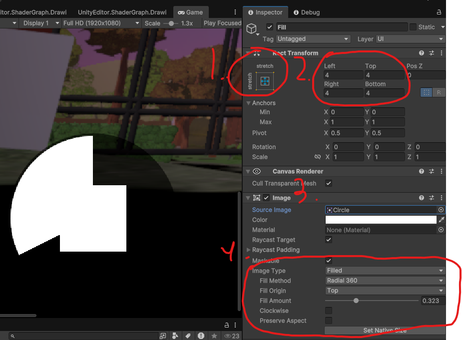

# Chicken Chaser CM 4 - HUD part 1

---
## Final Result


* [4.1) Creating UI in Unity](#41-creating-ui-in-unity)
    * [4.1a) Setting up a Canvas](#41a-setting-up-a-canvas)
    * [4.1b) Hierarchy](#41b-hierarchy)
    * [4.1c) Ability GameObject](#41c-ability-gameobject)
    * [4.1d) Fill GameObject](#41d-fill-gameobject)
    * [4.1e) Button GameObject](#41e-button-gameobject)
    * [4.1f) Icon GameObject](#41f-icon-gameobject)

* [4.2) Creating the scripts](#42-creating-the-scripts)

* [4.3) Attaching the scripts](#43-attaching-the-scripts)

* [End Results](#end-results)
    * [HudManager.cs](#hudmanagercs)
    * [PlayerChicken.cs](#playerchickencs)
    * [AbilityUIBind.cs [COMPLETE]](#abilityuibindcs-complete)

## [Model View Controller design Pattern](https://github.com/RealProgrammingInstructors/Shared-Content/blob/main/Content/Coding/ModelViewController.md)
## [Singleton](https://github.com/RealProgrammingInstructors/Shared-Content/blob/main/Content/Coding/Singleton.md)

---
## [Model View Controller design Pattern](https://github.com/RealProgrammingInstructors/Shared-Content/blob/main/Content/Coding/ModelViewController.md)

## 4.1) Creating UI in Unity

UI is very much in the eye of the beholder, but the goal of Chicken Chaser is to cover bases.

When working with UI, objects parent-child relationships are super important for organization and automation.
Pay close attention to the hierarchy as we add stuff.

Also generally when working with UI, I recommend being in split screen.


### 4.1a) Setting up a Canvas

Step one when working with UI is creating and modifying the canvas and event system.

    ENSURE the following

On the HUD canvas game object (found under UI), make sure the canvas scalar is set to a common resolution so the game scales nicely accross platforms. I've already done this for you, but when making your own you'll need to do this.


Next make sure the event system is correct. This is auto-generated when making UI, and enables multi-platform controls on UI objects.
The Event system can be found in the StaticWorld tab.


Finally in the gamew view, change the display to FULL HD 1920x1080 or some other 16x10 ratio because free aspect is awful.


### 4.1b) Hierarchy
1. Right click on  ``HUD Canvas`` (Found under UI) Create an image and rename it to ``Ability``


2. Right click on ``Ability`` and Create another image called ``Fill``

3. Right click on ``Ability`` and create another image called ``Button``

4. Right click on ``Button`` and create another image called ``Icon``

When done properly, it should look like this:


### 4.1c) Ability GameObject

NOTE: Each change is numbered reasoning below:


1. the Anchorage determines how the objects moves when the screen size scales. Attach to bottom left so it always stays bottom left.
2. The Position and Size are clearly the position and size... Choose numbers you feel are appropriate
3. Change the image to a Circle with a black semi-transparent color. (This is common practice for video game UI and helps the UI pop out without being too instrusive)

### 4.1d) Fill GameObject

NOTE: Each change is numbered reasoning below:



1. The Anchorage means FILL here, so we will always match the size of our parent
2. Our offsets from each side will create make the parent image look like a border
3. Make the image a circle (transparency optional)
4. Image type: Filled allows the image to render in many new ways with a % slider. Very useful for CoolDowns HealthBars and more. Every other setting is preference and arbitrary. Don't worry about the fill amount right now, but do notice its existence

### 4.1e) Button GameObject

NOTE: Each change is numbered reasoning below:


1. Again change the anchorage to fill, with a border.
2. Again make the button a circle, this is for contrast purposes (Add a color too so you can see each layer)
3. Add the Custom Button script. (This is a custom button that I created to provide touch screen support)
4. Change colors as desired (particularly the disabled color)

### 4.1f) Icon GameObject

NOTE: Each change is numbered reasoning below:


1. Anchor fill entirely (or will small border) so scale is always correct
2. Apply any image for debug purposes and mark it as ``Preserve Aspect`` so the scale is always correct


## 4.2) Creating the scripts

Next, we need to create the [HudManager.cs](../Assets/Scripts/Managers/HudManager.cs) in the Managers folder.

Then add the tag to the top [DefaultExecutionOrder(-1000)] so the script always executes first 
and replace Start with Awake as we're only accessing ourselves.
```csharp
using UnityEngine;

//Added
[DefaultExecutionOrder(-1000)]
public class HudManager : MonoBehaviour
{
    void Awake() 
    {
        
    }

    void Update() // (Leave blank for now)
    {
        
    }
}
```

Next, we need to create a bunch of variables. I've already provided a script: [AbilityUIBind.cs](../Assets/Scripts/UI/InGame/AbilityUIBind.cs) that will help later
let's 

Head over to the [AbilityUIBind.cs](../Assets/Scripts/UI/InGame/AbilityUIBind.cs) script, and uncomment everything

You will need to modify this script so it works with your code,
and you can take some time to read through it, but essentially the code is checking every frame for changes in its targeted ability, and because of the custom button script, it provides integration for "OnReleased" mobile support

```csharp
using UI;
using UnityEngine;
using UnityEngine.UI;

public class AbilityUIBind : MonoBehaviour
{
    
    [SerializeField] private CustomButton abilityButton;
    [SerializeField] private Image abilityFillBar;
    [SerializeField] private Image abilityIcon;
    
    //You may need to rename AbilityBase to AbstractAbility
    private AbstractAbility _targetAbility;
    
    //You may need to rename AbilityBase to AbstractAbility
    public void SetTargetAbility(AbstractAbility ability)
    {
        //Bind the ability
        _targetAbility = ability;
        
        //Bind Image,
        abilityIcon.sprite = ability.GetIcon(); //You may need to rename Icon to GetIcon()
        //Bind OnClick and CUSTOM OnRelease
        abilityButton.onClick.RemoveAllListeners();
        abilityButton.onReleased.RemoveAllListeners();
        abilityButton.onClick.AddListener(() => _targetAbility.StartUsingAbility()); //You may need to rename StartAbility() to StartUsingAbility()
        abilityButton.onReleased.AddListener(() => _targetAbility.StopUsingAbility()); //You may need to rename StopAbility() to StopUsingAbility()
    }
    
    //Every single frame, we need to be updating and checking for ability status changes.
    //NOTE: This can be done better by batching abilities in a manager and updating everything simultaneously instead of individually.
    private void LateUpdate()
    {
        abilityFillBar.fillAmount = _targetAbility.GetCooldownPercent(); //You may need to rename GetReadyPercent() to GetCooldownPercent()
        abilityButton.interactable = _targetAbility.CanActivate();
    }
    
}
```

Then finally go back to [HudManager.cs](../Assets/Scripts/Managers/HudManager.cs) and make a variable of this class for each ability and exposing them to unity (3)

    Try getting the students to do this

Let's also create a reference to our player.


```csharp
using UnityEngine;

[DefaultExecutionOrder(-1000)]
public class HudManager : MonoBehaviour
{
//----ADDED-------
    [Header("Interactables")]
    [SerializeField] private AbilityUIBind abilityA;
    [SerializeField] private AbilityUIBind abilityB;
    [SerializeField] private AbilityUIBind abilityC;
    
    private PlayerChicken _owner; //This is only actually needed for mobile support.
 //---------------------------
    void Awake() 
    {
        
    }

    void Update() // (Leave blank for now)
    {
        
    }
}
```
Next, we need to head over to [PlayerChicken.cs](../Assets/Scripts/Characters/Chicken/PlayerChicken.cs) and expose the abilities with readonly access. We do this with a "Get" function

    Try getting the students to do as many of these as possible

```csharp
public class PlayerChicken : Chicken 
{
//other code

// NEW FUNCTIONS ADDED AT THE BOTTOM
    public AbstractAbility GetCluckAbility()
    {
        return cluckAbility;
    }
    
    public AbstractAbility GetJumpAbility()
    {
        return jumpAbility;
    }
    
    public AbstractAbility GetDashAbility()
    {
        return dashAbility;
    }
} // END OF CLASS BRACKET
```

Next, we can optionally create a region to stay organized, and also create a function called BindPlayer in that region. 
This function will bind the player to the UI, and each of their abilities.

Back in [HudManager.cs](../Assets/Scripts/Managers/HudManager.cs)

```csharp
public class HudManager : MonoBehaviour
{
//Other code
    #region Registering Chickens

    public void BindPlayer(PlayerChicken player)
    {
        _owner = player;
            
        //Bind abilities
        abilityA.SetTargetAbility(player.GetCluckAbility());
        abilityB.SetTargetAbility(player.GetJumpAbility());
        abilityC.SetTargetAbility(player.GetDashAbility());
    }

    #endregion
    } // End of file
```

Next, we need to make a [Singleton](https://github.com/RealProgrammingInstructors/Shared-Content/blob/main/Content/Coding/Singleton.md).

In [HudManager.cs](../Assets/Scripts/Managers/HudManager.cs) we add the following


```csharp
using UnityEngine;

[DefaultExecutionOrder(-1000)]
public class HudManager : MonoBehaviour
{
    [Header("Interactables")]
    [SerializeField] private AbilityUIBind abilityA;
    [SerializeField] private AbilityUIBind abilityB;
    [SerializeField] private AbilityUIBind abilityC;
    
    private PlayerChicken _owner;

//-------------------- ADDED-----------------//
    public static HudManager Instance { get; private set; } //static means there is only 1 (And it always exists without being instansiated)

    void Awake()
    {
        //If there are two HUDs
        if (Instance && Instance != this)
        {
            //Remove one
            Destroy(Instance);
            return;
        }
        Instance = this;
    }
//-------------------------------------------//

    void Update() { }

    #region Registering Chickens

    public void BindPlayer(PlayerChicken player)
    {
        _owner = player;
            
        //Bind abilities
        abilityA.SetTargetAbility(player.GetCluckAbility());
        abilityB.SetTargetAbility(player.GetJumpAbility());
        abilityC.SetTargetAbility(player.GetDashAbility());
    }

    #endregion
    
}
```

Finally, we head back to [PlayerChicken.cs](../Assets/Scripts/Characters/Chicken/PlayerChicken.cs)

In Awake, just bind the HudManager
```csharp
public class PlayerChicken : Chicken
{

//Variables

    protected override void Awake()
    {
        base.Awake();
        HudManager.Instance.BindPlayer(this);  //ADDED
        PlayerControls.Initialize(this);
        PlayerControls.UseGameControls();
    }
//Other functions

} // End of file
```

NOTE: There are many ways to do things in code. Yes, you could make a list and 
dynamically populate abilities. But it's a lot more work, 
and it's an assumption that makes no sense in the default version of ChickenChaser


## 4.3) Attaching the scripts

1. Attach the HudManager script to ``HUDCanvas GameObject``


2. Attach the AbilityUIBind to the ``Ability GameObject``


3. Bind the objects serialized fields


4. Prefab and duplicate the ``Ability GameObject``


5. Move each prefab over so you can see them (I did x = 420, and x = 720)


6. Bind to HudManager


## End Results


### [HudManager.cs](../Assets/Scripts/Managers/HudManager.cs)
```csharp
using UnityEngine;

[DefaultExecutionOrder(-1000)]
public class HudManager : MonoBehaviour
{
    [Header("Interactables")]
    [SerializeField] private AbilityUIBind abilityA;
    [SerializeField] private AbilityUIBind abilityB;
    [SerializeField] private AbilityUIBind abilityC;
    
    private PlayerChicken _owner;

    public static HudManager Instance { get; private set; } //static means there is only 1 (And it always exists without being instansiated)

    void Awake()
    {
        //If there are two HUDs
        if (Instance && Instance != this)
        {
            //Remove one
            Destroy(Instance);
            return;
        }
        Instance = this;
    }

    void Update() { }

    #region Registering Chickens

    public void BindPlayer(PlayerChicken player)
    {
        _owner = player;
            
        //Bind abilities
        abilityA.SetTargetAbility(player.GetCluckAbility());
        abilityB.SetTargetAbility(player.GetJumpAbility());
        abilityC.SetTargetAbility(player.GetDashAbility());
    }

    #endregion
    
}
```

### [PlayerChicken.cs](../Assets/Scripts/Characters/Chicken/PlayerChicken.cs)
```csharp
using System;
using System.Collections;
using System.Collections.Generic;
using UnityEngine;

public class PlayerChicken : Chicken
{
    private Vector3 _moveDirection;
    private Vector2 _lookDirection;
    
    [Header("Looking")] 
    [SerializeField , Range(0,90)] private float pitchLimit;
    [SerializeField, Range(0,180)] private float yawLimit;
    [SerializeField] private float lookSpeed;

    [Header("Abilities")]
    [SerializeField] private AbstractAbility jumpAbility;
    [SerializeField] private AbstractAbility cluckAbility;
    [SerializeField] private AbstractAbility dashAbility;
    
    protected override void Awake()
    {
        base.Awake();
        HudManager.Instance.BindPlayer(this);
        PlayerControls.Initialize(this);
        PlayerControls.UseGameControls();
    }
    private void OnDisable()
    {
        PlayerControls.DisablePlayer();  
        jumpAbility.ForceCancelAbility();
        cluckAbility.ForceCancelAbility();
        dashAbility.ForceCancelAbility();
    }

    protected override void HandleMovement()
    {
        Vector3 direction = _moveDirection;
        if (IsGrounded)
        {
            //If we're grounded, then the direction we want to move should be projected onto the plane.
            //Doing this will help us move up steep slopes easier.
            direction = Vector3.ProjectOnPlane(_moveDirection, slopeNormal);
        }
            
        PhysicsBody.AddForce(transform.rotation * direction * speed, ForceMode.Acceleration);

        //Note: we don't care about falling speed, only XZ speed.
        Vector2 horizontalVelocity = new Vector2(PhysicsBody.linearVelocity.x, PhysicsBody.linearVelocity.z);
        currentSpeed = horizontalVelocity.magnitude; 

        //Check if our speed is exceeding the max speed
        if (currentSpeed > maxSpeed)
        {
            horizontalVelocity = horizontalVelocity.normalized * maxSpeed;
            //Limit the speed, but be sure to keep the gravity speed.
            PhysicsBody.linearVelocity = new Vector3(horizontalVelocity.x, PhysicsBody.linearVelocity.y, horizontalVelocity.y);
            
            //Lock the speed to prevent weird bugs
            currentSpeed = maxSpeed;
        }
        
        HandleLooking();
    }

    public override void OnFreedFromCage()
    {
        
    }

    public override void OnEscaped(Vector3 position)
    {
        
    }

    public override void OnCaptured()
    {
        
    }

    public void SetDashState(bool state)
    {
        if(state) dashAbility.StartUsingAbility();
        else dashAbility.StopUsingAbility();
    }

    public void SetCluckState(bool state)
    {
        if(state) cluckAbility.StartUsingAbility();
        else cluckAbility.StopUsingAbility();
    }

    public void SetJumpState(bool state)
    {
        if(state) jumpAbility.StartUsingAbility();
        else jumpAbility.StopUsingAbility();
    }

    public void SetMoveDirection(Vector2 direction)
    {
        //In unity, Y is up, so we need to convert to vector3, and have WS affect the forward (Z) axis.
        _moveDirection = new Vector3(direction.x, 0, direction.y);
    }

    public void SetLookDirection(Vector2 direction)
    {
        _lookDirection = direction;
    }

    private void HandleLooking()
    {
        //Caching the Time.deltaTime is important if you're using it more than once. It saves RAM.
        float timeShift = Time.deltaTime;
        float pitchChange = head.localEulerAngles.x - lookSpeed * _lookDirection.y * timeShift;
        float yawChange = transform.localEulerAngles.y + lookSpeed * _lookDirection.x * timeShift;
        
        //Apply limits so we don't Gimbal Lock ourselves
        // (Quaternion rotation would correct this but this does the job)
        if (pitchChange > pitchLimit && pitchChange < 180) pitchChange = pitchLimit;
        else if (pitchChange < 360-pitchLimit && pitchChange > 180) pitchChange = -pitchLimit;
        if (yawChange > yawLimit && yawChange < 180) yawChange = yawLimit;
        else if (yawChange < 360-yawLimit && yawChange > 180) yawChange = -yawLimit;

        //Apply the modifications to each part, be sure to use LOCAL euler angles, so that other systems work correctly.
        transform.localEulerAngles = new Vector3(0, yawChange, 0);
        head.localEulerAngles = new Vector3(pitchChange, 0, 0);
    }

    public AbstractAbility GetCluckAbility()
    {
        return cluckAbility;
    }
    
    public AbstractAbility GetJumpAbility()
    {
        return jumpAbility;
    }
    
    public AbstractAbility GetDashAbility()
    {
        return dashAbility;
    }
}

```

### [AbilityUIBind.cs [COMPLETE]](../Assets/Scripts/UI/InGame/AbilityUIBind.cs)
```csharp
using UI;
using UnityEngine;
using UnityEngine.UI;

public class AbilityUIBind : MonoBehaviour
{
    
    [SerializeField] private CustomButton abilityButton;
    [SerializeField] private Image abilityFillBar;
    [SerializeField] private Image abilityIcon;
    
    private AbstractAbility _targetAbility;
    
    public void SetTargetAbility(AbstractAbility ability)
    {
        //Bind the ability
        _targetAbility = ability;
        
        //Bind Image,
        abilityIcon.sprite = ability.GetIcon();
        //Bind OnClick and CUSTOM OnRelease
        abilityButton.onClick.RemoveAllListeners();
        abilityButton.onReleased.RemoveAllListeners();
        abilityButton.onClick.AddListener(() => _targetAbility.StartUsingAbility());
        abilityButton.onReleased.AddListener(() => _targetAbility.StopUsingAbility()); 
    }
    
    //Every single frame, we need to be updating and checking for ability status changes.
    //NOTE: This can be done better by batching abilities in a manager and updating everything simultaneously instead of individually.
    private void LateUpdate()
    {
        abilityFillBar.fillAmount = _targetAbility.GetCooldownPercent();
        abilityButton.interactable = _targetAbility.CanActivate();
    }
    
}
```