# Chicken Chaser CM 5 - Scriptable Objects [OPTIONAL]

---
## Final Result
IF DONE PROPERLY THE GAME SHOULD LOOK THE SAME AS CM4


* [5.1) Creating Scripts](#51-creating-scripts)

* [5.2) ChickenStats](#52-chickenstats)
    * [5.2a) Identify and Copy Chicken](#52a-identify-and-copy-chicken)
    * [5.2b) Move into ChickenStats](#52b-move-into-chickenstats)
    * [5.2c) Correcting scripts](#52c-correcting-scripts)

* [5.3) AbilityStats](#53-abilitystats)
    *   [5.3a) Identify and Copy AbilityBase](#53a-identify-and-copy-abilitybase)
    *   [5.3b) Move into AbilityStats](#53b-move-into-abilitystats)
    *   [5.3c) Correcting Scripts](#53c-correcting-scripts)
    * 
* [5.4) Create and Attach](#54-create-and-attach)


* [End Results](#end-results)

    * [Chicken.cs](#chickencs)
    * [ChickenStats.cs](#chickenstatscs)
    * [PlayerChicken.cs](#playerchickencs)
    * [AbstractAbility.cs [COMPLETE]](#abstractabilitycscomplete)
    * [AbilityStats.cs  [COMPLETE]](#abilitystatscs)
---
## [Shared Memory / Flyweight pattern and Scriptable objects](Shared%20CMs/ScriptableObjects.md)

## 5.1) Creating Scripts

In Unity, we need to create two scripts in the ScriptableObjects Folder

    ChickenStats
    AbilityStats

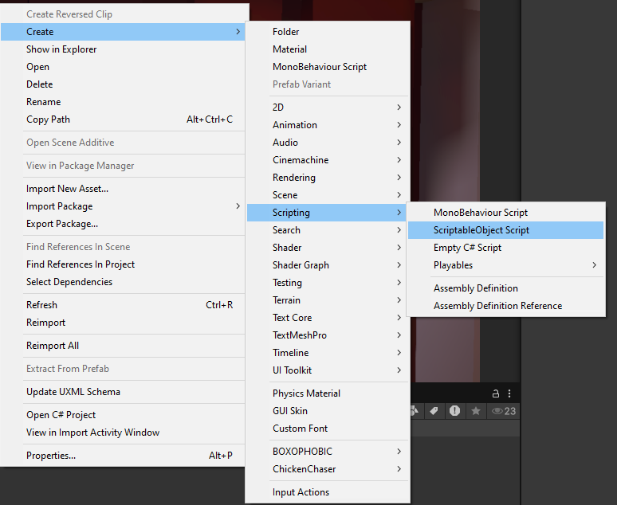

Then give them different colors. I strongly recommend using circles or diamonds (and staying consistent) or using custom images.

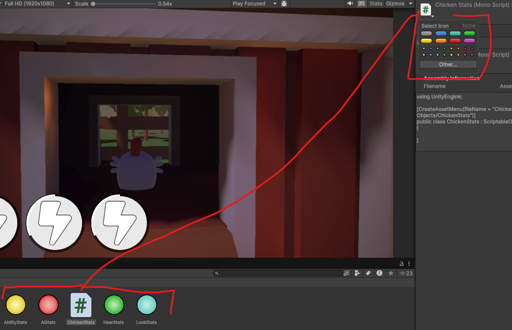

## 5.2) ChickenStats

### 5.2a) Identify and Copy Chicken
Let's start by adding ChickenStats. Go to [Chicken.cs](../Assets/Scripts/Characters/Chicken/Chicken.cs)
and identify and copy each variable that would be shared between chickens

```csharp
// USING STATEMENTS
public abstract class Chicken : MonoBehaviour
{
    [Header("Movement")]
    [SerializeField] protected float speed; // << Move
    [SerializeField] protected float maxSpeed; // << Move
    
    [Header("Foot Management")] 
    [SerializeField] protected float footRadius; // << Move
    [SerializeField] protected float footDistance; // << Move

    [Header("Objects")] 
    [SerializeField] protected Transform head; // (Cannot be moved easily)
    [SerializeField] protected Transform foot; // (Cannot be moved easily)
    
    protected Rigidbody PhysicsBody;
    protected Animator AnimatorController;
    protected bool IsGrounded;
    
    protected float currentSpeed;
    protected float currentFallTIme;
    protected Vector3 slopeNormal;
    
    //FUNCTIONS BEGIN HERE
}
```
### 5.2b) Move into ChickenStats

Now move them into [ChickenStats](../Assets/Scripts/ScriptableObjects/ChickenStats.cs)
and make getters for all of them

```csharp
using UnityEngine;

[CreateAssetMenu(fileName = "ChickenStats", menuName = "ChickenChaser/ChickenStats", order = 100)]
public class ChickenStats : ScriptableObject
{
    [Header("Movement")]
    [SerializeField] protected float speed;
    [SerializeField] protected float maxSpeed;
    
    [Header("Foot Management")] 
    [SerializeField] protected float footRadius;
    [SerializeField] protected float footDistance;

    public float Speed => speed;
    public float MaxSpeed => maxSpeed;
    public float FootRadius => footRadius;
    public float FootDistance => footDistance;
}
```
### 5.2c) Correcting scripts

Now finally, back in [Chicken.cs](../Assets/Scripts/Characters/Chicken/Chicken.cs)

```csharp
using System.Collections;
using System.Collections.Generic;
using UnityEngine;
using Utilities;

public abstract class Chicken : MonoBehaviour
{
    //ADDED
    [SerializeField] protected ChickenStats stats;
    
    [Header("Objects")] 
    [SerializeField] protected Transform head;
    [SerializeField] protected Transform foot;
    
    protected Rigidbody PhysicsBody;
    protected Animator AnimatorController;
    protected bool IsGrounded;
    
    protected float currentSpeed;
    protected float currentFallTIme;
    protected Vector3 slopeNormal;

    private void HandleGroundState()
    {
        //We're going to spherecast downwards, and detect if we've hit the floor.
        //Basic Spherecast check, NOTE: StaticUtilites.GroundLayers helps the code know which layers to look at for floors.
        // Preventing players from registering grounded on illegal objects.
        
        //--------------MODIFIED----------
        //(footRadius => stats.FootRadius, footDistance => stats.FootDistance)
        bool newGroundedState = Physics.SphereCast(foot.position, stats.FootRadius, Vector3.down, out RaycastHit slope, stats.FootDistance, StaticUtilities.GroundLayers);
       //----------------------------------
        
        //If the ground state is different
        if (newGroundedState != IsGrounded)
        {
            //We should enter that state
            IsGrounded = newGroundedState;
            //Then we should update our grounded state.
            AnimatorController.SetBool(StaticUtilities.IsGroundedAnimID, IsGrounded);

            //If we were falling
            if (currentFallTIme >= 0)
            {
                //Handle Landing
                HandleLanding();
                currentFallTIme = 0;
            }
        }

        //If we're not grounded then update the air time
        if (!IsGrounded) currentFallTIme += Time.deltaTime;
        //If we are grounded keep track of the slope normal so that Movement is smoother.
        else slopeNormal = slope.normal;
    }
     //Other functions
}
```
Next [PlayerChicken.cs](../Assets/Scripts/Characters/Chicken/PlayerChicken.cs) also needs modification

```csharp
 public class PlayerChicken : Chicken
{
    protected override void HandleMovement()
    {
        Vector3 direction = _moveDirection;
        if (IsGrounded)
        {
            //If we're grounded, then the direction we want to move should be projected onto the plane.
            //Doing this will help us move up steep slopes easier.
            direction = Vector3.ProjectOnPlane(_moveDirection, slopeNormal);
        }
            
        //MODIFIED (speed => stats.Speed)
        PhysicsBody.AddForce(transform.rotation * direction * stats.Speed, ForceMode.Acceleration);

        //Note: we don't care about falling speed, only XZ speed.
        Vector2 horizontalVelocity = new Vector2(PhysicsBody.velocity.x, PhysicsBody.velocity.z);
        currentSpeed = horizontalVelocity.magnitude; 

        //Check if our speed is exceeding the max speed
        //MODIFIED (maxSpeed => stats.MaxSpeed)
        if (currentSpeed > stats.MaxSpeed)
        {
            //MODIFIED (maxSpeed => stats.MaxSpeed)
            horizontalVelocity = horizontalVelocity.normalized * stats.MaxSpeed;
            //Limit the speed, but be sure to keep the gravity speed.
            
            PhysicsBody.linearVelocity = new Vector3(horizontalVelocity.x, PhysicsBody.velocity.y, horizontalVelocity.y);
            //Lock the speed to prevent weird bugs
            //MODIFIED (maxSpeed => stats.MaxSpeed)
            currentSpeed = stats.MaxSpeed;
        }
        
        HandleLooking();
    }
}
```


## 5.3) AbilityStats

because this is the second time doing this, try letting the students do it on their own.

### 5.3a) Identify and Copy AbilityBase

In [AbilityBase.cs](../Assets/Scripts/Ability/AbstractAbility.cs)
```csharp
public abstract class AbstractAbility : MonoBehaviour
{
    //We need to know how we appear visually
    [SerializeField] private Sprite icon; //This should be moved
    
    //We need to know how we function
    [SerializeField] private float cooldown; //This should be moved
    [SerializeField] private bool canBeHeld; //This should be moved
    
    //We need to who we belong to
    protected Chicken Owner;
    
    //We need to know what animations to control
    protected Animator AnimatorController;
    
    //We need to track our state
    private bool _isReady = true; // Default to true because we should start as ready.
    private bool _isBeingHeld;
    private float _currentCooldownTime;
    //Functions
}
```
### 5.3b) Move into AbilityStats
Then go into [AbilityStats.cs](../Assets/Scripts/ScriptableObjects/AbilityStats.cs) and move them

```csharp
using UnityEngine;

[CreateAssetMenu(fileName = "AbilityStats", menuName = "ChickenChaser/AbilityStats", order = 10)]
public class AbilityStats : ScriptableObject
{
    //We need to know how we appear visually
    [SerializeField] private Sprite icon;
    
    //We need to know how we function
    [SerializeField] private float cooldown;
    [SerializeField] private bool canBeHeld;

    public Sprite Icon => icon;
    public float Cooldown => cooldown;
    public bool CanBeHeld => canBeHeld;
}
```
### 5.3c) Correcting Scripts

Finally, fix any dependencies in [AbstractAbility.cs]() or child classes.
```csharp
using System.Collections;
using UnityEngine;

public abstract class AbstractAbility : MonoBehaviour
{
    [SerializeField] private AbilityStats stats;
    
    //We need to who we belong to
    protected Chicken Owner;
    
    //We need to know what animations to control
    protected Animator AnimatorController;
    
    //We need to track our state
    private bool _isReady = true; // Default to true because we should start as ready.
    private bool _isBeingHeld;
    private float _currentCooldownTime;
    
    //Getter Functions so we can access data in other files
    public Sprite GetIcon()
    {
        //------------------------Modified (icon => stats.Icon)
        return stats.Icon;
    }

    public float GetCooldownPercent()
    {
        //---------------------Modified (cooldown => stats.Cooldown)
        return _currentCooldownTime / stats.Cooldown;
    }

    private bool IsTriggerAnimation()
    {
        return AbilityTriggerID() != 0;
    }

    private bool IsBooleanAnimation()
    {
        return AbilityBoolID() != 0;
    }
    
    // Base Functionality
    private void Start()
    {
        //Use start because we don't own these components
        Owner = GetComponentInParent<Chicken>();
        AnimatorController = GetComponentInChildren<Animator>();
    }

    //IEnumerators are timer functions
    private IEnumerator BeginCooldown()
    {
        do
        {
            //Wait until we can activate
            yield return new WaitUntil(CanActivate);
            
            //If we've let go, then we should leave the loop
            if(!_isBeingHeld) yield break; 
           
            //Activate and Animate
            Activate();
            if(IsTriggerAnimation()) AnimatorController.SetTrigger(AbilityTriggerID());
            
            //Refresh the cooldown
            _currentCooldownTime = 0;
            _isReady = false;
            
             //------------------Modified (cooldown => stats.Cooldown)

            while (_currentCooldownTime < stats.Cooldown)
            {
                _currentCooldownTime += Time.deltaTime;
                //Wait until the next frame
                yield return null;
            }

            //Mark as ready, and set the currentTime to cooldownTime so that it's 100%
            
            //------------------Modified (cooldown => stats.Cooldown)
            _currentCooldownTime = stats.Cooldown;
            _isReady = true;
            
            //If we're still holding and we can be held, then repeat the loop
            //------------------Modified (canBeHeld => stats.CanBeHeld)
        } while (_isBeingHeld && stats.CanBeHeld);

        StopUsingAbility();
    }

    //Accessibility functions
    public void StartUsingAbility()
    {
        _isBeingHeld = true;
        //Only start if we're ready... If we're not ready, then a loop must be running still
        if(_isReady) StartCoroutine(BeginCooldown());
        if(IsBooleanAnimation()) AnimatorController.SetBool(AbilityBoolID(), true);
    }

    public void StopUsingAbility()
    {
        _isBeingHeld = false;
        if(IsBooleanAnimation()) AnimatorController.SetBool(AbilityBoolID(), false);
    }
    
    //Modified in Child Classes
    public virtual bool CanActivate()
    {
        //NOTE: we don't need to return the time, because they're updated together
        return _isReady;
    }

    public virtual void ForceCancelAbility()
    {
        //------------------Modified (cooldown => stats.Cooldown)
        _currentCooldownTime = stats.Cooldown;
        _isReady = true;
        StopAllCoroutines();
        StopUsingAbility();
    }
    
    protected virtual int AbilityBoolID()
    {
        return 0;
    }

    protected virtual int AbilityTriggerID()
    {
        return 0;
    }

    protected abstract void Activate();

}
```
## 5.4) Create and Attach
Finally, create the player chicken stats in a folder called ChickenStats in the Scriptable Objects folder:


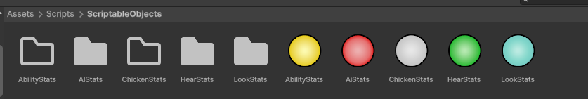

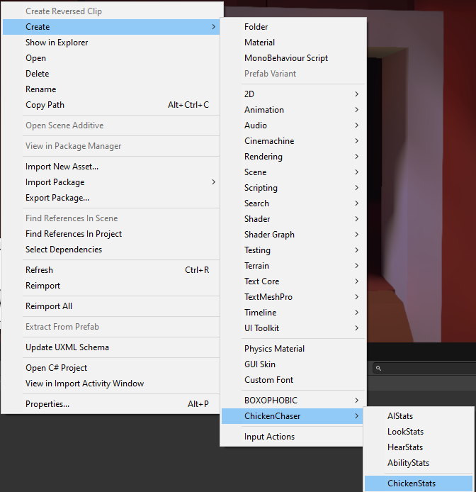

and give it the following stats: (obviously you can change it)

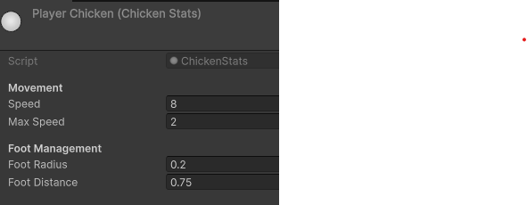

Then create another and call it AiChicken with the following stats: (obviously you can change it)

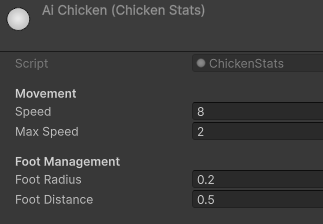

Next in the AbilityStats folder, create each ability with the following stats:

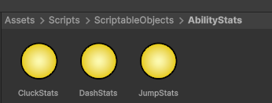

Cluck:

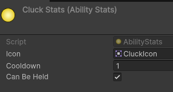

Dash:

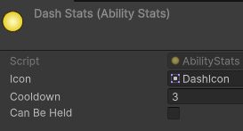

Jump:

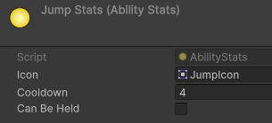

Finally attach them to the anything that needs them, currently it's just the player prefab

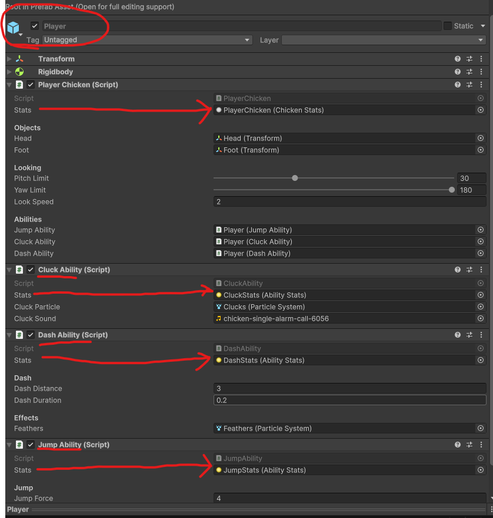

## End Results

IF DONE PROPERLY THE GAME SHOULD LOOK THE SAME AS CM4


### [Chicken.cs](../Assets/Scripts/Characters/Chicken/Chicken.cs)
```csharp
using System.Collections;
using System.Collections.Generic;
using UnityEngine;
using Utilities;

public abstract class Chicken : MonoBehaviour
{
    [SerializeField] protected ChickenStats stats;
    
    [Header("Objects")] 
    [SerializeField] protected Transform head;
    [SerializeField] protected Transform foot;
    
    protected Rigidbody PhysicsBody;
    protected Animator AnimatorController;
    protected bool IsGrounded;
    
    protected float currentSpeed;
    protected float currentFallTIme;
    protected Vector3 slopeNormal;
    
    protected virtual void Awake()
    {
        PhysicsBody = GetComponent<Rigidbody>();
        AnimatorController = GetComponentInChildren<Animator>();
    }

    private void FixedUpdate()
    {
        HandleGroundState();
        HandleMovement();
        HandleAnims();
    }


    private void HandleGroundState()
    {
        //We're going to spherecast downwards, and detect if we've hit the floor.
        //Basic Spherecast check, NOTE: StaticUtilites.GroundLayers helps the code know which layers to look at for floors.
        // Preventing players from registering grounded on illegal objects.
        bool newGroundedState = Physics.SphereCast(foot.position, stats.FootRadius, Vector3.down, out RaycastHit slope, stats.FootDistance, StaticUtilities.GroundLayers);
       
        //If the ground state is different
        if (newGroundedState != IsGrounded)
        {
            //We should enter that state
            IsGrounded = newGroundedState;
            //Then we should update our grounded state.
            AnimatorController.SetBool(StaticUtilities.IsGroundedAnimID, IsGrounded);

            //If we were falling
            if (currentFallTIme >= 0)
            {
                //Handle Landing
                HandleLanding();
                currentFallTIme = 0;
            }
        }

        //If we're not grounded then update the air time
        if (!IsGrounded) currentFallTIme += Time.deltaTime;
        //If we are grounded keep track of the slope normal so that Movement is smoother.
        else slopeNormal = slope.normal;
    }

    protected virtual void HandleLanding()
    {
        
    }

    protected virtual void HandleAnims()
    {
        AnimatorController.SetFloat(StaticUtilities.MoveSpeedAnimID, currentSpeed);
    }

    protected abstract void HandleMovement();
    
    public abstract void OnFreedFromCage();
    public abstract void OnEscaped(Vector3 position);
    public abstract void OnCaptured();
    
    public bool GetIsGrounded()
    {
        return IsGrounded;
    }
    public float GetCurrentSpeed()
    {
        return currentSpeed;
    }

    public Vector3 GetLookDirection()
    {
        return head.forward;
    }
}
```
### [ChickenStats.cs](../Assets/Scripts/ScriptableObjects/ChickenStats.cs)
```csharp
using UnityEngine;

[CreateAssetMenu(fileName = "ChickenStats", menuName = "ChickenChaser/ChickenStats", order = 100)]
public class ChickenStats : ScriptableObject
{
    [Header("Movement")]
    [SerializeField] protected float speed;
    [SerializeField] protected float maxSpeed;
    
    [Header("Foot Management")] 
    [SerializeField] protected float footRadius;
    [SerializeField] protected float footDistance;

    public float Speed => speed;
    public float MaxSpeed => maxSpeed;
    public float FootRadius => footRadius;
    public float FootDistance => footDistance;
}
```
### [PlayerChicken.cs](../Assets/Scripts/Characters/Chicken/PlayerChicken.cs)
```csharp
using System;
using System.Collections;
using System.Collections.Generic;
using UnityEngine;

public class PlayerChicken : Chicken
{
    private Vector3 _moveDirection;
    private Vector2 _lookDirection;
    
    [Header("Looking")] 
    [SerializeField , Range(0,90)] private float pitchLimit;
    [SerializeField, Range(0,180)] private float yawLimit;
    [SerializeField] private float lookSpeed;

    [Header("Abilities")]
    [SerializeField] private AbstractAbility jumpAbility;
    [SerializeField] private AbstractAbility cluckAbility;
    [SerializeField] private AbstractAbility dashAbility;
    
    protected override void Awake()
    {
        base.Awake();
        HudManager.Instance.BindPlayer(this);
        PlayerControls.Initialize(this);
        PlayerControls.UseGameControls();
    }
    private void OnDisable()
    {
        PlayerControls.DisablePlayer();  
        jumpAbility.ForceCancelAbility();
        cluckAbility.ForceCancelAbility();
        dashAbility.ForceCancelAbility();
    }

    protected override void HandleMovement()
    {
        Vector3 direction = _moveDirection;
        if (IsGrounded)
        {
            //If we're grounded, then the direction we want to move should be projected onto the plane.
            //Doing this will help us move up steep slopes easier.
            direction = Vector3.ProjectOnPlane(_moveDirection, slopeNormal);
        }
            
        PhysicsBody.AddForce(transform.rotation * direction * stats.Speed, ForceMode.Acceleration);

        //Note: we don't care about falling speed, only XZ speed.
        Vector2 horizontalVelocity = new Vector2(PhysicsBody.velocity.x, PhysicsBody.velocity.z);
        currentSpeed = horizontalVelocity.magnitude; 

        //Check if our speed is exceeding the max speed
        if (currentSpeed > stats.MaxSpeed)
        {
            horizontalVelocity = horizontalVelocity.normalized * stats.MaxSpeed;
            //Limit the speed, but be sure to keep the gravity speed.
            PhysicsBody.velocity = new Vector3(horizontalVelocity.x, PhysicsBody.velocity.y, horizontalVelocity.y);
            
            //Lock the speed to prevent weird bugs
            currentSpeed = stats.MaxSpeed;
        }
        
        HandleLooking();
    }

    public override void OnFreedFromCage()
    {
        
    }

    public override void OnEscaped(Vector3 position)
    {
        
    }

    public override void OnCaptured()
    {
        
    }

    public void SetDashState(bool state)
    {
        if(state) dashAbility.StartUsingAbility();
        else dashAbility.StopUsingAbility();
    }

    public void SetCluckState(bool state)
    {
        if(state) cluckAbility.StartUsingAbility();
        else cluckAbility.StopUsingAbility();
    }

    public void SetJumpState(bool state)
    {
        if(state) jumpAbility.StartUsingAbility();
        else jumpAbility.StopUsingAbility();
    }

    public void SetMoveDirection(Vector2 direction)
    {
        //In unity, Y is up, so we need to convert to vector3, and have WS affect the forward (Z) axis.
        _moveDirection = new Vector3(direction.x, 0, direction.y);
    }

    public void SetLookDirection(Vector2 direction)
    {
        _lookDirection = direction;
    }

    private void HandleLooking()
    {
        //Caching the Time.deltaTime is important if you're using it more than once. It saves RAM.
        float timeShift = Time.deltaTime;
        float pitchChange = head.localEulerAngles.x - lookSpeed * _lookDirection.y * timeShift;
        float yawChange = transform.localEulerAngles.y + lookSpeed * _lookDirection.x * timeShift;
        
        //Apply limits so we don't Gimbal Lock ourselves
        // (Quaternion rotation would correct this but this does the job)
        if (pitchChange > pitchLimit && pitchChange < 180) pitchChange = pitchLimit;
        else if (pitchChange < 360-pitchLimit && pitchChange > 180) pitchChange = -pitchLimit;
        if (yawChange > yawLimit && yawChange < 180) yawChange = yawLimit;
        else if (yawChange < 360-yawLimit && yawChange > 180) yawChange = -yawLimit;

        //Apply the modifications to each part, be sure to use LOCAL euler angles, so that other systems work correctly.
        transform.localEulerAngles = new Vector3(0, yawChange, 0);
        head.localEulerAngles = new Vector3(pitchChange, 0, 0);
    }

    public AbstractAbility GetCluckAbility()
    {
        return cluckAbility;
    }
    
    public AbstractAbility GetJumpAbility()
    {
        return jumpAbility;
    }
    
    public AbstractAbility GetDashAbility()
    {
        return dashAbility;
    }
}

```
### [AbstractAbility.cs](../Assets/Scripts/Ability/AbstractAbility.cs)[COMPLETE]
```csharp
using System.Collections;
using UnityEngine;

public abstract class AbstractAbility : MonoBehaviour
{
    [SerializeField] private AbilityStats stats;
    
    //We need to who we belong to
    protected Chicken Owner;
    
    //We need to know what animations to control
    protected Animator AnimatorController;
    
    //We need to track our state
    private bool _isReady = true; // Default to true because we should start as ready.
    private bool _isBeingHeld;
    private float _currentCooldownTime;
    
    //Getter Functions so we can access data in other files
    public Sprite GetIcon()
    {
        return stats.Icon;
    }

    public float GetCooldownPercent()
    {
        return _currentCooldownTime / stats.Cooldown;
    }

    private bool IsTriggerAnimation()
    {
        return AbilityTriggerID() != 0;
    }

    private bool IsBooleanAnimation()
    {
        return AbilityBoolID() != 0;
    }
    
    // Base Functionality
    private void Start()
    {
        //Use start because we don't own these components
        Owner = GetComponentInParent<Chicken>();
        AnimatorController = GetComponentInChildren<Animator>();
    }

    //IEnumerators are timer functions
    private IEnumerator BeginCooldown()
    {
        do
        {
            //Wait until we can activate
            yield return new WaitUntil(CanActivate);
            
            //If we've let go, then we should leave the loop
            if(!_isBeingHeld) yield break; 
           
            //Activate and Animate
            Activate();
            if(IsTriggerAnimation()) AnimatorController.SetTrigger(AbilityTriggerID());
            
            //Refresh the cooldown
            _currentCooldownTime = 0;
            _isReady = false;
            
            while (_currentCooldownTime < stats.Cooldown)
            {
                _currentCooldownTime += Time.deltaTime;
                //Wait until the next frame
                yield return null;
            }

            //Mark as ready, and set the currentTime to cooldownTime so that it's 100%
            _currentCooldownTime = stats.Cooldown;
            _isReady = true;
            
            //If we're still holding and we can be held, then repeat the loop
        } while (_isBeingHeld && stats.CanBeHeld);

        StopUsingAbility();
    }

    //Accessibility functions
    public void StartUsingAbility()
    {
        _isBeingHeld = true;
        //Only start if we're ready... If we're not ready, then a loop must be running still
        if(_isReady) StartCoroutine(BeginCooldown());
        if(IsBooleanAnimation()) AnimatorController.SetBool(AbilityBoolID(), true);
    }

    public void StopUsingAbility()
    {
        _isBeingHeld = false;
        if(IsBooleanAnimation()) AnimatorController.SetBool(AbilityBoolID(), false);
    }
    
    //Modified in Child Classes
    public virtual bool CanActivate()
    {
        //NOTE: we don't need to return the time, because they're updated together
        return _isReady;
    }

    public virtual void ForceCancelAbility()
    {
        _currentCooldownTime = stats.Cooldown;
        _isReady = true;
        StopAllCoroutines();
        StopUsingAbility();
    }
    
    protected virtual int AbilityBoolID()
    {
        return 0;
    }

    protected virtual int AbilityTriggerID()
    {
        return 0;
    }

    protected abstract void Activate();

}
```

### [AbilityStats.cs](../Assets/Scripts/ScriptableObjects/AbilityStats.cs)
```csharp
using UnityEngine;

[CreateAssetMenu(fileName = "AbilityStats", menuName = "ChickenChaser/AbilityStats", order = 10)]
public class AbilityStats : ScriptableObject
{
    //We need to know how we appear visually
    [SerializeField] private Sprite icon;
    
    //We need to know how we function
    [SerializeField] private float cooldown;
    [SerializeField] private bool canBeHeld;

    public Sprite Icon => icon;
    public float Cooldown => cooldown;
    public bool CanBeHeld => canBeHeld;
}
```