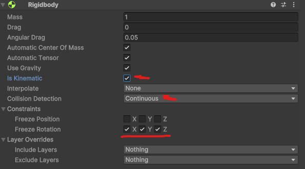
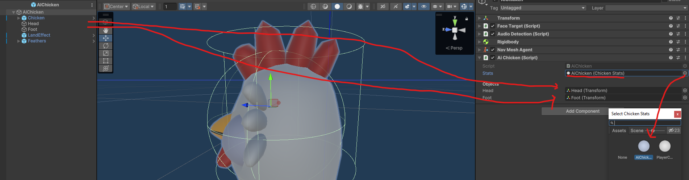
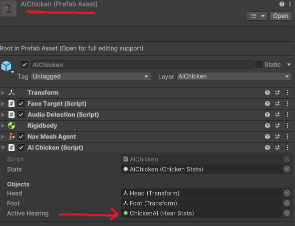
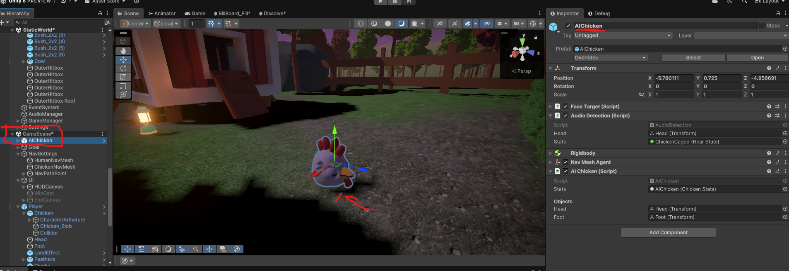

# Chicken Chaser CM 6 AI Chickens and Detection

---
## Final Result


* [6.1) Making things detectable](#61-making-things-detectable)
  
* [6.2) Prepping for AI ](#62-prepping-for-ai)
  *   [6.2a) Building a NavMesh](#62a-building-a-navmesh)
  *   [6.2b) Adjusting the prefab](#62b-adjusting-the-prefab)

* [6.3) Coding the AI](#63-coding-the-ai)

* [End Results](#end-results)
    * [Chicken.cs](#chickencs)
    * [AiChicken.cs](#aichickencs)


---

## 6.1) Making things detectable

First, let's begin by making the humans able to detect things. Chicken Chaser already has an Interface called [IVisualDetectable.cs](../Assets/Scripts/Interfaces/IVisualDetectable.cs).
This script is used by [IDetector.cs](../Assets/Scripts/Interfaces/IDetector.cs) to enable objects to detect other objects. Feel free to browse these scripts as they're powerful and can be used in many contexts.

Essentially, all we need to do to make something detectable, is mark it as IVisualDetectable, and all we need to do to make something detect other things is to mark is as IDetector.

So in [Chicken.cs](../Assets/Scripts/Characters/Chicken/Chicken.cs) apply the interface and add it's corrosponding functions at the bottom
```csharp
using Interfaces;
using UnityEngine;
using Utilities;
//MARK THE CLASS AS IVisualDetectable
public abstract class Chicken : MonoBehaviour, IVisualDetectable
{
   //OTHER CODE

    // --------- (NEW FUNCTIONS ADDED AT THE BOTTOM)-----
    public void AddVisibility(float visibility)
    {
        
    }

    public void RemoveVisibility(float visibility)
    {
        
    }

    public float GetVisibility()
    {
        return 1;
    }
}
```
Just like that, we're now detectable! 
***this next part is optional***, but allows the chickens more visible in light / invisible under certain conditions.

To complete this code, we just need to create a variable call visibility and use it

Still in [Chicken.cs](../Assets/Scripts/Characters/Chicken/Chicken.cs) 
```csharp
using Interfaces;
using UnityEngine;
using Utilities;
//MARK THE CLASS AS IVisualDetectable
public abstract class Chicken : MonoBehaviour, IVisualDetectable
{
    protected float Visibility = 1; // Optionally make this serialized, or add to ChickenStats. It's how quickly you get detected, 1x is default
//OTHER CODE
    public void AddVisibility(float visibility)
    {
        Visibility += visibility;
    }

    public void RemoveVisibility(float visibility)
    {
        Visibility -= Mathf.Max(0,visibility);
    }

    public float GetVisibility()
    {
        return Visibility;
    }
}
```

Finally, add a new layer called Player, and 
adjust the Layer on the Player Prefab to Player


Now the player will be detectable:


NOTE: if this doesn't work, you may need to tweak the layer setting in [StaticUtilities.cs](../Assets/Scripts/Utilities/StaticUtilities.cs)

## 6.2) Prepping for AI

### 6.2a) Building a NavMesh
First when working with AI we need to build a navmesh. Chicken Chaser comes with this mostly pre-made but parts needs help.

Start by finding the NavSettings in the GameScene, and editing the ChickenNavMesh


Next, we need to create an Agent Type for chickens


Give it the following settings


Then go back to the Navmesh and bake it. If you enable gizmos, you should see a blue carpet on the floor. This indicates where the Chickens (and humans by default) can go


### 6.2b) Adjusting the prefab

Next, navigate to the ***AiChicken Prefab*** and add the following components:

    Rigidbody (required for Chicken)
    Nav Mesh Agent (Gives movement)
    AI Chicken (because it's AI)
    Change the AI's layer to AiChicken


Next let's adjust the Rigidbody:

* Make it kinematic so it's physics are halted by default
* Set collision detection toContinuous as Chickens are high priority objects
* Set all freeze rotations to true as it's not the RBs responsibility



Next let's adjust the NavMesh

* Change the Agent Type to chicken
* Change the baseOffset to 0.16 (Prevent the chicken from clipping in the ground)
* Set the stopping distance to 1 (Useful for making sure the chicken stops at its target)
* Set the radius to 0.2 (This is used for real-time navmesh stuff)
* Set the height to 0.32 (This is used for real-time navmesh stuff)


Finally, let's adjust the AI chicken



## 6.3) Coding the AI

Lastly let's begin coding the ChickenAI. To begin, 
our chicken already has some components so let's begin by storing them.

in [AiChicken.cs](../Assets/Scripts/Characters/Chicken/AiChicken.cs)
```csharp
public class AiChicken : Chicken
{
    //Either make these all serialized, or access them all in awake with GetComponent
    private FaceTarget _faceTarget;
    private AudioDetection _audioDetection;
    private NavMeshAgent _agent;
    
    protected override void Awake()
    {
        base.Awake();
        
        _faceTarget = GetComponent<FaceTarget>();
        _audioDetection = GetComponent<AudioDetection>();
        _agent = GetComponent<NavMeshAgent>();
        
        //IF CM 5 WAS SKIPPED, USE JUST "speed"
        _agent.speed = stats.MaxSpeed;
        _agent.acceleration = stats.Speed;
    }
    
    //Other functions
}
```

Now, you can optionally make the chicken move to some destination in awake with _agent.SetDestination(Vector3). Doing so will reveal the animations don't work. This is because the Rigidbody is no longer responsible for movement

in [AiChicken.cs](../Assets/Scripts/Characters/Chicken/AiChicken.cs)

```csharp
public class AiChicken : MonoBehaviour
{
    protected override void HandleMovement()
    {
        //--ADDED--
        //Move close to the target and decelerate when near them
        currentSpeed = Mathf.Max(0,_agent.remainingDistance - _agent.stoppingDistance + 0.2f); 
        //Update the animator
        AnimatorController.SetFloat(StaticUtilities.MoveSpeedAnimID, currentSpeed);
    }
}
```

Finally, for now, let's have the AI move to the player when the player clucks (Which is something we set-up earlier in [Cluck.cs](../Assets/Scripts/Ability/CluckAbility.cs))

in [AiChicken.cs](../Assets/Scripts/Characters/Chicken/AiChicken.cs) mark the files as IDetector and apply the interface

We also need to add a stats variable for it, and bind its stats.

```csharp
public class AiChicken : Chicken, IDetector //ADDED
{
    //OTHER VARIABLES
    [SerializeField] private HearStats activeHearing;
    
    //[ADDED] PUT THIS NEAR AWAKE
    private void OnEnable()
    {
        //Used for caged chickens
        _faceTarget.enabled = false;
        
        _agent.enabled = true;
        _audioDetection.SetStats(activeHearing);
    }
    
    
    //---other functions---//
    //---other functions---//
    //---other functions---//
    
    //This is pre-configured to only detect the player chicken's cluck
    public void AddDetection(Vector3 location, float detection, EDetectionType type)
    {
        //If we're not enabled, or our detection wasn't high enough, don't proceed.
        if (!enabled || detection < 1) return;
        print("I'm moving towards: " + location);
        //Move towards detected location
        _agent.SetDestination(location);
        //Stop doing wave animation
        AnimatorController.SetBool(StaticUtilities.CluckAnimID, false);
    }
}
```
Be sure to apply the HearStats on the AiChicken



You can now place an AI chicken into the world and try it out




## End Results


### [Chicken.cs](../Assets/Scripts/Characters/Chicken/Chicken.cs)
```csharp
using Interfaces;
using UnityEngine;
using Utilities;

public abstract class Chicken : MonoBehaviour, IVisualDetectable
{
    [SerializeField] protected ChickenStats stats;
    
    [Header("Objects")] 
    [SerializeField] protected Transform head;
    [SerializeField] protected Transform foot;
    
    protected Rigidbody PhysicsBody;
    protected Animator AnimatorController;
    protected bool IsGrounded;
    
    protected float currentSpeed;
    protected float currentFallTIme;
    protected Vector3 slopeNormal;
    
    protected float Visibility = 1;

    
    protected virtual void Awake()
    {
        PhysicsBody = GetComponent<Rigidbody>();
        AnimatorController = GetComponentInChildren<Animator>();
    }

    private void FixedUpdate()
    {
        HandleGroundState();
        HandleMovement();
        HandleAnims();
    }


    private void HandleGroundState()
    {
        //We're going to spherecast downwards, and detect if we've hit the floor.
        //Basic Spherecast check, NOTE: StaticUtilites.GroundLayers helps the code know which layers to look at for floors.
        // Preventing players from registering grounded on illegal objects.
        bool newGroundedState = Physics.SphereCast(foot.position, stats.FootRadius, Vector3.down, out RaycastHit slope, stats.FootDistance, StaticUtilities.GroundLayers);
       
        //If the ground state is different
        if (newGroundedState != IsGrounded)
        {
            //We should enter that state
            IsGrounded = newGroundedState;
            //Then we should update our grounded state.
            AnimatorController.SetBool(StaticUtilities.IsGroundedAnimID, IsGrounded);

            //If we were falling
            if (currentFallTIme >= 0)
            {
                //Handle Landing
                HandleLanding();
                currentFallTIme = 0;
            }
        }

        //If we're not grounded then update the air time
        if (!IsGrounded) currentFallTIme += Time.deltaTime;
        //If we are grounded keep track of the slope normal so that Movement is smoother.
        else slopeNormal = slope.normal;
    }

    protected virtual void HandleLanding()
    {
        
    }

    protected virtual void HandleAnims()
    {
        AnimatorController.SetFloat(StaticUtilities.MoveSpeedAnimID, currentSpeed);
    }

    protected abstract void HandleMovement();
    
    public abstract void OnFreedFromCage();
    public abstract void OnEscaped(Vector3 position);
    public abstract void OnCaptured();
    
    public bool GetIsGrounded()
    {
        return IsGrounded;
    }
    public float GetCurrentSpeed()
    {
        return currentSpeed;
    }

    public Vector3 GetLookDirection()
    {
        return head.forward;
    }

    public void AddVisibility(float visibility)
    {
        Visibility += visibility;
    }

    public void RemoveVisibility(float visibility)
    {
        Visibility -= Mathf.Max(0,visibility);
    }

    public float GetVisibility()
    {
        return Visibility;
    }
}
```
### [AiChicken.cs](../Assets/Scripts/Characters/Chicken/AiChicken.cs)
```csharp
using System.Collections;
using System.Collections.Generic;
using AI;
using Interfaces;
using UnityEngine;
using UnityEngine.AI;
using Utilities;

public class AiChicken : Chicken, IDetector
{

    //Either make these all serialized, or access them all in awake with GetComponent
    private FaceTarget _faceTarget;
    private AudioDetection _audioDetection;
    private NavMeshAgent _agent;
    
    protected override void Awake()
    {
        base.Awake();
        
        _faceTarget = GetComponent<FaceTarget>();
        _audioDetection = GetComponent<AudioDetection>();
        _agent = GetComponent<NavMeshAgent>();

        _agent.speed = stats.MaxSpeed;
        _agent.acceleration = stats.Speed;
    }

    protected override void HandleMovement()
    {
        //Move close to the target and decelerate when near them
        currentSpeed = Mathf.Max(0,_agent.remainingDistance - _agent.stoppingDistance + 0.2f);
        AnimatorController.SetFloat(StaticUtilities.MoveSpeedAnimID, currentSpeed);
    }

    public override void OnFreedFromCage()
    {
        
    }

    public override void OnEscaped(Vector3 position)
    {
        
    }

    public override void OnCaptured()
    {
        
    }

    public void AddDetection(Vector3 location, float detection, EDetectionType type)
    {
        if (!enabled || detection < 1) return;
        print("I'm moving towards: " + location);
        _agent.SetDestination(location);
        AnimatorController.SetBool(StaticUtilities.CluckAnimID, false);
    }
}

```