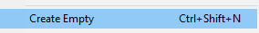
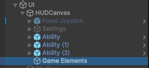
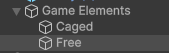
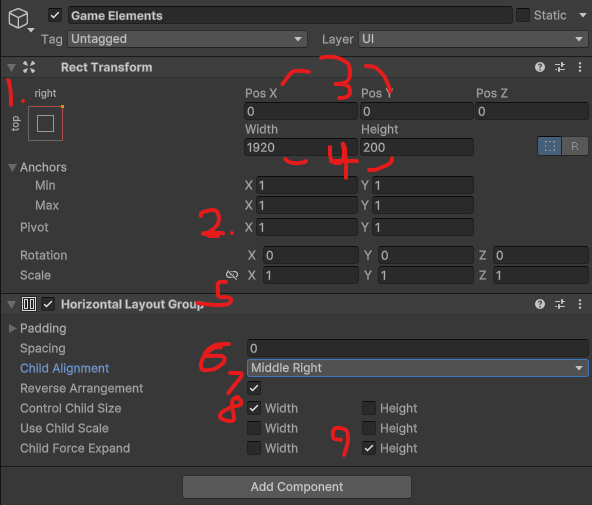
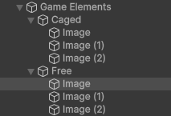
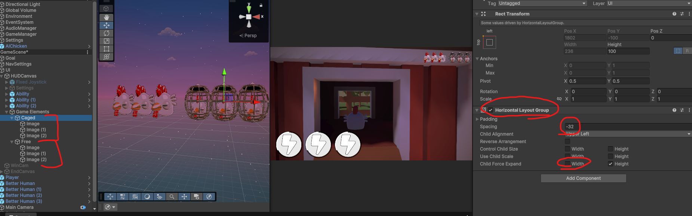
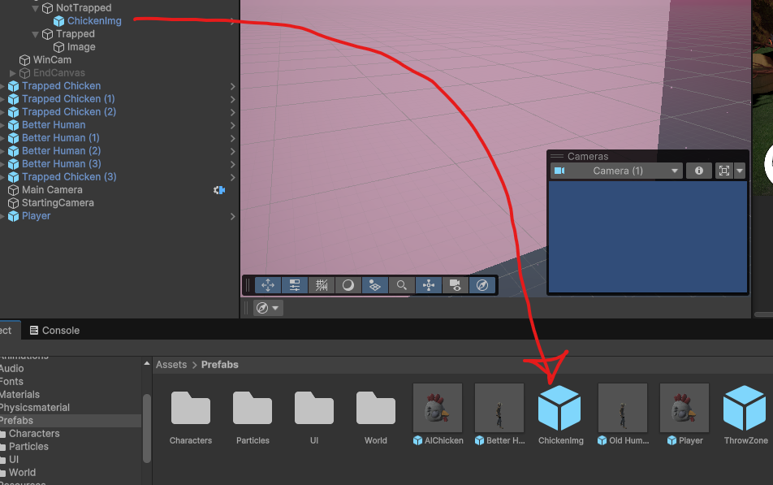
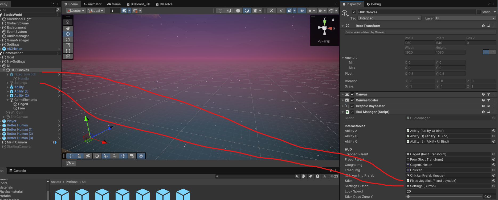

# Chicken Chaser CM 8 Hud Part 2

---
## Final Result

* [8.1) Keeping track of Chickens](#81-keeping-track-of-chickens)
  *   [8.1a) UI](#81a-ui)
  *   [8.1b) HudManager Code](#81b-hudmanager-code)
  *   [8.1c) Notify changes](#81c-notify-changes)
  *   [8.1d) Apply changes](#81d-apply-changes)

* [8.2) Score](#82-score-)

* [8.3) Mobile Controls [OPTIONAL]](#83-mobile-controls-optional)

* [End Results](#end-results)
  * [HudManager.cs](#hudmanagercs)
  * [AiChicken.cs](#aichickencs)
  * [ScoreManager.cs](#scoremanagercs)

## [Observer Design Pattern](https://github.com/RealProgrammingInstructors/Shared-Content/blob/main/Content/Coding/Observer.md)

---
## 8.1) Keeping track of Chickens

### 8.1a) UI

1. Start by creating a new EMPTY UI object in the game HUD and call it **Game Elements** (Arguably, you can create a new canvas for this)





2. Then create 2 EMPTY children named **CAGED** and **FREE**, Order does matter, but you can choose



3. Back on **Game Elements** change the following settings:
* Anchoring to top right
* Pivot to 1,1 [ORDER MATTERS]
* Position to 0,0
* Width to 1920, height to 200
* Add component: Horizontal Layout Group
* Alignment MiddleRight
* Reverse Alignment [OPTIONAL]
* Control Child Width
* DO NOT force expand width



4. Next, add 3 images to caged and free (These are temporary). Replace the images with free or caged on them. PRO TIP: Hold CTRL or SHIFT to select multiple (They are different)



5. Next select both Caged and Free simultaneously (or copy paste):
* Add a horizontal layout group component
* Spacing -32
* DO NOT expand on width



Hopefully you can see the idea for how this will work. If we remove one from one side, and add it to the other, the size will stay the same, and auto organize.

6. Finally, in order to best achieve this, we should prefab a blank image object so all our objects are consistant and easy to use.



7. Then delete all the objects so it's just the parents left


### 8.1b) HudManager Code

Next we need to get references to our transforms so we can parent new objects to them. 

We also need a reference to each image object, 

We need a reference to the prefab.

and finally, we need a Dictionary so we can remember which Chicken is which. The main purpose of this is future flexibility and ease of use.

in [HudManager.cs](../Assets/Scripts/Managers/HudManager.cs)
```csharp
using UnityEngine;
using UnityEngine.UI;

[DefaultExecutionOrder(-1000)]
public class HudManager : MonoBehaviour
{
    [Header("Interactables")]
    [SerializeField] private AbilityUIBind abilityA;
    [SerializeField] private AbilityUIBind abilityB;
    [SerializeField] private AbilityUIBind abilityC;
    
    private PlayerChicken _owner;

    //---------------- ADDED ----------------------//
    [Header("HUD")] 
    [SerializeField] private Transform trappedParent;
    [SerializeField] private Transform freedParent;

  
    [SerializeField] private Sprite caughtImg;
    [SerializeField] private Sprite freedImg;
    
    //Make sure to Import using UnityEngine.UI; for images
    [SerializeField] private Image chickenImgPrefab;
    
    private Dictionary<AiChicken, Image> _hudChickens = new();
    //------------------------------------------------------//
    
    public static HudManager Instance { get; private set; } //static means there is only 1 (And it always exists without being instansiated)
    
    
    //FUNCTIONS
}
```
Continuing, we now need three functions:
    
 * RegisterChicken(AiChicken) --> Called via singleton, binds the chicken to us
 * DeRegisterChicken(AiChicken) --> Called via singleton
 * CaughtChicken (Image)
 * FreeChicken (Image);
    
in [HudManager.cs](../Assets/Scripts/Managers/HudManager.cs)

```csharp
 public class HudManager : MonoBehaviour
{
    //VARIABLES
    void Awake()
    {
        //If there are two HUDs
        if (Instance && Instance != this)
        {
            //Remove one
            Destroy(Instance);
            return;
        }
        Instance = this;
    }

    void Update() { }

    #region Registering Chickens

    public void BindPlayer(PlayerChicken player)
    {
        _owner = player;
            
        //Bind abilities
        abilityA.SetTargetAbility(player.GetCluckAbility());
        abilityB.SetTargetAbility(player.GetJumpAbility());
        abilityC.SetTargetAbility(player.GetDashAbility());
    }
//--------------------- ADDED--------------------//
    public void RegisterChicken(AiChicken chicken)
    {
        
    }
    
    public void DeRegisterChicken(AiChicken chicken)
    {
        
    }


    private void CaughtChicken(Image target)
    {
        
    }

    private void FreeChicken(Image target)
    {
        
    }
//-----------------------------------------//
    #endregion
    
}
```
### 8.1c) Notify changes
Next to continue, we once more need [Observer Design Pattern](https://github.com/RealProgrammingInstructors/Shared-Content/blob/main/Content/Coding/Observer.md). Observer is one of the most common patterns used in UI.

Go into [AiChicken.cs](../Assets/Scripts/Characters/Chicken/AiChicken.cs) (or do this is [Chicken.cs](../Assets/Scripts/Characters/Chicken/Chicken.cs) if you want the player to have this aswell) and create two events:

```csharp
public class AiChicken : Chicken, IDetector
{

    //Either make these all serialized, or access them all in awake with GetComponent
    private FaceTarget _faceTarget;
    private AudioDetection _audioDetection;
    private NavMeshAgent _agent;

    [SerializeField] private HearStats activeHearing;
    //--------------------- ADDED--------------------//
    public Action OnCaught;
    public Action OnFreed;
    //-----------------------------------------//
    //FUNCTIONS
}
```

Still in [AiChicken.cs](../Assets/Scripts/Characters/Chicken/AiChicken.cs) We need to invoke these functions, and tell the HudManager we exist


In Awake, Register the chicken.
create OnDestroy and Deregister the chicken
In Caught, invoke the caught function (Can optionally also be OnDisable)
In Freed, invoke the freed function (Can optionally also be OnEnable)

```csharp
public class AiChicken : Chicken, IDetector
{
protected override void Awake()
    {
        base.Awake();
        
        _faceTarget = GetComponent<FaceTarget>();
        _audioDetection = GetComponent<AudioDetection>();
        _agent = GetComponent<NavMeshAgent>();

        _agent.speed = stats.MaxSpeed;
        _agent.acceleration = stats.Speed;
        
        //-------------- ADDED -------------------//
        HudManager.Instance.RegisterChicken(this);
        //---------------------------------//
    }

    //-------------- ADDED -------------------//
    private void OnDestroy()
    {
        HudManager.Instance.DeRegisterChicken(this);
    }
    //---------------------------------//
    
    //...//
    
    public override void OnFreedFromCage()
    {
        enabled = true;
         //-------------- ADDED -------------------//
        OnFreed.Invoke(); // No ? as the HUD should always exist.
        //---------------------------------//
    }
    //...//
    public override void OnCaptured()
    {
        AnimatorController.SetFloat(StaticUtilities.MoveSpeedAnimID, 0);
         //-------------- ADDED -------------------//
        OnCaught.Invoke();
        //---------------------------------//
    }
    
}
```

### 8.1d) Apply Changes

Finally, back in [HudManager.cs](../Assets/Scripts/Managers/HudManager.cs)

Let's create our functions:

```csharp
public class HudManager : MonoBehaviour
{
  public void RegisterChicken(AiChicken chicken)
  {
      //Create a prefab and add it to the dictionary.
      Image clone = Instantiate(chickenImgPrefab);
      _hudChickens.Add(chicken, clone);
  
      //Bind our events to automate chicken captures and released
      chicken.OnCaught += () => CaughtChicken(clone);
      chicken.OnFreed += () => FreeChicken(clone);
      
      //Assume the chicken is caught (You do this in AiChicken if you prefer, and it may make more sense)
      CaughtChicken(clone);
  }
  
  public void DeRegisterChicken(AiChicken chicken)
  {
      //Destroy and remove the chicken
      Destroy(_hudChickens[chicken]);
      _hudChickens.Remove(chicken);
  }
  
  private void CaughtChicken(Image target)
  {
      target.transform.SetParent(trappedParent,false);
      target.sprite = caughtImg;
  }
  
  private void FreeChicken(Image target)
  {
      target.transform.SetParent(freedParent,false);;
      target.sprite = freedImg;
  }
}
```
TIP: You can optimize these methods by instead of switching an object between parents, create a child object in both, and just switch between which one is on and which one is off. This will save a decent amount of memory.

## 8.2) Score 

There's a pre-made script called [ScoreManager.cs](../Assets/Scripts/Managers/ScoreManager.cs) but it needs to be partially filled out to work

First, in [AiChicken.cs](../Assets/Scripts/Characters/Chicken/AiChicken.cs) Let's add a static variable to keep track of the number of active chickens.
Let's make a getter function so it can be accessed anywhere, and increase the number by 1 when a chicken is enabled, and decrease when a chicken is disabled

```csharp
using System;
using System.Collections;
using AI;
using Interfaces;
using ScriptableObjects;
using UnityEngine;
using UnityEngine.AI;
using Utilities;

public class AiChicken : Chicken, IDetector
{

    //Either make these all serialized, or access them all in awake with GetComponent
    private FaceTarget _faceTarget;
    private AudioDetection _audioDetection;
    private NavMeshAgent _agent;

    [SerializeField] private HearStats activeHearing;
    
    public Action OnCaught;
    public Action OnFreed;
 //--------------------- ADDED -----------------//
    private static int _numActiveChickens;
//--------------------- ----------------- -----------------//


    protected override void Awake()
    {
        base.Awake();
        
        _faceTarget = GetComponent<FaceTarget>();
        _audioDetection = GetComponent<AudioDetection>();
        _agent = GetComponent<NavMeshAgent>();

        _agent.speed = stats.MaxSpeed;
        _agent.acceleration = stats.Speed;
        
        HudManager.Instance.RegisterChicken(this);
        // ---------------- ADDED ---------------- //
        
        // Used in the score
        GameManager.RegisterAIChicken();
        //----------------------------------------//
    }

    private void OnDestroy()
    { ...  }

    private void OnEnable()
    {
        _faceTarget.enabled = false;
        _agent.enabled = true;
        
        _audioDetection.SetStats(activeHearing);
        
        //Enable object collisions
        BodyCollider.enabled = true;
        
        //Do cluck anim so we're not static, without the particle we just look like we're waving
        AnimatorController.SetBool(StaticUtilities.CluckAnimID, true);
        AnimatorController.enabled = true;
        
        //Subscribe to player events
        PlayerChicken.OnPlayerCaught += MoveTo;
        PlayerChicken.OnPlayerEscaped += MoveTo;
        
        //--------------------- ADDED -----------------//
        _numActiveChickens += 1;
        ScoreManager.Instance.UpdateScore();
        //--------------------- ----------------- -----------------//
    }

    private void OnDisable()
    {
        //Unsubscribe from player events (as we can't complete them)
        PlayerChicken.OnPlayerCaught -= MoveTo;
        PlayerChicken.OnPlayerEscaped -= MoveTo;
        
        //Disable any active anims
        AnimatorController.SetBool(StaticUtilities.CluckAnimID, false);
        AnimatorController.enabled = false;
        
        //Stop the agent
        _agent.ResetPath();
        _agent.enabled = false;
        
        //Disable collisions
        BodyCollider.enabled = false;
        
        //Enable the face target component
        _faceTarget.enabled = true;

        //--------------------- ADDED -----------------//
        _numActiveChickens -= 1;
        ScoreManager.Instance.UpdateScore();
        //--------------------- ----------------- -----------------//
    }

   // OTHER FUNCTIONS
    
    //--------------------- ADDED -----------------//
    public static int NumActiveAIChickens()
    {
        return _numActiveChickens;
    }
    //--------------------- ----------------- -----------------//
}
```

Then finally, we just need to correct the ScoreManager and uncomment parts of it.

in [ScoreManager.cs](../Assets/Scripts/Managers/ScoreManager.cs)
```csharp
public class ScoreManager : MonoBehaviour
{
    
    //Variables 
    private void Awake()
    {
        ...
    }
    private void OnPlayerRescued()
    {
        ...
    }
    
    //These need to be enabled as the developer adds them...
    private void OnEnable()
    {
        //----------------------- REMOVED ---------------//
        print("Fix Score");
        //----------------------- ENABLED ---------------//
        PlayerChicken.OnPlayerCaught += LoseGame;
        PlayerChicken.OnPlayerRescued += OnPlayerRescued;
        PlayerChicken.OnPlayerEscaped += WinGame;
        //--------------------------------------------//
        SettingsManager.SaveFile.onUIScaleChanged += OnUIScaleChanged;
        SettingsManager.SaveFile.onUIScaleChanged += OnUIScaleChanged;
    }

    private void OnDisable()
    {
        //----------------------- ENABLED ---------------//
        PlayerChicken.OnPlayerCaught -= LoseGame;
        PlayerChicken.OnPlayerRescued -= OnPlayerRescued;
        PlayerChicken.OnPlayerEscaped -= WinGame;
        //--------------------------------------------//
        
        SettingsManager.SaveFile.onUIScaleChanged -= OnUIScaleChanged;
    }

    private void OnBeginEndGame(bool won)
    {
        ...
    }

    
    public void UpdateScore()
    {
        numChickensSaved.text = GameManager.NumChickensSaved + "/" + GameManager.NumChickens;
        TimeSpan s = TimeSpan.FromSeconds(_cachedTime);
        timeSpent.text = $"{s.Minutes}m {s.Seconds}s {s.Milliseconds}ms";
        finalScore.text = ((_cachedDidWin?1 - scoreCurve.Evaluate(_cachedTime / expectedEndTime):0) * maximumTimePoints + (pointsPerSavedChicken * GameManager.NumChickensSaved)).ToString(CultureInfo.InvariantCulture);
        
        //----------------------- REMOVED ---------------//
        bool x = true;
        //----------------------- ENABLED ---------------//
        bool x = AiChicken.NumActiveAIChickens() == 0;
        //----------------------- --------------- ---------------//
        //Determine which button to show
        hopeIsNotLost.SetActive(!x);
        mainMenu.gameObject.SetActive(x);
            
        mainMenu.Select();
    }
    
    public void LoadMainMenu()
    {
       ...
    }
    
    //Simple timer
    private IEnumerator EndGameTimer()
    {
       ...
    }
    //Let's just take responsibility for this...
    private void OnUIScaleChanged(float obj)
    {
        ...
    }
}

```

## 8.3) Mobile Controls [OPTIONAL]
// TODO: Use new scoring system, 
// Add version into all code sources,
// Also replace the dash particle in all versions
// Remember to make these changes in the base version
//(And remove the pre-made Chicken ui game elements spot)
//Add reminders everywhere to NOT add chickens into the static world as they WILL NOT work

Now let's add some touch screen controls. I've pre-downloaded a plugin and configured it that adds a joystick UI element. All we need to do it use it.

in [HudManager.cs](../Assets/Scripts/Managers/HudManager.cs)

let's add the following variables. 
OPTIONAL OPTIMIZATION: We can use pre-processor directives to exclude this code from certain builds. 
That means this logic only will exist on mobile platforms.

```csharp
using System.Collections.Generic;
using UnityEngine;
using UnityEngine.UI;

//-------------ADDED-------------//
using UI; //(Using from UI namespace needed for settings)
//---------------------------------//

[DefaultExecutionOrder(-1000)]
public class HudManager : MonoBehaviour
{
    //Other Variables 
    
    //We want these variables to exist in the Unity editor so we can customize, but not to exist in builds that don't need them.

//-------------ADDED-------------//
#if (!UNITY_STANDALONE && !UNITY_WEBGL) || UNITY_EDITOR
    [SerializeField] private Joystick stick;
    [SerializeField] private Button settingsButton;
    [SerializeField] private float lookSpeed = 20; // Just to make looking around a bit easier
    [SerializeField, Range(0,1)] private float stickDeadZoneY = 0.02f; // Just to make looking around a bit easier
    [SerializeField] private bool editorPhoneMode = true; //Makes the UI visible in editor
    private float _lookMultiplier;
#endif
//---------------------------------//

    //Functions...
```

Next, let's edit Awake, and delete Update as we'll use it elsewhere
We want to enable our buttons in the scene
```csharp
    void Awake()
    {
        //If there are two HUDs
        if (Instance && Instance != this)
        {
            //Remove one
            Destroy(Instance);
            return;
        }
        Instance = this;
        //----------------------- ADDED ------------------------//
        #if !UNITY_STANDALONE && !UNITY_WEBGL
        //Enable the joystick and settings button, and make the settings button functional
            stick.gameObject.SetActive(true);
            settingsButton.gameObject.SetActive(true);
            settingsButton.onClick.AddListener(EnterSettings);
        #endif
        //-----------------------------------------------------//
        
    }

    //---------- REMOVE THIS ---------------//
    //void Update() { }
    //-----------------------------------------//
``` 
Finally, let's write the core of our code, giving functionality to the joystick and settings button and making sure it works with the settings.
```csharp
    //----------------------- ADDED ------------------------//
    #region Mobile
        

    //NOTE: Add the preprocessors at the end as they make development much harder.
    #if !UNITY_STANDALONE && !UNITY_WEBGL

        private static Vector2 _displayScale;
        
        private void OnEnable()
        {
            //Bind the sensitivity settings
            SettingsManager.SaveFile.onLookSenseChanged += OnLookSensChanged;
            //Set current state
            OnLookSensChanged(SettingsManager.currentSettings.LookSensitivity);
        }

        private void OnDisable()
        {
            //Unbind the settings
            SettingsManager.SaveFile.onLookSenseChanged -= OnLookSensChanged;
        }

        #if UNITY_EDITOR
        
        #endif
        
        private void Update()
        {
            #if UNITY_EDITOR
            if (!editorPhoneMode) return;
            #endif
            _owner.SetMoveDirection(stick.Direction != Vector2.zero ? Vector2.up : Vector2.zero);
            //For looking, we should check to see if the magnitude is some really small number, if it is, we should actually just ignore it.
            Vector2 value = new Vector2(stick.Direction.x, Mathf.Abs(stick.Direction.y) > stickDeadZoneY?stick.Direction.y/((float)Screen.currentResolution.width/Screen.currentResolution.height): 0);
            //Force the owner to look as if its recieving mouse input.
            _owner.SetLookDirection(Vector2.Scale(value ,_displayScale));
        }
        
        private void OnLookSensChanged(float obj)
        {
            //When the sense is changed, double check the screen scale and recompute values (In case screen was rotated, there are other ways to check this though)
            _lookMultiplier = obj;
            _displayScale = new Vector2(1, (float)Screen.width / Screen.height) *(lookSpeed * _lookMultiplier);
        }
        
        private void EnterSettings()
        {
            //Open the settings menu
            settingsButton.onClick.RemoveAllListeners();
            settingsButton.onClick.AddListener(ExitSettings);
            //Be sure to import UI.Settings;
            Settings.OpenSettings(false);
        }

        private void ExitSettings()
        {
            //Close the settings menu
            settingsButton.onClick.RemoveAllListeners();
            settingsButton.onClick.AddListener(EnterSettings);
            //Be sure to import UI.Settings;
            Settings.CloseSettings();
        }
#endif
    
    #endregion
    //----------------------- ----------------------- ------------------------//
}
```

Finally, let's Apply our settings in the editor:


## End Results


### [HudManager.cs](../Assets/Scripts/Managers/HudManager.cs)
```csharp
using System.Collections.Generic;
using UI;
using UnityEngine;
using UnityEngine.UI;

[DefaultExecutionOrder(-1000)]
public class HudManager : MonoBehaviour
{
    [Header("Interactables")]
    [SerializeField] private AbilityUIBind abilityA;
    [SerializeField] private AbilityUIBind abilityB;
    [SerializeField] private AbilityUIBind abilityC;
    
    private PlayerChicken _owner;

    [Header("HUD")] 
    [SerializeField] private Transform trappedParent;
    [SerializeField] private Transform freedParent;

    //Make sure to Import  using UnityEngine.UI; for images
    [SerializeField] private Sprite caughtImg;
    [SerializeField] private Sprite freedImg;
    
    [SerializeField] private Image chickenImgPrefab;

    private Dictionary<AiChicken, Image> _hudChickens = new();
    
    public static HudManager Instance { get; private set; } //static means there is only 1 (And it always exists without being instansiated)
    
#if (!UNITY_STANDALONE && !UNITY_WEBGL) || UNITY_EDITOR
    [SerializeField] private Joystick stick;
    [SerializeField] private Button settingsButton;
    [SerializeField] private float lookSpeed = 20; // Just to make looking around a bit easier
    [SerializeField, Range(0,1)] private float stickDeadZoneY = 0.02f; // Just to make looking around a bit easier
    [SerializeField] private bool editorPhoneMode = true; //Makes the UI visible in editor
    private float _lookMultiplier;
#endif


    void Awake()
    {
        //If there are two HUDs
        if (Instance && Instance != this)
        {
            //Remove one
            Destroy(Instance);
            return;
        }
        Instance = this;
        
#if !UNITY_STANDALONE && !UNITY_WEBGL
        //Enable the joystick and settings button, and make the settings button functional
        stick.gameObject.SetActive(true);
        settingsButton.gameObject.SetActive(true);
        settingsButton.onClick.AddListener(EnterSettings);
#endif
    }

    #region Registering Chickens

    public void BindPlayer(PlayerChicken player)
    {
        _owner = player;
            
        //Bind abilities
        abilityA.SetTargetAbility(player.GetCluckAbility());
        abilityB.SetTargetAbility(player.GetJumpAbility());
        abilityC.SetTargetAbility(player.GetDashAbility());
    }

    public void RegisterChicken(AiChicken chicken)
    {
        //Create a prefab and add it to the dictionary.
        Image clone = Instantiate(chickenImgPrefab);
        _hudChickens.Add(chicken, clone);

        //Bind our events to automate chicken captures and released
        chicken.OnCaught += () => CaughtChicken(clone);
        chicken.OnFreed += () => FreeChicken(clone);
        
        //Assume the chicken is caught (You do this in AiChicken if you prefer, and it may make more sense)
        CaughtChicken(clone);
    }
    
    public void DeRegisterChicken(AiChicken chicken)
    {
        //Destroy and remove the chicken
        Destroy(_hudChickens[chicken]);
        _hudChickens.Remove(chicken);
    }

    private void CaughtChicken(Image target)
    {
        target.transform.SetParent(trappedParent,false);
        target.sprite = caughtImg;
    }

    private void FreeChicken(Image target)
    {
        target.transform.SetParent(freedParent,false);;
        target.sprite = freedImg;
    }

    #endregion
    
    
    #region Mobile
        

    //NOTE: Add the preprocessors at the end as they make development much harder.
#if !UNITY_STANDALONE && !UNITY_WEBGL

        private static Vector2 _displayScale;
        
        private void OnEnable()
        {
            //Bind the sensitivity settings
            SettingsManager.SaveFile.onLookSenseChanged += OnLookSensChanged;
            //Set current state
            OnLookSensChanged(SettingsManager.currentSettings.LookSensitivity);
        }

        private void OnDisable()
        {
            //Unbind the settings
            SettingsManager.SaveFile.onLookSenseChanged -= OnLookSensChanged;
        }

        #if UNITY_EDITOR
        
        #endif
        
        private void Update()
        {
            #if UNITY_EDITOR
            if (!editorPhoneMode) return;
            #endif
            _owner.SetMoveDirection(stick.Direction != Vector2.zero ? Vector2.up : Vector2.zero);
            //For looking, we should check to see if the magnitude is some really small number, if it is, we should actually just ignore it.
            Vector2 value = new Vector2(stick.Direction.x, Mathf.Abs(stick.Direction.y) > stickDeadZoneY?stick.Direction.y/((float)Screen.currentResolution.width/Screen.currentResolution.height): 0);
            //Force the owner to look as if its recieving mouse input.
            _owner.SetLookDirection(Vector2.Scale(value ,_displayScale));
        }
        
        private void OnLookSensChanged(float obj)
        {
            //When the sense is changed, double check the screen scale and recompute values (In case screen was rotated, there are other ways to check this though)
            _lookMultiplier = obj;
            _displayScale = new Vector2(1, (float)Screen.width / Screen.height) *(lookSpeed * _lookMultiplier);
        }
        
        private void EnterSettings()
        {
            //Open the settings menu
            settingsButton.onClick.RemoveAllListeners();
            settingsButton.onClick.AddListener(ExitSettings);
            Settings.OpenSettings(false);
        }

        private void ExitSettings()
        {
            //Close the settings menu
            settingsButton.onClick.RemoveAllListeners();
            settingsButton.onClick.AddListener(EnterSettings);
            Settings.CloseSettings();
        }
#endif
    
    #endregion
    
}

```
### [AiChicken.cs](../Assets/Scripts/Characters/Chicken/AiChicken.cs)
```csharp
using System;
using System.Collections;
using AI;
using Interfaces;
using Managers;
using ScriptableObjects;
using UnityEngine;
using UnityEngine.AI;
using Utilities;

public class AiChicken : Chicken, IDetector
{

    //Either make these all serialized, or access them all in awake with GetComponent
    private FaceTarget _faceTarget;
    private AudioDetection _audioDetection;
    private NavMeshAgent _agent;

    [SerializeField] private HearStats activeHearing;
    
    public Action OnCaught;
    public Action OnFreed;
    
    private static int _numActiveChickens;
    
    protected override void Awake()
    {
        base.Awake();
        
        _faceTarget = GetComponent<FaceTarget>();
        _audioDetection = GetComponent<AudioDetection>();
        _agent = GetComponent<NavMeshAgent>();

        _agent.speed = stats.MaxSpeed;
        _agent.acceleration = stats.Speed;
        
        HudManager.Instance.RegisterChicken(this);
        GameManager.RegisterAIChicken();
    }

    private void OnDestroy()
    {
        HudManager.Instance.DeRegisterChicken(this);
    }

    private void OnEnable()
    {
        _faceTarget.enabled = false;
        _agent.enabled = true;
        
        _audioDetection.SetStats(activeHearing);
        
        //Enable object collisions
        BodyCollider.enabled = true;
        
        //Do cluck anim so we're not static, without the particle we just look like we're waving
        AnimatorController.SetBool(StaticUtilities.CluckAnimID, true);
        AnimatorController.enabled = true;
        
        //Subscribe to player events
        PlayerChicken.OnPlayerCaught += MoveTo;
        PlayerChicken.OnPlayerEscaped += MoveTo;
    }

    private void OnDisable()
    {
        //Unsubscribe from player events (as we can't complete them)
        PlayerChicken.OnPlayerCaught -= MoveTo;
        PlayerChicken.OnPlayerEscaped -= MoveTo;
        
        //Disable any active anims
        AnimatorController.SetBool(StaticUtilities.CluckAnimID, false);
        AnimatorController.enabled = false;
        
        //Stop the agent
        _agent.ResetPath();
        _agent.enabled = false;
        
        //Disable collisions
        BodyCollider.enabled = false;
        
        //Enable the face target component
        _faceTarget.enabled = true;
        
    }

    private void MoveTo(Vector3 location)
    {
        _agent.SetDestination(location);
    }

    protected override void HandleMovement()
    {
        //Move close to the target and decelerate when near them
        currentSpeed = Mathf.Max(0,_agent.remainingDistance - _agent.stoppingDistance + 0.2f);
        AnimatorController.SetFloat(StaticUtilities.MoveSpeedAnimID, currentSpeed);
    }

    public override void OnFreedFromCage()
    {
        enabled = true;
     OnFreed.Invoke();   
    }

    public override void OnEscaped(Vector3 position)
    {
        //Print who is trying to escape (When doing , gameObject the debug will show that object when pressed on in unity)
        Debug.Log("I'm trying to escape", gameObject);
        
        //Move to the location to escape
        MoveTo(position);
            
        //We should not escape just yet because the AI needs time to actually get to the exit...
        //let's start a coroutine and see if we've escaped.
        StartCoroutine(CheckForEscaped());

        //Hide the AI so that we don't have 'unfair' captures
        Visibility = 0;
    }
    
    private IEnumerator CheckForEscaped()
    {
        //CACHED Move until the path is done generating and we reach the target
        WaitUntil target = new WaitUntil(() => _agent.hasPath && _agent.remainingDistance <= _agent.stoppingDistance);

        //Use cached variable
        yield return target;
            
        Debug.Log("I'm trying to escape");
        
        //Destroy ourselves
        Destroy(gameObject);
    }

    public override void OnCaptured()
    {
        AnimatorController.SetFloat(StaticUtilities.MoveSpeedAnimID, 0);
        OnCaught.Invoke();
    }

    public void AddDetection(Vector3 location, float detection, EDetectionType type)
    {
        if (!enabled || detection < 1) return;
        print("I'm moving towards: " + location);
        _agent.SetDestination(location);
        AnimatorController.SetBool(StaticUtilities.CluckAnimID, false);
    }
    
    public static int NumActiveAIChickens()
    {
        return _numActiveChickens;
    }
}
```
### [ScoreManager.cs](../Assets/Scripts/Managers/ScoreManager.cs)
```csharp
using System;
using System.Collections;
using System.Globalization;
using Managers;
using TMPro;
using UnityEngine;
using UnityEngine.UI;

public class ScoreManager : MonoBehaviour
{
    
    [Header("HUDs")]
    [SerializeField] private Canvas hudCanvas;
    [SerializeField] private Canvas endCanvas;
    
    //This should actually be it's own script.
    [Header("Score")] 
    [SerializeField] private AnimationCurve scoreCurve; // 0 is Quick, 1 is very long
    [SerializeField] private float expectedEndTime;
    [SerializeField] private int maximumTimePoints = 10000;
    [SerializeField] private int pointsPerSavedChicken = 5000;
    
    [Header("End Canvas")] 
    [SerializeField] private TextMeshProUGUI endStatus;
    [SerializeField] private TextMeshProUGUI numChickensSaved;
    [SerializeField] private TextMeshProUGUI timeSpent;
    [SerializeField] private TextMeshProUGUI finalScore;
    [SerializeField] private GameObject hopeIsNotLost;
    [SerializeField] private Button mainMenu;
    private float _cachedTime;
    private bool _canLoadMenu;
    private bool _cachedDidWin;
    
    
    private void WinGame(Vector3 _) => OnBeginEndGame(true);
    private void LoseGame(Vector3 _) => OnBeginEndGame(false);
    
    public static ScoreManager Instance { get; private set; }
    private void Awake()
    {
        print("Score Awake");
        if(Instance && Instance != this)
        {
            Destroy(gameObject);
            return;
        }

        Instance = this;
           
        hudCanvas.gameObject.SetActive(true);
        endCanvas.gameObject.SetActive(false);
        
        OnUIScaleChanged(SettingsManager.currentSettings.UIScale);
    }
    private void OnPlayerRescued()
    {
        _canLoadMenu = false;
        StopAllCoroutines();
        hudCanvas.gameObject.SetActive(true);
        endCanvas.gameObject.SetActive(false);
    }
    
    //These need to be enabled as the developer adds them...
    private void OnEnable()
    {
        PlayerChicken.OnPlayerCaught += LoseGame;
        PlayerChicken.OnPlayerRescued += OnPlayerRescued;
        PlayerChicken.OnPlayerEscaped += WinGame;
        
        SettingsManager.SaveFile.onUIScaleChanged += OnUIScaleChanged;
        SettingsManager.SaveFile.onUIScaleChanged += OnUIScaleChanged;
    }

    private void OnDisable()
    {
        PlayerChicken.OnPlayerCaught -= LoseGame;
        PlayerChicken.OnPlayerRescued -= OnPlayerRescued;
        PlayerChicken.OnPlayerEscaped -= WinGame;
        
        SettingsManager.SaveFile.onUIScaleChanged -= OnUIScaleChanged;
    }

    private void OnBeginEndGame(bool won)
    {
        _canLoadMenu = true;
        StartCoroutine(EndGameTimer());
        hudCanvas.gameObject.SetActive(false);
        endCanvas.gameObject.SetActive(true);

        endStatus.text = won ? "ESCAPED" : "CAUGHT";
        //This is currently not recieving updates when a regular chicken escapes...
        _cachedTime = GameManager.TimeInLevel;
        _cachedDidWin = won;
        UpdateScore();
        //We need a method to tell whether we won.
    }

    
    public void UpdateScore()
    {
        numChickensSaved.text = GameManager.NumChickensSaved + "/" + GameManager.NumChickens;
        TimeSpan s = TimeSpan.FromSeconds(_cachedTime);
        timeSpent.text = $"{s.Minutes}m {s.Seconds}s {s.Milliseconds}ms";
        finalScore.text = ((_cachedDidWin?1 - scoreCurve.Evaluate(_cachedTime / expectedEndTime):0) * maximumTimePoints + (pointsPerSavedChicken * GameManager.NumChickensSaved)).ToString(CultureInfo.InvariantCulture);

        bool x = AiChicken.NumActiveAIChickens() == 0;
        //Determine which button to show
        hopeIsNotLost.SetActive(!x);
        mainMenu.gameObject.SetActive(x);
            
        mainMenu.Select();
    }
    
    public void LoadMainMenu()
    {
        //Only allow this to run once.
        if (!_canLoadMenu) return;
        GameManager.LoadMainMenu();
        _canLoadMenu = false;
    }
    
    //Simple timer
    private IEnumerator EndGameTimer()
    {
        yield return new WaitForSeconds(90); 
        LoadMainMenu();
    }
    //Let's just take responsibility for this...
    private void OnUIScaleChanged(float obj)
    {
        endCanvas.scaleFactor = obj;
        hudCanvas.scaleFactor = obj;
    }
}
```