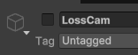

# Chicken Chaser CM 9 End Of Game 

---
## Final Result

* [9.1) Finalizing Game Scene](#91-finalizing-game-scene)
    *   [9.1a) Cinemachine Automatic Cutscenes](#91a-cinemachine-automatic-cutscenes)
    *   [9.1b) Placing the Cages](#91b-placing-the-cages)
    *   [9.1c) Start of Game prep](#91c-start-of-game-prep)

* [9.2) Settings Sensitivity Integration [OPTIONAL]](#92-settings-sensitivity-integration-optional)

* [9.3) Sounds and Effects [OPTIONAL]](#93-sounds-and-effects-optional)
    * [9.3a) Capture and Escape sounds](#93a-capture-and-escape-sounds)
    * [9.3b) OnLanded effect](#93b-onlanded-effect)

* [9.4) Building Games [OPTIONAL]](#94-building-games-optional)

* [End Results](#end-results)
    * [Rotator.cs](#rotatorcs-complete)
    * [ChickenStats.cs](#chickenstatscs-complete)
    * [PlayerChicken.cs](#playerchickencs-complete)
    * [AiChicken.cs](#aichickencs-complete)
    * [Chicken.cs](#chickencs-complete)

## [Builds](https://github.com/RealProgrammingInstructors/Shared-Content/blob/main/Content/Unity/Builds.md)

---

## 9.1) Finalizing Game Scene

### 9.1a) Cinemachine Automatic Cutscenes

Cinemachine provides an insanely easy to use cutscene system. Let's add it to Chicken Chaser.

To do this, simply disable the current camera, or enable a new camera with a higher priority.

Let's add an end-game effect. Once the player chicken is captured, let's  change how the camera works

1. Move the camera in the scene to look at the player.


2. Right click on player and add a Cinemachine Camera (or cinemachine virtual camera) name it LossCam
3. Enable Priority, and set priority to 100


4. Test it: Simply disable the cam and press play, then enable the cam while the game is running.


5. Adjust as necessary.

6. Modify the [PlayerChicken.cs](../Assets/Scripts/Characters/Chicken/PlayerChicken.cs) script add a variable for a gameobject that we can enable and disable. Enable the object when caught, and disable when freed.

```csharp
using System;
using UnityEngine;
using UnityEngine.AI;
using Utilities;

public class PlayerChicken : Chicken
{
    private Vector3 _moveDirection;
    private Vector2 _lookDirection;
    
    [Header("Looking")] 
    [SerializeField , Range(0,90)] private float pitchLimit;
    [SerializeField, Range(0,180)] private float yawLimit;
    [SerializeField] private float lookSpeed;

    [Header("Abilities")]
    [SerializeField] private AbstractAbility jumpAbility;
    [SerializeField] private AbstractAbility cluckAbility;
    [SerializeField] private AbstractAbility dashAbility;

    //-------------ADDDED------------//
    [Header("Effects")]
    [SerializeField] private GameObject lossCam;
    //------------------------------------//
    
    //Observable player events
    public static Action<Vector3> OnPlayerCaught;
    public static Action<Vector3> OnPlayerEscaped;
    public static Action OnPlayerRescued; // It's not out of the picture that another chicken can rescue the player.
    
    protected override void Awake(){ ... }

    private void OnEnable(){ ... }

    private void OnDisable(){ ... }

    protected override void HandleMovement(){ ... }

    public override void OnFreedFromCage()
    {
        enabled = true;
        PlayerControls.UseGameControls();
        OnPlayerRescued?.Invoke();

        //Stop Using the cluck ability
        cluckAbility.StopUsingAbility();

        //-------------ADDDED------------//
        lossCam.SetActive(false);
    }

    public override void OnEscaped(Vector3 position){ ... }

    public override void OnCaptured()
    {
        //Optional debug line
        Debug.Log("Player has been captured");
        
        //Fix the players hopping animations
        AnimatorController.SetFloat(StaticUtilities.MoveSpeedAnimID, 0);
        cluckAbility.StartUsingAbility(); //Cluck to bring all chickens to you (done later)

        //Unlock the mouse and make it visible
        Cursor.lockState = CursorLockMode.Confined;
        Cursor.visible = true;
        
        //Make humans ignore us
        Visibility = 0;
        
        //Notify our subscribers (?) if we have any
        OnPlayerCaught?.Invoke(transform.position);
        
        //-------------ADDDED------------//
        lossCam.SetActive(true);
    }

    public void SetDashState(bool state)  { ... }

    public void SetCluckState(bool state){ ... }

    public void SetJumpState(bool state){ ... }

    public void SetMoveDirection(Vector2 direction){ ... }

    public void SetLookDirection(Vector2 direction){ ... }

    private void HandleLooking(){ ... }

    public AbstractAbility GetCluckAbility(){ ... }
    
    public AbstractAbility GetJumpAbility(){ ... }
    
    public AbstractAbility GetDashAbility(){ ... }
}
```

7. Attach the object


8. Disable the Loss camera by default




9. [OPTIONAL] You can change the transition time on the MainCamera object


10. [OPTIONAL] Make the camera rotate, to do this, we want to orbit around a point (Without rotating the player)


To achieve this, right click on LossCam and add an empty parent. Then on that object create a "rotator" component. Rotator is a very basic script that exist in many projects

Place the script in the game folder
in [Rotator.cs](../Assets/Scripts/Game/Rotator.cs)
```csharp
using UnityEngine;

public class Rotator : MonoBehaviour
{
    [SerializeField] private float rotationSpeed = 1;
    private void LateUpdate() //Use late update as it's camera / effect related
    {
        //Rotate about the up axis based on some speed relative to the world
        transform.Rotate(Vector3.up,  rotationSpeed * Time.deltaTime, Space.World);
    }
}
```

11. Apply to prefab


12. Apply as effect and to prefab


If you're experiencing issues make sure Rotator is disabled, but LossCam is not

### 9.1b) Placing the Cages

Placing the cages is really straight forward. The only real rule is to make sure the objects are in GameScene and not StaticWorld else there navmesh won't work correctly.


Here's a map of how the original game placed the chickens, but do what feels right.


### 9.1c) Start of Game prep

Enable the StartingCamera Gameobject, which is a premade auto-cinematic to help make the objective clear to players.


## 9.2) Settings Sensitivity Integration [OPTIONAL]

In [PlayerChicken.cs](../Assets/Scripts/Characters/Chicken/PlayerChicken.cs) add the following:

a function to edit the variable, and then the observer pattern in OnEnable and OnDisable

```csharp
//Other variables

    protected override void Awake()    { ... }

    private void OnEnable()
    {
        //Enable components for good measure
        PhysicsBody.isKinematic = false;
        BodyCollider.enabled = true;
        
        //-------------------------ADDED--------------------//
        SettingsManager.SaveFile.onLookSenseChanged += OnLookSensChanged;
        lookSpeed = SettingsManager.currentSettings.LookSensitivity;
        //-------------------------------------------//
    }

    private void OnDisable()
    {
        
        //Disable components for good measure
        PhysicsBody.isKinematic = true;
        BodyCollider.enabled = false;
        
        PlayerControls.DisablePlayer();  
        jumpAbility.ForceCancelAbility();
        cluckAbility.ForceCancelAbility();
        dashAbility.ForceCancelAbility();
        
        //-------------------------ADDED--------------------//
        SettingsManager.SaveFile.onLookSenseChanged -= OnLookSensChanged;
    }

//-------------------------ADDED--------------------//
    private void OnLookSensChanged(float val)
    {
        lookSpeed = val;
    }
//-------------------------------------------//

//Other functions
```
## 9.3) Sounds and Effects [OPTIONAL]

To make the game feel more alive, we should add effects and sounds to interactions.

### 9.3a) Capture and Escape sounds

Both players and AI chickens need to play sounds when they're caught to notify the player something major happened
Let's being by editing [ChickenStats.cs](../Assets/Scripts/ScriptableObjects/ChickenStats.cs)

```csharp
using UnityEngine;

[CreateAssetMenu(fileName = "ChickenStats", menuName = "ChickenChaser/ChickenStats", order = 100)]
public class ChickenStats : ScriptableObject
{
    [Header("Movement")]
    [SerializeField] protected float speed;
    [SerializeField] protected float maxSpeed;
    
    [Header("Foot Management")] 
    [SerializeField] protected float footRadius;
    [SerializeField] protected float footDistance;

    //------------ ADDED-----------------------//
    [Header("Audio")]
    [SerializeField] private AudioClip caughtSound;
    [SerializeField] private AudioClip escapedSound;
    //-----------------------------------------//

    public float Speed => speed;
    public float MaxSpeed => maxSpeed;
    public float FootRadius => footRadius;
    public float FootDistance => footDistance;

    //------------ ADDED-----------------------//
    public AudioClip CaughtSound => caughtSound;
    public AudioClip EscapedSound => escapedSound;
    //-----------------------------------------//
}
```

We now want these to play as "UI Sounds" which is a common practice. Sounds are played via AudioSource and can be emitted as 2D, or 3D. Changing the settings drastically changes how they work. The [GameManager.cs](../Assets/Scripts/Managers/GameManager.cs) is a UI sound manager, and will play the sounds.

Next in [AiChicken.cs](../Assets/Scripts/Characters/Chicken/AiChicken.cs)

```csharp
public class AiChicken : Chicken, IDetector
{

    //Functions and variables

    public override void OnEscaped(Vector3 position)
    {
        //Print who is trying to escape (When doing , gameObject the debug will show that object when pressed on in unity)
        Debug.Log("I'm trying to escape", gameObject);
        
        //Move to the location to escape
        MoveTo(position);
            
        //We should not escape just yet because the AI needs time to actually get to the exit...
        //let's start a coroutine and see if we've escaped.
        StartCoroutine(CheckForEscaped());

        //Hide the AI so that we don't have 'unfair' captures
        Visibility = 0;
        
        //------------------------------- ADDED------------------//
        
        GameManager.PlayUISound(stats.EscapedSound);
        //--------------------------------------------------------//
    }
    
    private IEnumerator CheckForEscaped()   { ... }

    public override void OnCaptured()
    {
        AnimatorController.SetFloat(StaticUtilities.MoveSpeedAnimID, 0);
        OnCaught.Invoke();
        
        //------------------------------- ADDED------------------//
        GameManager.PlayUISound(stats.CaughtSound);
    }
}
```

Next in [PlayerChicken.cs](../Assets/Scripts/Characters/Chicken/PlayerChicken.cs) it's the same thing

```csharp
public class PlayerChicken : Chicken
{
    //Variables and functions

    public override void OnEscaped(Vector3 position)
    {
        //Optional Debug
        Debug.Log("Player won the game!");
        
        //Notify anyone who wants to know when we escape
        OnPlayerEscaped?.Invoke(transform.position);
        
        //Create an AI to take over for us
        NavMeshAgent agent = gameObject.AddComponent<NavMeshAgent>();
        agent.enabled = true;
        agent.baseOffset = 0.16f;
        agent.height = 0.32f;
        agent.radius = 0.2f;
        agent.agentTypeID = 0;
        agent.SetDestination(position);
        
        //Enable the animations
        AnimatorController.SetFloat(StaticUtilities.MoveSpeedAnimID, stats.MaxSpeed);

        //Prevent any weirdness
        enabled = false;
        
        //-------------------------ADDED------------------//
        GameManager.PlayUISound(stats.EscapedSound);
    }

    public override void OnCaptured()
    {
        //Optional debug line
        Debug.Log("Player has been captured");
        
        //Fix the players hopping animations
        AnimatorController.SetFloat(StaticUtilities.MoveSpeedAnimID, 0);
        cluckAbility.StartUsingAbility(); //Cluck to bring all chickens to you (done later)

        //Unlock the mouse and make it visible
        Cursor.lockState = CursorLockMode.Confined;
        Cursor.visible = true;
        
        //Make humans ignore us
        Visibility = 0;
        
        //Notify our subscribers (?) if we have any
        OnPlayerCaught?.Invoke(transform.position);
        
        lossCam.SetActive(true);
        
        //-------------------------ADDED------------------//
        GameManager.PlayUISound(stats.CaughtSound);
    }
}
```

Last, let's apply the audio in unity:


### 9.3b) OnLanded effect

In many games, Animation events a great way to have actions invoked in sync with animations. There's a premade one in chicken chaser for  the chicken animation
It's viewable by opening the chicken move animation


There's also premade a listener. So in [Chicken.cs](../Assets/Scripts/Characters/Chicken/Chicken.cs) let's use it and ask it to play a sound and effect.

First, we need two more variables:

Serialized -  landEffect (ParticleSystem)
protected -  Audio (AudioSource)

```csharp
public abstract class Chicken : MonoBehaviour, IVisualDetectable, ITrappable
{
    [SerializeField] protected ChickenStats stats;
    
    [Header("Objects")] 
    [SerializeField] protected Transform head;
    [SerializeField] protected Transform foot;

    //------------------------- ADDED------------------//
    [SerializeField] private ParticleSystem landEffect;

    protected AudioSource Audio;
    //-----------------------------------------------------------//
    protected Rigidbody PhysicsBody;
    protected Animator AnimatorController;
    protected Collider BodyCollider;
    protected bool IsGrounded;
    
    protected float currentSpeed;
    protected float currentFallTIme;
    protected Vector3 slopeNormal;
    
    protected float Visibility = 1;
    
    //Functions
}
```

next, in Awake
```csharp
public abstract class Chicken : MonoBehaviour, IVisualDetectable, ITrappable
{
    protected virtual void Awake()
    {
        PhysicsBody = GetComponent<Rigidbody>();
        AnimatorController = GetComponentInChildren<Animator>();
        BodyCollider = GetComponentInChildren<Collider>();
         //----------------------------ADDED-------------------------------//
        Audio = GetComponentInChildren<AudioSource>();
        
        ChickenAnimatorReceiver car = transform.GetChild(0).GetComponent<ChickenAnimatorReceiver>();
        //This will give errors until we fix HandleLanding as the animation reciever wants a float for fall distance.
        car.OnLandEffect += HandleLanding;
         //-----------------------------------------------------------//
    }
}
```

Now we need to Update the Handle Ground State function so we can use fall distance *(just in case you want falling to do something)

```csharp
private void HandleGroundState()
    {
        //We're going to spherecast downwards, and detect if we've hit the floor.
        //Basic Spherecast check, NOTE: StaticUtilites.GroundLayers helps the code know which layers to look at for floors.
        // Preventing players from registering grounded on illegal objects.
        bool newGroundedState = Physics.SphereCast(foot.position, stats.FootRadius, Vector3.down, out RaycastHit slope, stats.FootDistance, StaticUtilities.GroundLayers);
       
        //If the ground state is different
        if (newGroundedState != IsGrounded)
        {
            //We should enter that state
            IsGrounded = newGroundedState;
            //Then we should update our grounded state.
            AnimatorController.SetBool(StaticUtilities.IsGroundedAnimID, IsGrounded);

            //If we were falling
            if (currentFallTIme >= 0)
            {
                //Handle Landing
                //---------------------------MODIFIED--------------------------------//
                HandleLanding(Mathf.Max(currentFallTIme / 2, 3)); // Arbitrarily limit effects
                //-------------------------------------------------------------------//
                currentFallTIme = 0;
            }
        }

        //If we're not grounded then update the air time
        if (!IsGrounded) currentFallTIme += Time.deltaTime;
        //If we are grounded keep track of the slope normal so that Movement is smoother.
        else slopeNormal = slope.normal;
    }
```

Next, we need to update HandleLanding

```csharp
protected virtual void HandleLanding(float force) // << --- Modified ------------
  {
      //------------------ Added---------------//
      landEffect.emission.SetBurst(0, new ParticleSystem.Burst(0, Random.Range(10,20) * force));
      landEffect.Play();
          
      //If we missed, we can't possibly find a clip...
      Vector3 pos = foot.position;
          
      //Make sure hit is not null
      if (!Physics.SphereCast(pos, stats.FootRadius, Vector3.down, out RaycastHit hit, stats.FootDistance,StaticUtilities.GroundLayers)) return;
            
      //Make sure the layer is not null
      if (!GameManager.SoundsDictionary.TryGetValue(hit.transform.tag, out AudioVolumeRangeSet set)) return;
      Audio.pitch = Random.Range(0.8f, 1.2f);
      //Play the desired audio + detection
      Audio.PlayOneShot(set.clip, set.volume);
      AudioDetection.onSoundPlayed.Invoke(pos, set.volume, set.rangeMultiplier * force, EAudioLayer.Chicken);
   //------------------------------------------------//
  }
```

and finally we attach the particle system to the prefabs.

PLAYER PREFAB


AI PREFAB


## 9.4) Building Games [OPTIONAL]

[Go here for more info on builds](https://github.com/RealProgrammingInstructors/Shared-Content/blob/main/Content/Unity/Builds.md)


## End Results


### [Rotator.cs](../Assets/Scripts/Game/Rotator.cs) [COMPLETE]
```csharp
using UnityEngine;

public class Rotator : MonoBehaviour
{
    [SerializeField] private float rotationSpeed = 1;
    private void LateUpdate()
    {
        transform.Rotate(Vector3.up,  rotationSpeed * Time.deltaTime, Space.World);
    }
}
```
### [PlayerChicken.cs](../Assets/Scripts/Characters/Chicken/PlayerChicken.cs) [COMPLETE]
```csharp
using System;
using Managers;
using UnityEngine;
using UnityEngine.AI;
using Utilities;

public class PlayerChicken : Chicken
{
    private Vector3 _moveDirection;
    private Vector2 _lookDirection;
    
    [Header("Looking")] 
    [SerializeField , Range(0,90)] private float pitchLimit;
    [SerializeField, Range(0,180)] private float yawLimit;
    [SerializeField] private float lookSpeed;

    [Header("Abilities")]
    [SerializeField] private AbstractAbility jumpAbility;
    [SerializeField] private AbstractAbility cluckAbility;
    [SerializeField] private AbstractAbility dashAbility;

    [Header("Effects")]
    [SerializeField] private GameObject lossCam;
    
    //Observable player events
    public static Action<Vector3> OnPlayerCaught;
    public static Action<Vector3> OnPlayerEscaped;
    public static Action OnPlayerRescued; // It's not out of the picture that another chicken can rescue the player.
    
    protected override void Awake()
    {
        base.Awake();
        HudManager.Instance.BindPlayer(this);
        PlayerControls.Initialize(this);
        PlayerControls.UseGameControls();
    }

    private void OnEnable()
    {
        //Enable components for good measure
        PhysicsBody.isKinematic = false;
        BodyCollider.enabled = true;
        
        SettingsManager.SaveFile.onLookSenseChanged += OnLookSensChanged;
        lookSpeed = SettingsManager.currentSettings.LookSensitivity;
    }

    private void OnDisable()
    {
        
        //Disable components for good measure
        PhysicsBody.isKinematic = true;
        BodyCollider.enabled = false;
        
        PlayerControls.DisablePlayer();  
        jumpAbility.ForceCancelAbility();
        cluckAbility.ForceCancelAbility();
        dashAbility.ForceCancelAbility();
        
        SettingsManager.SaveFile.onLookSenseChanged -= OnLookSensChanged;
    }

    private void OnLookSensChanged(float val)
    {
        lookSpeed = val;
    }

    protected override void HandleMovement()
    {
        Vector3 direction = _moveDirection;
        if (IsGrounded)
        {
            //If we're grounded, then the direction we want to move should be projected onto the plane.
            //Doing this will help us move up steep slopes easier.
            direction = Vector3.ProjectOnPlane(_moveDirection, slopeNormal);
        }
            
        PhysicsBody.AddForce(transform.rotation * direction * stats.Speed, ForceMode.Acceleration);

        //Note: we don't care about falling speed, only XZ speed.
        Vector2 horizontalVelocity = new Vector2(PhysicsBody.linearVelocity.x, PhysicsBody.linearVelocity.z);
        currentSpeed = horizontalVelocity.magnitude; 

        //Check if our speed is exceeding the max speed
        if (currentSpeed > stats.MaxSpeed)
        {
            horizontalVelocity = horizontalVelocity.normalized * stats.MaxSpeed;
            //Limit the speed, but be sure to keep the gravity speed.
            PhysicsBody.linearVelocity = new Vector3(horizontalVelocity.x, PhysicsBody.linearVelocity.y, horizontalVelocity.y);
            
            //Lock the speed to prevent weird bugs
            currentSpeed = stats.MaxSpeed;
        }
        
        HandleLooking();
    }

    public override void OnFreedFromCage()
    {
        enabled = true;
        PlayerControls.UseGameControls();
        OnPlayerRescued?.Invoke();

        //Stop Using the cluck ability
        cluckAbility.StopUsingAbility();

        lossCam.SetActive(false);
    }

    public override void OnEscaped(Vector3 position)
    {
        //Optional Debug
        Debug.Log("Player won the game!");
        
        //Notify anyone who wants to know when we escape
        OnPlayerEscaped?.Invoke(transform.position);
        
        //Disable the controls
        PlayerControls.DisableControls();
        
        //Create an AI to take over for us
        NavMeshAgent agent = gameObject.AddComponent<NavMeshAgent>();
        agent.enabled = true;
        agent.baseOffset = 0.16f;
        agent.height = 0.32f;
        agent.radius = 0.2f;
        agent.agentTypeID = 0;
        agent.SetDestination(position);
        
        //Enable the animations
        AnimatorController.SetFloat(StaticUtilities.MoveSpeedAnimID, stats.MaxSpeed);

        //Prevent any weirdness
        enabled = false;
        
        GameManager.PlayUISound(stats.EscapedSound);
    }

    public override void OnCaptured()
    {
        //Optional debug line
        Debug.Log("Player has been captured");
        
        //Fix the players hopping animations
        AnimatorController.SetFloat(StaticUtilities.MoveSpeedAnimID, 0);
        cluckAbility.StartUsingAbility(); //Cluck to bring all chickens to you (done later)

        //Unlock the mouse and make it visible
        Cursor.lockState = CursorLockMode.Confined;
        Cursor.visible = true;
        
        //Make humans ignore us
        Visibility = 0;
        
        //Notify our subscribers (?) if we have any
        OnPlayerCaught?.Invoke(transform.position);
        
        lossCam.SetActive(true);
        
        GameManager.PlayUISound(stats.CaughtSound);
    }

    public void SetDashState(bool state)
    {
        if(state) dashAbility.StartUsingAbility();
        else dashAbility.StopUsingAbility();
    }

    public void SetCluckState(bool state)
    {
        if(state) cluckAbility.StartUsingAbility();
        else cluckAbility.StopUsingAbility();
    }

    public void SetJumpState(bool state)
    {
        if(state) jumpAbility.StartUsingAbility();
        else jumpAbility.StopUsingAbility();
    }

    public void SetMoveDirection(Vector2 direction)
    {
        //In unity, Y is up, so we need to convert to vector3, and have WS affect the forward (Z) axis.
        _moveDirection = new Vector3(direction.x, 0, direction.y);
    }

    public void SetLookDirection(Vector2 direction)
    {
        _lookDirection = direction;
    }

    private void HandleLooking()
    {
        //Caching the Time.deltaTime is important if you're using it more than once. It saves RAM.
        float timeShift = Time.deltaTime;
        float pitchChange = head.localEulerAngles.x - lookSpeed * _lookDirection.y * timeShift;
        float yawChange = transform.localEulerAngles.y + lookSpeed * _lookDirection.x * timeShift;
        
        //Apply limits so we don't Gimbal Lock ourselves
        // (Quaternion rotation would correct this but this does the job)
        if (pitchChange > pitchLimit && pitchChange < 180) pitchChange = pitchLimit;
        else if (pitchChange < 360-pitchLimit && pitchChange > 180) pitchChange = -pitchLimit;
        if (yawChange > yawLimit && yawChange < 180) yawChange = yawLimit;
        else if (yawChange < 360-yawLimit && yawChange > 180) yawChange = -yawLimit;

        //Apply the modifications to each part, be sure to use LOCAL euler angles, so that other systems work correctly.
        transform.localEulerAngles = new Vector3(0, yawChange, 0);
        head.localEulerAngles = new Vector3(pitchChange, 0, 0);
    }

    public AbstractAbility GetCluckAbility()
    {
        return cluckAbility;
    }
    
    public AbstractAbility GetJumpAbility()
    {
        return jumpAbility;
    }
    
    public AbstractAbility GetDashAbility()
    {
        return dashAbility;
    }
}

```
### [ChickenStats.cs](../Assets/Scripts/ScriptableObjects/ChickenStats.cs) [COMPLETE]
```csharp
using UnityEngine;

[CreateAssetMenu(fileName = "ChickenStats", menuName = "ChickenChaser/ChickenStats", order = 100)]
public class ChickenStats : ScriptableObject
{
    [Header("Movement")]
    [SerializeField] protected float speed;
    [SerializeField] protected float maxSpeed;
    
    [Header("Foot Management")] 
    [SerializeField] protected float footRadius;
    [SerializeField] protected float footDistance;

    [Header("Audio")]
    [SerializeField] private AudioClip caughtSound;
    [SerializeField] private AudioClip escapedSound;

    public float Speed => speed;
    public float MaxSpeed => maxSpeed;
    public float FootRadius => footRadius;
    public float FootDistance => footDistance;

    public AudioClip CaughtSound => caughtSound;
    public AudioClip EscapedSound => escapedSound;
}

```
### [AiChicken.cs](../Assets/Scripts/Characters/Chicken/AiChicken.cs) [COMPLETE]
```csharp
using System;
using System.Collections;
using AI;
using Interfaces;
using Managers;
using ScriptableObjects;
using UnityEngine;
using UnityEngine.AI;
using Utilities;

public class AiChicken : Chicken, IDetector
{

    //Either make these all serialized, or access them all in awake with GetComponent
    private FaceTarget _faceTarget;
    private AudioDetection _audioDetection;
    private NavMeshAgent _agent;

    [SerializeField] private HearStats activeHearing;
    
    public Action OnCaught;
    public Action OnFreed;

    private static int _numActiveChickens;


    protected override void Awake()
    {
        base.Awake();
        
        _faceTarget = GetComponent<FaceTarget>();
        _audioDetection = GetComponent<AudioDetection>();
        _agent = GetComponent<NavMeshAgent>();

        _agent.speed = stats.MaxSpeed;
        _agent.acceleration = stats.Speed;
        
        HudManager.Instance.RegisterChicken(this);
        GameManager.RegisterAIChicken();
    }

    private void OnDestroy()
    {
        HudManager.Instance.DeRegisterChicken(this);
    }

    private void OnEnable()
    {
        _faceTarget.enabled = false;
        _agent.enabled = true;
        
        _audioDetection.SetStats(activeHearing);
        
        //Enable object collisions
        BodyCollider.enabled = true;
        
        //Do cluck anim so we're not static, without the particle we just look like we're waving
        AnimatorController.SetBool(StaticUtilities.CluckAnimID, true);
        AnimatorController.enabled = true;
        
        //Subscribe to player events
        PlayerChicken.OnPlayerCaught += MoveTo;
        PlayerChicken.OnPlayerEscaped += MoveTo;
        
        _numActiveChickens += 1;
        ScoreManager.Instance.UpdateScore();
    }

    private void OnDisable()
    {
        //Unsubscribe from player events (as we can't complete them)
        PlayerChicken.OnPlayerCaught -= MoveTo;
        PlayerChicken.OnPlayerEscaped -= MoveTo;
        
        //Disable any active anims
        AnimatorController.SetBool(StaticUtilities.CluckAnimID, false);
        AnimatorController.enabled = false;
        
        //Stop the agent
        _agent.ResetPath();
        _agent.enabled = false;
        
        //Disable collisions
        BodyCollider.enabled = false;
        
        //Enable the face target component
        _faceTarget.enabled = true;

        _numActiveChickens -= 1;
        ScoreManager.Instance.UpdateScore();
    }

    private void MoveTo(Vector3 location)
    {
        _agent.SetDestination(location);
    }

    protected override void HandleMovement()
    {
        //Move close to the target and decelerate when near them
        currentSpeed = Mathf.Max(0,_agent.remainingDistance - _agent.stoppingDistance + 0.2f);
        AnimatorController.SetFloat(StaticUtilities.MoveSpeedAnimID, currentSpeed);
    }

    public override void OnFreedFromCage()
    {
        enabled = true;
     OnFreed.Invoke();   
    }

    public override void OnEscaped(Vector3 position)
    {
        //Print who is trying to escape (When doing , gameObject the debug will show that object when pressed on in unity)
        Debug.Log("I'm trying to escape", gameObject);
        
        //Move to the location to escape
        MoveTo(position);
            
        //We should not escape just yet because the AI needs time to actually get to the exit...
        //let's start a coroutine and see if we've escaped.
        StartCoroutine(CheckForEscaped());

        //Hide the AI so that we don't have 'unfair' captures
        Visibility = 0;
        
        GameManager.PlayUISound(stats.EscapedSound);
    }
    
    private IEnumerator CheckForEscaped()
    {
        //CACHED Move until the path is done generating and we reach the target
        WaitUntil target = new WaitUntil(() => _agent.hasPath && _agent.remainingDistance <= _agent.stoppingDistance);

        //Use cached variable
        yield return target;
            
        Debug.Log("I'm trying to escape");
        
        
        
        //Destroy ourselves
        Destroy(gameObject);
    }

    public override void OnCaptured()
    {
        AnimatorController.SetFloat(StaticUtilities.MoveSpeedAnimID, 0);
        OnCaught.Invoke();
        
        GameManager.PlayUISound(stats.CaughtSound);
    }

    public void AddDetection(Vector3 location, float detection, EDetectionType type)
    {
        if (!enabled || detection < 1) return;
        print("I'm moving towards: " + location);
        _agent.SetDestination(location);
        AnimatorController.SetBool(StaticUtilities.CluckAnimID, false);
    }
    
    public static int NumActiveAIChickens()
    {
        return _numActiveChickens;
    }
}

```

### [Chicken.cs](../Assets/Scripts/Characters/Chicken/Chicken.cs) [COMPLETE]
```csharp
using AI;
using Characters;
using Interfaces;
using Managers;
using ScriptableObjects;
using UnityEngine;
using Utilities;

public abstract class Chicken : MonoBehaviour, IVisualDetectable, ITrappable
{
    [SerializeField] protected ChickenStats stats;
    
    [Header("Objects")] 
    [SerializeField] protected Transform head;
    [SerializeField] protected Transform foot;

    [SerializeField] private ParticleSystem landEffect;

    protected AudioSource Audio;
    protected Rigidbody PhysicsBody;
    protected Animator AnimatorController;
    protected Collider BodyCollider;
    protected bool IsGrounded;
    
    protected float currentSpeed;
    protected float currentFallTIme;
    protected Vector3 slopeNormal;
    
    protected float Visibility = 1;

    
    protected virtual void Awake()
    {
        PhysicsBody = GetComponent<Rigidbody>();
        AnimatorController = GetComponentInChildren<Animator>();
        BodyCollider = GetComponentInChildren<Collider>();
        Audio = GetComponentInChildren<AudioSource>();
        
        ChickenAnimatorReceiver car = transform.GetChild(0).GetComponent<ChickenAnimatorReceiver>();
        car.OnLandEffect += HandleLanding;
    }

    private void FixedUpdate()
    {
        HandleGroundState();
        HandleMovement();
        HandleAnims();
    }


    private void HandleGroundState()
    {
        //We're going to spherecast downwards, and detect if we've hit the floor.
        //Basic Spherecast check, NOTE: StaticUtilites.GroundLayers helps the code know which layers to look at for floors.
        // Preventing players from registering grounded on illegal objects.
        bool newGroundedState = Physics.SphereCast(foot.position, stats.FootRadius, Vector3.down, out RaycastHit slope, stats.FootDistance, StaticUtilities.GroundLayers);
       
        //If the ground state is different
        if (newGroundedState != IsGrounded)
        {
            //We should enter that state
            IsGrounded = newGroundedState;
            //Then we should update our grounded state.
            AnimatorController.SetBool(StaticUtilities.IsGroundedAnimID, IsGrounded);

            //If we were falling
            if (currentFallTIme >= 0)
            {
                //Handle Landing
                HandleLanding(Mathf.Max(currentFallTIme / 2, 3)); // Arbitrarily limit effects
                currentFallTIme = 0;
            }
        }

        //If we're not grounded then update the air time
        if (!IsGrounded) currentFallTIme += Time.deltaTime;
        //If we are grounded keep track of the slope normal so that Movement is smoother.
        else slopeNormal = slope.normal;
    }

    protected virtual void HandleLanding(float force)
    {
        landEffect.emission.SetBurst(0, new ParticleSystem.Burst(0, Random.Range(10,20) * force));
        landEffect.Play();
            
        //If we missed, we can't possibly find a clip...
        Vector3 pos = foot.position;
            
        //Make sure hit is not null
        if (!Physics.SphereCast(pos, stats.FootRadius, Vector3.down, out RaycastHit hit, stats.FootDistance,StaticUtilities.GroundLayers)) return;
           

            
        //Make sure the layer is not null
        if (!GameManager.SoundsDictionary.TryGetValue(hit.transform.tag, out AudioVolumeRangeSet set)) return;
        Audio.pitch = Random.Range(0.8f, 1.2f);
        //Play the desired audio + detection
        Audio.PlayOneShot(set.clip, set.volume);
        AudioDetection.onSoundPlayed.Invoke(pos, set.volume, set.rangeMultiplier * force, EAudioLayer.Chicken);
    }

    protected virtual void HandleAnims()
    {
        AnimatorController.SetFloat(StaticUtilities.MoveSpeedAnimID, currentSpeed);
    }

    protected abstract void HandleMovement();
    
    public abstract void OnFreedFromCage();
    
    public abstract void OnEscaped(Vector3 position);
    public void OnPreCapture()
    {
        enabled = false;
    }

    public Transform GetTransform()
    {
        return transform;
    }

    public bool CanBeTrapped()
    {
        return isActiveAndEnabled;
    }

    public abstract void OnCaptured();
    
    public bool GetIsGrounded()
    {
        return IsGrounded;
    }
    public float GetCurrentSpeed()
    {
        return currentSpeed;
    }

    public Vector3 GetLookDirection()
    {
        return head.forward;
    }

    public void AddVisibility(float visibility)
    {
        Visibility += visibility;
    }

    public void RemoveVisibility(float visibility)
    {
        Visibility -= Mathf.Max(0,visibility);
    }

    public float GetVisibility()
    {
        return Visibility;
    }
}

```